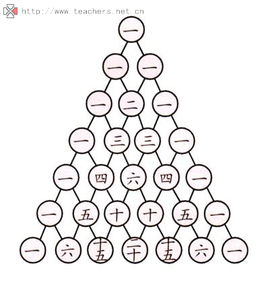

```
		  1
        1   1
      1   2   1
    1   3   3   1
  1   4   6   4   1
1   5   10  10  5   1
```


```python
#!/usr/bin/env python3
# -*- coding: utf-8 -*-

#Nzhong
def triangles():
	# n = [1];
	# while True:
	# 	yield n
	# 	n = [sum(i) for i in zip([0] + n, n + [0])]

	# N = [1]
	# while True:
	#     yield N
	#     N.append(0)
	#     N = [N[i-1] + N[i] for i in range(len(N))]

	N = [1]
	while True:
	    yield N
	    N.append(0)
	    N.insert(0, 0)
	    #print(N)
	    N = [N[i] + N[i + 1] for i in range(len(N) - 1)]
# 期待输出:
# [1]
# [1, 1]
# [1, 2, 1]
# [1, 3, 3, 1]
# [1, 4, 6, 4, 1]
# [1, 5, 10, 10, 5, 1]
# [1, 6, 15, 20, 15, 6, 1]
# [1, 7, 21, 35, 35, 21, 7, 1]
# [1, 8, 28, 56, 70, 56, 28, 8, 1]
# [1, 9, 36, 84, 126, 126, 84, 36, 9, 1]
n = 0
for t in triangles():
    print(t)
    n = n + 1
    if n == 7:
        break

```

```lua
local function add( t )
	local r={1}
	for i = 2,#t do
		t[i] = t[i - 1] + t[i]
	end
	t[#t + 1] = 1
	return r
end

local arr = {1}
for i = 1, 9 do
	arr = add(arr)
end

for i = 1, #arr do
	print(arr[i])
end
```
