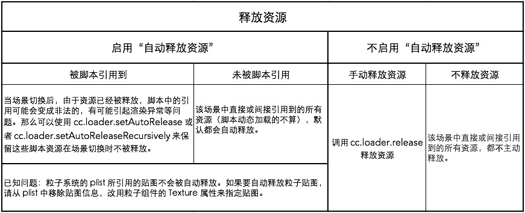

# Cocos Creator 资源释放策略


## 普通资源

我们可以使用 `cc.loader.release` 来精确释放不使用的资源

## 动态资源
我们使用 `cc.loader.loadRes` 或 `cc.loader.loadResDir` 动态加载的资源，则不受场景设置的影响，默认不自动释放。

我们可以使用 `cc.loader.setAutoRelease` 或者 `cc.loader.setAutoReleaseRecursively` 来保留这些资源。

```js
// auto release the texture event if "Auto Release Assets" disabled in current scene
cc.loader.setAutoRelease(texture2d, true);
// don't release the texture even if "Auto Release Assets" enabled in current scene
cc.loader.setAutoRelease(texture2d, false);
// first parameter can be url
cc.loader.setAutoRelease(audioUrl, false);
```

## 场景

默认情况下，当加载新场景时，旧场景的资源根据旧场景是否勾选 “Auto Release Assets(自动释放资源)”，将会被释放或者保留，该项默认关闭。 




## 贴图资源 Texture

使用单独存在的 `Texture` 作为 `Sprite` 资源，在预览和发布游戏时，将无法对这些 `Sprite` 进行批量渲染优化的操作。目前编辑器不支持转换原有的单张 `Texture` 引用到 `Atlas` 里的 `SpriteFrame` 引用，所以在开发正式项目时，应该尽早把需要使用的图片合成 `Atlas（图集）`，并通过 `Atlas` 里的 `SpriteFrame` 引用使用。

另外，引擎中的 `cc.macro.CLEANUP_IMAGE_CACHE` 字段表示是否将贴图上传至 GPU 之后删除 `DOM Image` 缓存。具体来说，我们通过设置 `image.src` 为空字符串来释放这部分内存。正常情况下，可以不需要开启这个选项，因为在 web 平台，`Image` 对象所占用的内存很小。但是在微信小游戏平台的当前版本，`Image` 对象会缓存解码后的图片数据，它所占用的内存空间很大。所以我们在微信小游戏平台默认开启了这个选项，在上传 `GL` 贴图之后立即释放 `Image` 对象的内存，避免过高的内存占用。

## 预制资源 Prefab

### 设置优化策略
优化策略能优化所选预制的实例化时间，也就是执行 `cc.instantiate` 所需的时间。可设置的值有：

* **自动调整（默认）**：

    设为这个选项后，引擎将根据创建次数自动调整优化策略。初次创建实例时，等同于 **优化单次创建性能**，多次创建后将自动 **优化多次创建性能**。

* **优化单次创建性能**：

    该选项会跳过针对这个 `prefab` 的代码生成优化操作。

* **优化多次创建性能**：

    该选项会启用针对这个 `prefab` 的代码生成优化操作。

如果这个预制需要反复执行 `cc.instantiate`，请选择 **优化多次创建性能**，否则保持默认的 **自动调整** 即可。

在旧版本引擎中，优化方式固定为 优化多次创建性能，在需要批量创建对象的场合中效果拔群。但是有不少人将 `prefab` 作为多人协作或者分步加载的工具，这些 `prefab` 基本只会实例化一次，就会导致节点创建速度变慢。新版本默认采用 自动调整 以后，很好的解决了这个问题。

### 设置延迟加载资源
该项默认关闭。

勾选之后，使用 **属性检查器** 关联、`loadRes` 等方式单独加载预制资源时，将会延迟加载预制所依赖的其它资源，提升部分页游的加载速度。详情请参考 场景的延迟加载。

## 图集资源 Atlas

图集（Atlas）也称作 [Sprite Sheet](https://www.codeandweb.com/what-is-a-sprite-sheet)

多个 `Sprite` 如果渲染的是来自同一张图集的图片时，这些 `Sprite` 可以使用同一个渲染批次来处理，大大减少 CPU 的运算时间，提高运行效率。

我们可以使用 CocosCreator 自带的 自动图集资源 (Auto Atlas)

## 位图字体

**合并渲染**

如果位图字体使用的贴图和其他 `Sprite` 使用的贴图是同一张，而且位图字体和 `Sprite` 之间没有插入使用其他贴图的渲染对象时，位图字体就可以和 `Sprite` 合并渲染批次。在放置位图字体资源时，请把 `.fnt` 文件、`.png` 文件和 `Sprite` 所使用的贴图文件放在一个文件夹下，然后参考 自动图集工作流程 将位图字体的贴图和 `Sprite` 使用的贴图打包成一个图集，即可在原生和 WebGL 渲染环境下自动享受位图字体合并渲染的性能提升。

## 节点

**节点的销毁**

调用一个节点的 `removeFromParent` 后，它不一定就能完全从内存中释放，因为有可能由于一些逻辑上的问题，导致程序中仍然引用到了这个对象。因此如果一个节点不再使用了，请直接调用它的 `destroy` 而不是 `removeFromParent`。`destroy` 不但会激活组件上的 `onDestroy`，还会降低内存泄露的几率，同时减轻内存泄露时的后果。

总之，如果一个节点不再使用，`destroy` 就对了，不需要 `removeFromParent` 也不需要设置 `parent` 为 `null` 哈。