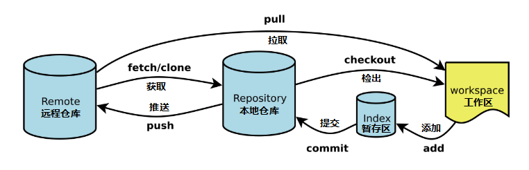
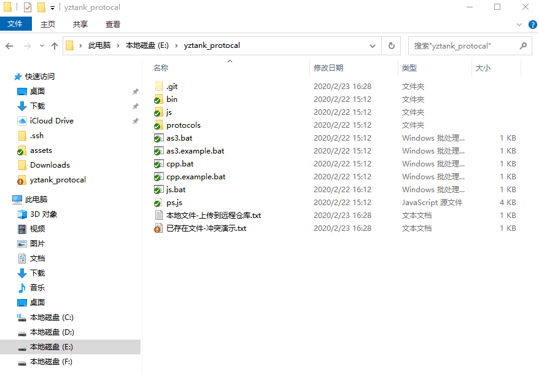
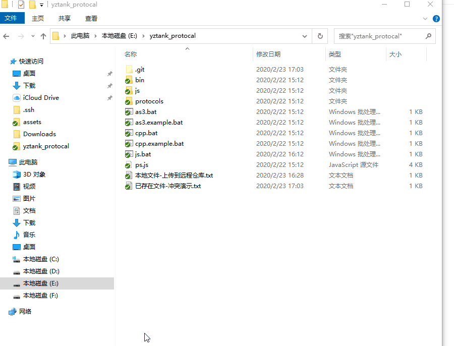

# Git tortoiseGit 教程
> TortoiseGit 2.9.0.0 (C:\Program Files\TortoiseGit\bin)
> 
> git version 2.25.0.windows.1 (C:\Program Files\Git\bin; C:\Program Files\Git\mingw64\; C:\Program Files\Git\etc\gitconfig)

## 修复 ICON

Windows 的 ICON 只会显示最初的 15 个。

因此要把 tortoiseGit 的 ICON 位置提前即可，提前方式可以前面加 空格 等方式。

Icon 规则如 SVN 一样，不再描述。


## 用户信息 gitconfig


## 基础知识
与SVN等不同的是，Git拥有本地的数据库。

下图为各项动作的目标及动作的名词解释。



* Workspace：工作区
* Index / Stage：暂存区
* Repository：仓库区（或本地仓库）
* Remote：远程仓库

## 克隆 Clone

从 远程服务器 克隆 Clone 到本地工作区。


## 变更和新文件 提交到本地仓库 并且 推送到远程仓库

如下图所示， `js.bat` 修改过，`新文件.txt` 为新增文件。

```
$ git add
$ git commit
$ git push 
```


## 本地删除的文件 并且 从本地仓库获取最新版本


## 本地删除的文件 并且 从远程仓库获取 最新版本

假设条件：
1. **本地用户**对 “远程文件-下载到本地工作区.txt”进行了文件**修改**。
1. **远程用户**也对  “远程文件-下载到本地工作区.txt”进行了文件**修改**。
1. **本地用户**想**放弃**自己的修改内容，直接想从**远程仓库**获得**最新版本的修改**。


## 从远程仓库获取文件时 发生冲突

接下来，我们会进行演示如何从远程仓库获取最新版本的时候，以及文件冲突的解决方案。

本地文件内容用字母(a-z)填充，远程仓库另外一位同学提交的内容用数字(0-9)填充。

当前状况：
* 远程用户  
  新增文件“远程文件-下载到本地工作区.txt”，对"已存在文件-冲突演示.txt"进行内容编辑；
* 本地用户  
  新增文件“本地文件-上传到远程仓库.txt”，对"已存在文件-冲突演示.txt"进行内容编辑，必定产生冲突；


下面进行一个常见的**错误示范**


下面为错误提示信息的关键部分，**它不仅告诉你错误的原因，也推荐你接下去该处理的方式**，所以也希望大家在碰到错误问题的时候，多看看，多思考。

```
error: Your local changes to the following files would be overwritten by merge:
已存在文件-冲突演示.txt
Please commit your changes or stash them before you merge.
Updating fdb1797..fb3c0ae
Aborting

git 未能顺利结束 (退出码 1) 
```

**下面为推荐的操作方式**。

1. 对文件进行修改之后，提交`commit` 到本地仓库， 保持一个 **看上去干净** 的环境
    
    > 我们对"已存在文件-冲突演示.txt"进行内容修改，从ICON看出，这是一个修改后的文件；  
    > 我们新增了一个“本地文件-上传到远程仓库.txt”，从ICON看出，这个文件并没有加入到版本管理。  
    > **提交**`commit` （**不是提交并推送**）到本地仓库， 保持一个 **看上去干净** 的环境  
2. 有两种方式：  
   最终结果都可以从ICON中体现，“远程文件-下载到本地工作区.txt”已经下载下来，"已存在文件-冲突演示.txt"是冲突的。

   1. 选择`Git 同步 Sync`后选择 **获取`fetch`** 或者 右键选择 **获取`fetch`**，再进行 **合并`merge`**，这个方式比较温和，可以看到有什么差别，然后再决定下一步怎么做，**比较推荐**；
    
    > 获取`fetch`可以从 远程仓库 下载数据到 本地仓库，它只是下载数据，但并没有合并`merge`，因此还要进行合并`merge`的动作，才能在工作区完整的体现出来。
   2. 还有一种方式是 选择`Git 同步 Sync`选择 **拉取`pull`** 或者 右键选择获取 **拉取`pull`**，这个方式比较暴力；
    
    
3. 解决冲突
   
4. 提交`commit` 到本地仓库，变成一个 真正干净 的环境。**注意，这里提交的是本地仓库，而非远程仓库！**
   
5. 选择`Git 同步 Sync`后选择 **推送`push`** 或者 右键选择 **推送`push`**，推送到 **远程仓库**。
   


## 工作区文件 与本地仓库的比较 和 与远程仓库的比较，可还原

准备工作：

查看 **日志信息** 时，勾选左下角的 **所有分支** 选项。具体看 GIF 操作演示。


假设条件：
1. “远程文件-下载到本地工作区.txt”的内容原来为 "1111111122222222"。
2. **本地用户**对“远程文件-下载到本地工作区.txt”的新增内容 "aaaaaaaa"。
3. **远程用户**也对  “远程文件-下载到本地工作区.txt”进行了文件**修改**，新增内容 "333333333"。
4. 现在**本地用户**想 **与本地仓库版本的比较** 和 **与远程仓库版本的比较**


> 可以发现通过 显示日志 操作，**勾选 所有分支**，不仅出现了 master 的本地仓库日志，还出现了 orgin/master 的远程仓库日志，通过选择单个文件，然后右键 **与工作副本比较**，可以实现 **与本地仓库版本的比较** 和 **与远程仓库版本的比较**
>
> 除了比较，还可以 **还原到此版本**

## 重置到某一版本(非当个文件)

右键 显示日志，，勾选左下角的 **所有分支** 选项，选择想要的历史版本，点击 **重置'master'到此版本**，重置类型选择 **硬重置**，按确定。**注意！会丢弃所有本地变更！**


## 如何解决配置文件带来的冲突问题

开发人员需新建一个文件名为 `config.xml.default` 的文件作为默认配置文件。

项目成员复制`config.xml.default`，重新生成一份`config.xml`，并把`config.xml`文件放入 `.ignore` 忽略列表，那么大家的配置文件就都不会冲突了。