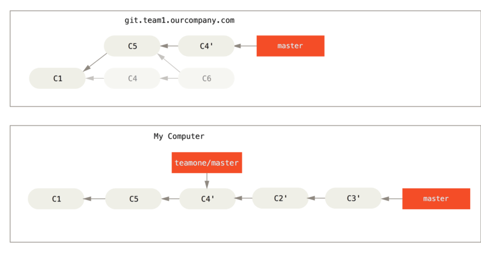

# Git 基础

## 配置文件位置

### MAC

* `/etc/gitconfig`：**系统**上每一个用户及他们仓库的通用配置
* `~/.gitconfig` 或 `~/.config/git/config` ：针对**当前用户**
* 当前使用仓库的 Git 目录中的 `.git/config` 文件：针对**当前仓库**

### Windows
* `C:\Program Files\Git\etc\gitconfig`：**系统设置**
* `C:\Users\用户名\.gitconfig` ：针对**当前用户**
* 当前使用仓库的 Git 目录中的 `.git/config` 文件：针对**当前仓库**

每一个级别覆盖上一级别的配置，所以 当前仓库的 `.git/config` 的配置变量会覆盖` /etc/gitconfig` 系统中的配置变量。

## 用户信息

当安装完 Git 应该做的第一件事就是设置你的用户名称与邮件地址。（做提交信息用而非用户密码验证）  
这样做很重要，因为每一个 Git 的提交都会使用这些信息，并且它会写入到你的每一次提交中，不可更改：

```sh
$ git config --global user.name "John Doe"
$ git config --global user.email johndoe@example.com
```

当你想针对特定项目使用不同的用户名称与邮件地址时，可以在那个项目目录下运行没有 `--global` 选项的命令来配置。

如果想要检查你的配置，可以使用 `git config --list` 命令来列出所有 Git 当时能找到的配置。

```sh
$ git config --list
user.name=John Doe
user.email=johndoe@example.com
color.status=auto
color.branch=auto
color.interactive=auto
color.diff=auto
...
```

## 直接记录快照，而非差异比较
 每次你提交更新，或在 Git 中保存项目状态时，它主要对当时的全部文件制作一个快照并保存这个快照的索引。 为了高效，如果文件没有修改，Git 不再重新存储该文件，而是只保留一个链接指向之前存储的文件。 Git 对待数据更像是一个 快照流。

## 文件状态


你工作目录下的每一个文件都不外乎这两种状态：**已跟踪**或**未跟踪**。

 已跟踪的文件是指那些被纳入了版本控制的文件，在上一次快照中有它们的记录，在工作一段时间后，它们的状态可能是**未修改**，**已修改**或**已放入暂存区**。 工作目录中除**已跟踪**文件以外的所有其它文件都属于**未跟踪**文件，它们既不存在于上次快照的记录中，也没有被放入**暂存区**。 初次克隆某个仓库的时候，工作目录中的所有文件都属于**已跟踪**文件，并处于**未修改**状态。


### 检查当前文件状态
```
$ git status
On branch master
nothing to commit, working directory clean
```

说明你现在的工作目录相当干净。

现在，让我们在项目下创建一个新的 README 文件。 如果之前并不存在这个文件，使用 `git status` 命令，你将看到一个新的**未跟踪**文件：

```
$ echo 'My Project' > README
$ git status
On branch master
Untracked files:
  (use "git add <file>..." to include in what will be committed)

    README

nothing added to commit but untracked files present (use "git 
```
### 跟踪新文件
使用命令 `git add` 开始跟踪一个文件。 所以，要跟踪 `README` 文件，运行：

```
$ git add README
```

此时再运行 `git status` 命令，会看到 README 文件已被跟踪，并处于暂存状态：
```
$ git status
On branch master
Changes to be committed:
  (use "git reset HEAD <file>..." to unstage)

    new file:   README
```

只要在 `Changes to be committed` 这行下面的，就说明是已暂存状态。 如果此时提交，那么该文件在你运行 `git add` 时的版本将被留存在历史记录中。`git add` 命令使用文件或目录的路径作为参数；如果参数是目录的路径，该命令将递归地跟踪该目录下的所有文件。

### 暂存已修改文件

现在我们来修改一个已被跟踪的文件。 如果你修改了一个名为 `CONTRIBUTING.md` 的已被跟踪的文件，然后运行 `git status` 命令，会看到下面内容：

```
$ git status
On branch master
Changes to be committed:
  (use "git reset HEAD <file>..." to unstage)

    new file:   README

Changes not staged for commit:
  (use "git add <file>..." to update what will be committed)
  (use "git checkout -- <file>..." to discard changes in working directory)

    modified:   CONTRIBUTING.md
```

文件 `CONTRIBUTING.md` 出现在 `Changes not staged for commit` 这行下面，说明已跟踪文件的内容发生了变化，但还没有放到暂存区。

要暂存这次更新，需要运行 `git add` 命令。 **这是个多功能命令：可以用它开始跟踪新文件，或者把已跟踪的文件放到暂存区，还能用于合并时把有冲突的文件标记为已解决状态等。 将这个命令理解为“添加这一次（为什么是这一次？看下文）内容到下一次提交中”而不是“将一个文件添加到项目中”要更加合适。** 现在让我们运行 `git add` 将 `CONTRIBUTING.md` 放到暂存区，然后再看看 `git status` 的输出：

```
$ git add CONTRIBUTING.md
$ git status
On branch master
Changes to be committed:
  (use "git reset HEAD <file>..." to unstage)

    new file:   README
    modified:   CONTRIBUTING.md
```

现在两个文件都已暂存，下次提交时就会一并记录到仓库。 假设此时，你想要在 `CONTRIBUTING.md` 里再加条注释。 重新编辑存盘后，准备好提交。 不过且慢，再运行 `git status` 看看：

```
$ vim CONTRIBUTING.md
$ git status
On branch master
Changes to be committed:
  (use "git reset HEAD <file>..." to unstage)

    new file:   README
    modified:   CONTRIBUTING.md

Changes not staged for commit:
  (use "git add <file>..." to update what will be committed)
  (use "git checkout -- <file>..." to discard changes in working directory)

    modified:   CONTRIBUTING.md
```

怎么回事？ **现在 `CONTRIBUTING.md` 文件同时出现在暂存区和非暂存区。 这怎么可能呢？ 好吧，实际上 Git 只不过暂存了你运行 `git add` 命令时的版本。 如果你现在提交，`CONTRIBUTING.md` 的版本是你最后一次运行 `git add` 命令时的那个版本，而不是你运行 `git commit` 时，在工作目录中的当前版本。** 所以，运行了 `git add` 之后又作了修订的文件，需要重新运行 `git add` 把最新版本重新暂存起来：

```
$ git add CONTRIBUTING.md
$ git status
On branch master
Changes to be committed:
  (use "git reset HEAD <file>..." to unstage)

    new file:   README
    modified:   CONTRIBUTING.md
```


### 状态简览
如果你使用 `git status -s` 命令或 `git status --short` 命令，你将得到一种格式更为紧凑的输出。

```
$ git status -s
 M README
MM Rakefile
A  lib/git.rb
M  lib/simplegit.rb
?? LICENSE.txt
```

新添加的**未跟踪**文件前面有 `??` 标记，新添加到**暂存区**中的文件前面有 `A` 标记，**修改**过的文件前面有 `M` 标记。 你可能注意到了 `M` 有**两个**可以出现的位置，出现在**右边**的 `M` 表示该文件被修改了但是还**没被放入暂存区**，出现在靠**左边**的 `M` 表示该文件被**修改了并被放入了暂存区**。

例如，上面的状态报告显示： `README` 文件在工作区被**修改了但是还没有将修改后的文件放入暂存区**,`lib/simplegit.rb` 文件被**修改了并已将修改后的文件放入了暂存区**。 而 `Rakefile` 在工作区**被修改并提交到暂存区后又在工作区中被修改**了，所以在**暂存区**和**工作区**都有该文件被修改了的记录。

### 忽略文件

一般我们总会有些文件无需纳入 Git 的管理，也不希望它们总出现在未跟踪文件列表。 通常都是些自动生成的文件，比如日志文件，或者编译过程中创建的临时文件等。 在这种情况下，我们可以创建一个名为 `.gitignore` 的文件，列出要忽略的文件的模式。 来看一个实际的 `.gitignore` 例子：

```
$ cat .gitignore
*.[oa]
*~
```

第一行告诉 Git 忽略所有以 `.o` 或 `.a` 结尾的文件。一般这类对象文件和存档文件都是编译过程中出现的。 第二行告诉 Git 忽略所有以波浪符`~`结尾的文件，许多文本编辑软件（比如 Emacs）都用这样的文件名保存副本。 此外，你可能还需要忽略 log，tmp 或者 pid 目录，以及自动生成的文档等等。 要养成一开始就设置好 `.gitignore` 文件的习惯，以免将来误提交这类无用的文件。

文件 `.gitignore` 的格式规范如下：

* 所有`空行`或者以 `＃` 开头的行都会被 Git 忽略。
* 可以使用标准的 `glob` 模式匹配，`glob` 模式是指 `shell` 所使用的简化了的正则表达式。。
* 匹配模式可以以`/`开头防止递归。
* 匹配模式可以以`/`结尾指定目录。
* 要忽略指定模式以外的文件或目录，可以在模式前加上惊叹号`!`取反。

我们再看一个 `.gitignore` 文件的例子：

```
# no .a files
*.a

# but do track lib.a, even though you're ignoring .a files above
!lib.a

# only ignore the TODO file in the current directory, not subdir/TODO
/TODO

# ignore all files in the build/ directory
build/

# ignore doc/notes.txt, but not doc/server/arch.txt
doc/*.txt

# ignore all .pdf files in the doc/ directory
doc/**/*.pdf
```

### 查看已暂存和未暂存的修改

`git diff`

比对**工作目录中当前文件**和**暂存区域快照**的差异。  
查看尚未暂存的文件更新了哪些部分，不加参数直接输入。  

`git diff --staged` `git diff --cached`

比对**已暂存文件**与**最后一次提交的文件**的差异


### 提交更新

每次准备提交前，先用 `git status` 看下，你所需要的文件是不是都已暂存起来了， 然后再运行提交命令 

```
$ git commit -m "Story 182: Fix benchmarks for speed"
[master 463dc4f] Story 182: Fix benchmarks for speed
 2 files changed, 2 insertions(+)
 create mode 100644 README

```

好，现在你已经创建了第一个提交！ 可以看到，提交后它会告诉你，当前是在哪个分支（master）提交的，本次提交的完整 `SHA-1` 校验和是什么（463dc4f），以及在本次提交中，有多少文件修订过，多少行添加和删改过。

请记住，提交时记录的是放在暂存区域的快照。 任何还未暂存文件的仍然保持已修改状态，可以在下次提交时纳入版本管理。 每一次运行提交操作，都是对你项目作一次快照，以后可以回到这个状态，或者进行比较。

### 跳过使用暂存区域直接提交

尽管使用暂存区域的方式可以精心准备要提交的细节，但有时候这么做略显繁琐。 Git 提供了一个跳过使用暂存区域的方式， 只要在提交的时候，给 `git commit` 加上 `-a` 选项，Git 就会自动把所有已经跟踪过的文件暂存起来一并提交，从而跳过 `git add` 步骤：

```
$ git status
On branch master
Changes not staged for commit:
  (use "git add <file>..." to update what will be committed)
  (use "git checkout -- <file>..." to discard changes in working directory)

    modified:   CONTRIBUTING.md

no changes added to commit (use "git add" and/or "git commit -a")
$ git commit -a -m 'added new benchmarks'
[master 83e38c7] added new benchmarks
 1 file changed, 5 insertions(+), 0 deletions(-)
```

看到了吗？提交之前不再需要 `git add` 文件 `CONTRIBUTING.md` 了。 这是因为 `-a` 选项使本次提交包含了所有修改过的文件。 这很方便，但是要小心；有时这个选项会将不需要的文件添加到提交中。

### 移除文件

移除文件的意思是不再纳入版本管理。

* 移除版本管理 并且 删除本地文件

    可以用 `git rm` 命令完成此项工作，并连带从工作目录中删除指定的文件，这样以后就不会出现在未跟踪文件清单中了。

* 移除版本管理 并且 保留本地文件
  
  可以放入`.gitignore` 文件
  或者
  使用 --cached 选项：
  ```
    $ git rm --cached README
  ```

* **不移除**版本管理 并且 保留修改的本地文件不提交


### 移动文件
不像其它的 VCS 系统，Git 并不显式跟踪文件移动操作。

要在 Git 中对文件改名，可以这么做：

```
$ git mv file_from file_to
```

它会恰如预期般正常工作。 实际上，即便此时查看状态信息，也会明白无误地看到关于重命名操作的说明：

```
$ git mv README.md README
$ git status
On branch master
Changes to be committed:
  (use "git reset HEAD <file>..." to unstage)

    renamed:    README.md -> README
```

其实，运行 `git mv` 就相当于运行了下面三条命令：

```
$ mv README.md README
$ git rm README.md
$ git add README
```


## 创建新仓库
创建新文件夹，打开，然后执行 

```
# 为了方便管理，所有的git仓库都置于同一目录下，假设为/home/gitrepo
cd /home
mkdir gitrepo
chown git:git gitrepo

# 接下来，创建我们的第一个git仓库：sample.git，
cd gitrepo
git init --bare sample.git

# 最后一步，把仓库所属用户改为git。
chown -R git:git sample.git
```

以创建新的 git 仓库。

## 查看仓库

如果想查看你已经配置的远程仓库服务器，可以运行 `git remote` 命令。

你也可以指定选项 `-v`，会显示需要读写远程仓库使用的 Git 保存的简写与其对应的 URL。

```
$ git remote -v
origin	https://github.com/schacon/ticgit (fetch)
origin	https://github.com/schacon/ticgit (push)
```
## 添加远程仓库

运行 

`git remote add <shortname> <url>` 
or
`git remote add origin <server>`

添加一个新的远程 Git 仓库，同时指定一个你可以轻松引用的简写：

```
$ git remote
origin
$ git remote add pb https://github.com/paulboone/ticgit
$ git remote -v
origin	https://github.com/schacon/ticgit (fetch)
origin	https://github.com/schacon/ticgit (push)
pb	https://github.com/paulboone/ticgit (fetch)
pb	https://github.com/paulboone/ticgit (push)
```

现在你可以在命令行中使用字符串 `pb` 来代替整个 URL。 例如，如果你想拉取 Paul 的仓库中有但你没有的信息，可以运行 `git fetch pb`：

```
$ git fetch pb
remote: Counting objects: 43, done.
remote: Compressing objects: 100% (36/36), done.
remote: Total 43 (delta 10), reused 31 (delta 5)
Unpacking objects: 100% (43/43), done.
From https://github.com/paulboone/ticgit
 * [new branch]      master     -> pb/master
 * [new branch]      ticgit     -> pb/ticgit
```


## 远程仓库的移除与重命名

想要将 pb 重命名为 paul，可以用 `git remote rename` 这样做：

```
$ git remote rename pb paul
$ git remote
origin
paul
```

值得注意的是这同样也会修改你的远程分支名字。 那些过去引用 `pb/master` 的现在会引用 `paul/master`。

如果因为一些原因想要移除一个远程仓库——你已经从服务器上搬走了或不再想使用某一个特定的镜像了，又或者某一个贡献者不再贡献了——可以使用 `git remote rm` ：

```
$ git remote rm paul
$ git remote
origin
```

## 克隆仓库
执行如下命令以创建一个本地仓库的克隆版本：  
`git clone /path/to/repository`

如果是远端服务器上的仓库，你的命令会是这个样子：  
`git clone username@host:/path/to/repository`


## 从远程仓库抓取（获取）与拉取
与SVN等不同的是，Git拥有本地的数据库。

下图为各项动作的目标及动作的名词解释。


* Workspace：工作区
* Index / Stage：暂存区
* Repository：仓库区（或本地仓库）
* Remote：远程仓库

从远程仓库中获得数据，可以执行：

```
$ git fetch [remote-name]
```

如果你使用 `clone` 命令克隆了一个仓库，命令会自动将其添加为远程仓库并默认以 `origin` 为简写。 所以，`git fetch origin` 会抓取克隆（或上一次抓取）后新推送的所有工作。 

必须注意 `git fetch` 命令会**将数据拉取到你的本地仓库——它并不会自动合并或修改你当前的工作**。 当准备好时你必须手动将其合并入你的工作。


从远程仓库中获得数据并自动尝试合并到当前所在的分支，可以执行：

```
$ git pull [remote-name]
```

`git pull` 相当于 `git fetch` + try `git merge`


## 添加 提交 推送

你可以提出更改（把它们添加到暂存区），使用如下命令：

`git add <filename>`  

这是 git 基本工作流程的第一步；使用如下命令以实际提交改动：

`git commit -m "代码提交信息"`

现在，你的改动已经提交到了 **`HEAD`**，但是还没到你的远端仓库。

有时候我们提交完了才发现漏掉了几个文件没有添加，或者提交信息写错了。 此时，可以运行带有 `--amend` 选项的提交命令尝试重新提交：

`$ git commit --amend`

这个命令会将暂存区中的文件提交。如果自上次提交以来你还未做任何修改（例如，在上次提交后马上执行了此命令），那么快照会保持不变，而你所修改的只是提交信息。


### 推送改动

你的改动现在已经在本地仓库的 **HEAD** 中了。执行如下命令以将这些改动提交到**远端仓库**：

`git push origin master`  

可以把 master 换成你想要推送的任何分支。 

## 更新远程仓库引起的冲突

当 远程仓库 与 本地工作区有文件冲突时，简单的使用 `git pull` 是不能把文件更新到本地。
因此，在做更新之前，让工作区保持一个 **干净的** 环境，进行 `commit` 操作。


若本地工作区一直处于没有修改的的状态（新增文件没有关系）

1. 一个 相对干净 的环境
2. 拉取`pull`，或者用获取`fetch` 然后再手动合并`merge`


若本地工作区有修改的的状态，更新时会尝试合并，但也可能会产生冲突。

1. 对文件进行修改
2. 提交`commit` 到本地仓库， 保持一个 看上去干净 的环境
3. 拉取`pull`，或者用获取`fetch` 然后再手动合并`merge`
4. 可能直接合并；如果存在冲突，解决冲突
5. 提交`commit` 到本地仓库，变成一个 真正干净 的环境。
6. 推送`push`，将数据提交到服务器上的代码库

## 撤销 替换


假如你操作失误（当然，这最好永远不要发生），你可以使用如下命令替换掉本地改动：  
`git checkout -- <filename>`  
此命令会使用 HEAD 中的最新内容替换掉你的**工作区**的文件。已添加到**暂存区**的改动以及新文件都不会受到影响。

假如你想丢弃你在本地的所有改动与提交，可以到服务器上获取最新的版本历史，并将你本地主分支指向它：
```
$ git fetch origin
$ git reset --hard origin/master
```


恢复**暂存区**的指定文件到**工作区**

`$ git checkout [file]`

恢复**某个commit的指定文件**到**暂存区和工作区**

`$ git checkout [commit] [file]`

恢复**暂存区**的所有文件到**工作区**

`$ git checkout .`

重置**暂存区的指定文件**，与上一次commit保持一致，但**工作区**不变

`$ git reset [file]`

重置**暂存区与工作区**，与上一次commit保持一致

`$ git reset --hard`

重置**当前分支的指针**为指定commit，同时重置**暂存区**，但**工作区**不变

`$ git reset [commit]`

重置**当前分支的HEAD**为指定commit，同时重置**暂存区和工作区**，与指定commit一致

`$ git reset --hard [commit]`

重置**当前HEAD**为指定commit，但保持**暂存区和工作区**不变

`$ git reset --keep [commit]`

新建一个`commit`，用来撤销指定`commit`，
后者的所有变化都将被前者抵消，并且应用到**当前分支**

`$ git revert [commit]`


暂时将未提交的变化移除，稍后再移入

`$ git stash`


## 分支简介


我们假设现在有一个工作目录，里面包含了三个将要被暂存和提交的文件。 暂存操作会为每一个文件计算校验和（使用我们在 起步 中提到的 `SHA-1` 哈希算法），然后会把当前版本的文件快照保存到 Git 仓库中（Git 使用 `blob` 对象来保存它们），最终将校验和加入到暂存区域等待提交：

```
$ git add README test.rb LICENSE
$ git commit -m 'The initial commit of my project'
```

当使用 `git commit` 进行提交操作时，Git 会先计算每一个子目录（本例中只有项目根目录）的校验和，然后在 Git 仓库中这些校验和保存为树对象。 随后，Git 便会创建一个提交对象，它除了包含上面提到的那些信息外，还包含指向这个树对象（项目根目录）的指针。如此一来，Git 就可以在需要的时候重现此次保存的快照。

现在，Git 仓库中有五个对象：三个 `blob` 对象（保存着文件快照）、一个树对象（记录着目录结构和 `blob` 对象索引）以及一个提交对象（包含着指向前述树对象的指针和所有提交信息）。


做些修改后再次提交，那么这次产生的提交对象会包含一个指向上次提交对象（父对象）的指针。


Git 的分支，其实本质上仅仅是指向提交对象的可变指针。 Git 的默认分支名字是 `master。` 在多次提交操作之后，你其实已经有一个指向最后那个提交对象的 `master` 分支。 它会在每次的提交操作中自动向前移动。


### 分支创建

它只是为你创建了一个可以移动的新的指针。 比如，创建一个 `testing` 分支， 你需要使用 `git branch` 命令：

```
$ git branch testing
```
这会在当前所在的提交对象上创建一个指针。


Git 又是怎么知道当前在哪一个分支上呢？ 

也很简单，它有一个名为 `HEAD` 的特殊指针。 请注意它和许多其它版本控制系统（如 Subversion 或 CVS）里的 `HEAD` 概念完全不同。 在 Git 中，**它是一个指针，指向当前所在的本地分支（译注：将 `HEAD` 想象为当前分支的别名）。** 在本例中，你仍然在 `master` 分支上。 因为 `git branch` 命令仅仅 创建 一个新分支，并不会自动切换到新分支中去。


### 分支切换

要切换到一个已存在的分支，你需要使用 `git checkout` 命令。 我们现在切换到新创建的 `testing` 分支去：

```
$ git checkout testing
```

这样 `HEAD` 就指向 `testing` 分支了。


那么，这样的实现方式会给我们带来什么好处呢？ 现在不妨再提交一次：

```
$ vim test.rb
$ git commit -a -m 'made a change'
```


如图所示，你的 `testing` 分支向前移动了，但是 `master` 分支却没有，它仍然指向运行 `git checkout` 时所指的对象。 这就有意思了，现在我们切换回 `master` 分支看看：

```
$ git checkout master
```


这条命令做了两件事。** 一是使 `HEAD` 指回 `master` 分支，二是将工作目录恢复成 `master` 分支所指向的快照内容。** 也就是说，你现在做修改的话，项目将始于一个较旧的版本。 本质上来讲，这就是忽略 `testing` 分支所做的修改，以便于向另一个方向进行开发。

> 分支切换会改变你工作目录中的文件
> 
> 在切换分支时，一定要注意你工作目录里的文件会被改变。 如果是切换到一个较旧的分支，你的工作目录会恢复到该分支最后一次提交时的样子。 如果 Git 不能干净利落地完成这个任务，它将禁止切换分支。

我们不妨再稍微做些修改并提交：

```
$ vim test.rb
$ git commit -a -m 'made other changes'
```

现在，这个项目的提交历史已经产生了分叉。 因为刚才你创建了一个新分支，并切换过去进行了一些工作，随后又切换回 `master` 分支进行了另外一些工作。 上述两次改动针对的是不同分支：你可以在不同分支间不断地来回切换和工作，并在时机成熟时将它们合并起来。 而所有这些工作，你需要的命令只有 `branch、checkout 和 commit`。


### 查看分支历史

行 `git log --oneline --decorate --graph --all` ，它会输出你的提交历史、各个分支的指向以及项目的分支分叉情况。

```
$ git log --oneline --decorate --graph --all
* c2b9e (HEAD, master) made other changes
| * 87ab2 (testing) made a change
|/
* f30ab add feature #32 - ability to add new formats to the
* 34ac2 fixed bug #1328 - stack overflow under certain conditions
* 98ca9 initial commit of my project
```


## 分支的新建与合并

让我们来看一个简单的分支新建与分支合并的例子，实际工作中你可能会用到类似的工作流。 你将经历如下步骤：

1. 开发某个网站。
1. 为实现某个新的需求，创建一个分支。
1. 在这个分支上开展工作。

正在此时，你突然接到一个电话说有个很严重的问题需要紧急修补。 你将按照如下方式来处理：

1. 切换到你的线上分支（production branch）。
1. 为这个紧急任务新建一个分支，并在其中修复它。
1. 在测试通过之后，切换回线上分支，然后合并这个修补分支，最后将改动推送到线上分支。
1. 切换回你最初工作的分支上，继续工作。

### 新建分支
首先，我们假设你正在你的项目上工作，并且已经有一些提交。


现在，你已经决定要解决你的公司使用的问题追踪系统中的 `#53` 问题。 想要新建一个分支并同时切换到那个分支上，你可以运行一个带有 `-b` 参数的 `git checkout` 命令：

```
$ git checkout -b iss53
Switched to a new branch "iss53"
```

它是下面两条命令的简写：

```
$ git branch iss53
$ git checkout iss53
```


你继续在 `#53` 问题上工作，并且做了一些提交。 在此过程中，`iss53` 分支在不断的向前推进，因为你已经检出到该分支（也就是说，你的 `HEAD` 指针指向了 `iss53` 分支）

```
$ vim index.html
$ git commit -a -m 'added a new footer [issue 53]'
```


现在你接到那个电话，有个紧急问题等待你来解决。 有了 Git 的帮助，你不必把这个紧急问题和 `iss53` 的修改混在一起，你也不需要花大力气来还原关于 `53#` 问题的修改，然后再添加关于这个紧急问题的修改，最后将这个修改提交到线上分支。 你所要做的仅仅是切换回 `master` 分支。

但是，**在你这么做之前，要留意你的工作目录和暂存区里那些还没有被提交的修改，它可能会和你即将检出的分支产生冲突从而阻止 Git 切换到该分支。 最好的方法是，在你切换分支之前，保持好一个干净的状态。** 有一些方法可以绕过这个问题（即，保存进度（`stashing`） 和 修补提交（`commit amending`））。 现在，我们假设你已经把你的修改全部提交了，这时你可以切换回 `master` 分支了：

```
$ git checkout master
Switched to branch 'master'
```

这个时候，你的工作目录和你在开始 `#53` 问题之前一模一样，现在你可以专心修复紧急问题了。 请牢记：当你切换分支的时候，Git 会重置你的工作目录，使其看起来像回到了你在那个分支上最后一次提交的样子。 Git 会自动添加、删除、修改文件以确保此时你的工作目录和这个分支最后一次提交时的样子一模一样。

接下来，你要修复这个紧急问题。 让我们建立一个针对该紧急问题的分支（hotfix branch），在该分支上工作直到问题解决：

```
$ git checkout -b hotfix
Switched to a new branch 'hotfix'
$ vim index.html
$ git commit -a -m 'fixed the broken email address'
[hotfix 1fb7853] fixed the broken email address
 1 file changed, 2 insertions(+)
 ```


### 快进（fast-forward）

你可以运行你的测试，确保你的修改是正确的，然后将其合并回你的 `master` 分支来部署到线上。 你可以使用 `git merge` 命令来达到上述目的

```
$ git checkout master
$ git merge hotfix
Updating f42c576..3a0874c
Fast-forward
 index.html | 2 ++
 1 file changed, 2 insertions(+)
```

在合并的时候，你应该注意到了`快进（fast-forward）`这个词。 由于当前 `master` 分支所指向的提交是你当前提交（有关 hotfix 的提交）的直接上游，所以 Git 只是简单的将指针向前移动。 换句话说，**当你试图合并两个分支时，如果顺着一个分支走下去能够到达另一个分支，那么 Git 在合并两者的时候，只会简单的将指针向前推进（指针右移），因为这种情况下的合并操作没有需要解决的分歧——这就叫做 `快进（fast-forward）`。**

现在，最新的修改已经在 master 分支所指向的提交快照中，你可以着手发布该修复了。


关于这个紧急问题的解决方案发布之后，你准备回到被打断之前时的工作中。 然而，你应该先删除 `hotfix` 分支，因为你已经不再需要它了 —— `master` 分支已经指向了同一个位置。 你可以使用带 `-d` 选项的` git branch` 命令来删除分支：

```
$ git branch -d hotfix
Deleted branch hotfix (3a0874c).
```

现在你可以切换回你正在工作的分支继续你的工作，也就是针对 `#53` 问题的那个分支（iss53 分支）。

```
$ git checkout iss53
Switched to branch "iss53"
$ vim index.html
$ git commit -a -m 'finished the new footer [issue 53]'
[iss53 ad82d7a] finished the new footer [issue 53]
1 file changed, 1 insertion(+)
```


你在 `hotfix` 分支上所做的工作并没有包含到 `iss53` 分支中。 如果你需要拉取 `hotfix` 所做的修改，你可以使用 `git merge master` 命令将 `master` 分支合并入 `iss53` 分支，或者你也可以等到 `iss53` 分支完成其使命，再将其合并回 `master` 分支。


### 分支的合并

假设你已经修正了 `#53` 问题，并且打算将你的工作合并入 `master` 分支。 为此，你需要合并 `iss53` 分支到 `master` 分支，这和之前你合并 `hotfix` 分支所做的工作差不多。 你只需要检出到你想合并入的分支，然后运行 `git merge` 命令：

```
$ git checkout master
Switched to branch 'master'
$ git merge iss53
Merge made by the 'recursive' strategy.
index.html |    1 +
1 file changed, 1 insertion(+)
```

这和你之前合并 `hotfix` 分支的时候看起来有一点不一样。 在这种情况下，你的开发历史从一个更早的地方开始分叉开来（`diverged`）。 因为，`master` 分支所在提交并不是 `iss53` 分支所在提交的直接祖先，Git 不得不做一些额外的工作。 出现这种情况的时候，**Git 会使用两个分支的末端所指的快照（C4 和 C5）以及这两个分支的工作祖先（C2），做一个简单的三方合并。**


和之前将分支指针向前推进所不同的是，Git 将此次三方合并的结果做了一个新的快照并且自动创建一个新的提交指向它。 这个被称作一次合并提交，它的特别之处在于他有不止一个父提交。


需要指出的是，**Git 会自行决定选取哪一个提交作为最优的共同祖先，并以此作为合并的基础**；这和更加古老的 CVS 系统或者 Subversion （1.5 版本之前）不同，在这些古老的版本管理系统中，用户需要自己选择最佳的合并基础。 Git 的这个优势使其在合并操作上比其他系统要简单很多。

既然你的修改已经合并进来了，你已经不再需要 iss53 分支了。 现在你可以在任务追踪系统中关闭此项任务，并删除这个分支。

```
$ git branch -d iss53
```

### 遇到冲突时的分支合并

有时候合并操作不会如此顺利。 如果你在两个不同的分支中，对同一个文件的同一个部分进行了不同的修改，Git 就没法干净的合并它们。 如果你对 `#53` 问题的修改和有关 `hotfix` 的修改都涉及到同一个文件的同一处，在合并它们的时候就会产生合并冲突：

```
$ git merge iss53
Auto-merging index.html
CONFLICT (content): Merge conflict in index.html
Automatic merge failed; fix conflicts and then commit the result.
```

此时 Git 做了合并，但是没有自动地创建一个新的合并提交。 Git 会暂停下来，等待你去解决合并产生的冲突。 你可以在合并冲突后的任意时刻使用 `git status` 命令来查看那些因包含合并冲突而处于未合并（`unmerged`）状态的文件：

```
$ git status
On branch master
You have unmerged paths.
  (fix conflicts and run "git commit")

Unmerged paths:
  (use "git add <file>..." to mark resolution)

    both modified:      index.html

no changes added to commit (use "git add" and/or "git commit -a")
```


任何因包含合并冲突而有待解决的文件，都会以未合并状态标识出来。 Git 会在有冲突的文件中加入标准的冲突解决标记，这样你可以打开这些包含冲突的文件然后手动解决冲突。 出现冲突的文件会包含一些特殊区段，看起来像下面这个样子：


```
<<<<<<< HEAD:index.html
<div id="footer">contact : email.support@github.com</div>
=======
<div id="footer">
 please contact us at support@github.com
</div>
>>>>>>> iss53:index.html
```

这表示 `HEAD` 所指示的版本（也就是你的 `master` 分支所在的位置，因为你在运行 `merge` 命令的时候已经检出到了这个分支）在这个区段的上半部分（`=======` 的上半部分），而 iss53 分支所指示的版本在 `=======` 的下半部分。 为了解决冲突，你必须选择使用由 `=======` 分割的两部分中的一个，或者你也可以自行合并这些内容。 例如，你可以通过把这段内容换成下面的样子来解决冲突：

```
<div id="footer">
please contact us at email.support@github.com
</div>
```

上述的冲突解决方案仅保留了其中一个分支的修改，并且 `<<<<<<< , ======= , 和 >>>>>>>` 这些行被完全删除了。 在你解决了所有文件里的冲突之后，对每个文件使用 git add 命令来将其标记为冲突已解决。 一旦暂存这些原本有冲突的文件，Git 就会将它们标记为冲突已解决。

等你退出合并工具之后，Git 会询问刚才的合并是否成功。 如果你回答是，Git 会暂存那些文件以表明冲突已解决： 你可以再次运行 `git status` 来确认所有的合并冲突都已被解决：

```
$ git status
On branch master
All conflicts fixed but you are still merging.
  (use "git commit" to conclude merge)

Changes to be committed:

    modified:   index.html
```

如果你对结果感到满意，并且确定之前有冲突的的文件都已经暂存了，这时你可以输入 `git commit` 来完成合并提交。 默认情况下提交信息看起来像下面这个样子：

```
Merge branch 'iss53'

Conflicts:
    index.html
#
# It looks like you may be committing a merge.
# If this is not correct, please remove the file
#	.git/MERGE_HEAD
# and try again.


# Please enter the commit message for your changes. Lines starting
# with '#' will be ignored, and an empty message aborts the commit.
# On branch master
# All conflicts fixed but you are still merging.
#
# Changes to be committed:
#	modified:   index.html
#
```


## 变基 rebase

无论是通过变基 `rebase` ，还是通过三方合并 `merge` ，整合的最终结果所指向的快照始终是一样的，只不过提交历史不同罢了。 变基是将一系列提交按照原有次序依次应用到另一分支上，而合并是把最终结果合在一起。

回顾之前在 分支的合并 中的一个例子，你会看到开发任务分叉到两个不同分支，又各自提交了更新。


合分支最容易的方法是 `merge` 命令。 它会把两个分支的最新快照（C3 和 C4）以及二者最近的共同祖先（C2）进行三方合并，合并的结果是生成一个新的快照（并提交），如下图。


其实，还有一种方法：你可以**提取在 C4 中引入的补丁和修改，然后在 C3 的基础上应用一次**。 在 Git 中，这种操作就叫做 **变基 `rebase`**。 你可以使用 `rebase` 命令将提交到某一分支上的所有修改都移至另一分支上，就好像“重新播放”一样。


在上面这个例子中，运行：

```
$ git checkout experiment
$ git rebase master
First, rewinding head to replay your work on top of it...
Applying: added staged command
```

> 切换当前为 `experiment` C4 分支，在 `master` C3 的基础上应用一次

它的原理是首先找到这两个分支（即当前分支 `experiment`、变基操作的目标基底分支 `master`）的最近共同祖先 C2，然后对比当前分支相对于该祖先的历次提交，提取相应的修改并存为临时文件，然后将当前分支指向目标基底 C3, 最后以此将之前另存为临时文件的修改依序应用。（译注：写明了 `commit id`，以便理解，下同）


现在回到 `master` 分支，进行一次快进合并。

```
$ git checkout master
$ git merge experiment
```


此时，`C4` 指向的快照就和上面使用 `merge` 命令的例子中 `C5` 指向的快照一模一样了。 这两种整合方法的最终结果没有任何区别，但是变基使得提交历史更加整洁。 你在查看一个经过变基的分支的历史记录时会发现，尽管实际的开发工作是并行的，但它们看上去就像是串行的一样，提交历史是一条直线没有分叉。

一般我们这样做的目的是为了确保在向远程分支推送时能保持提交历史的整洁。


### 多分支变基

你创建了一个特性分支 `server`，为服务端添加了一些功能，提交了 C3 和 C4。 然后从 C3 上创建了特性分支 `client`，为客户端添加了一些功能，提交了 C8 和 C9。 最后，你回到 `server` 分支，又提交了 C10。


假设你希望将 `client` 中的修改合并到主分支并发布，但暂时并不想合并 `server` 中的修改，因为它们还需要经过更全面的测试。 这时，你就可以使用 `git rebase` 命令的` --onto` 选项，选中在 `client` 分支里但不在 `server` 分支里的修改（即 C8 和 C9），将它们在 `master` 分支上重放：

```
$ git rebase --onto master server client
```

> “取出 client 分支，找出处于 client 分支和 server 分支的共同祖先之后的修改，然后把它们在 master 分支上重放一遍”。

这理解起来有一点复杂，不过效果非常酷。


现在可以快进合并 `master` 分支了。

```
$ git checkout master
$ git merge client
```


接下来你决定将 `server` 分支中的修改也整合进来。 使用 `git rebase [basebranch] [topicbranch]` 命令可以直接将特性分支（即本例中的 `server`）变基到目标分支（即 `master`）上。这样做能省去你先切换到 `server` 分支，再对其执行变基命令的多个步骤。

```
$ git rebase master server
```


如图 将 `server` 中的修改变基到 `master` 上 所示，`server` 中的代码被“续”到了 `master` 后面。


然后就可以快进合并主分支 `master` 了：
```
$ git checkout master
$ git merge server
```


至此，`client` 和 `server` 分支中的修改都已经整合到主分支里了，你可以删除这两个分支，最终提交历史会变成图 最终的提交历史 中的样子：

```
$ git branch -d client
$ git branch -d server
```


### 变基的风险

奇妙的变基也并非完美无缺，要用它得遵守一条准则：

**不要对在你的仓库外有副本的分支执行变基。**

假设你从一个中央服务器克隆然后在它的基础上进行了一些开发。 你的提交历史如图所示：


然后，某人又向中央服务器提交了一些修改，其中还包括一次合并。 你抓取了这些在远程分支上的修改，并将其合并到你本地的开发分支，然后你的提交历史就会变成这样：


接下来，这个人又决定把合并操作回滚，改用变基；继而又用 `git push --force` 命令覆盖了服务器上的提交历史。 之后你从服务器抓取更新，会发现多出来一些新的提交。


结果就是你们两人的处境都十分尴尬。 如果你执行 `git pull` 命令，你将合并来自两条提交历史的内容，生成一个新的合并提交，最终仓库会如图所示：


此时如果你执行 `git log` 命令，你会发现有两个提交的作者、日期、日志居然是一样的，这会令人感到混乱。 此外，如果你将这一堆又推送到服务器上，你实际上是将那些已经被变基抛弃的提交又找了回来，这会令人感到更加混乱。 很明显对方并不想在提交历史中看到 C4 和 C6，因为之前就是他把这两个提交通过变基丢弃的。

**用变基解决变基**

如果你 真的 遭遇了类似的处境，Git 还有一些高级魔法可以帮到你。 如果团队中的某人强制推送并覆盖了一些你所基于的提交，你需要做的就是检查你做了哪些修改，以及他们覆盖了哪些修改。

实际上，Git 除了对整个提交计算 SHA-1 校验和以外，也对本次提交所引入的修改计算了校验和—— 即 “patch-id”。

如果你拉取被覆盖过的更新并将你手头的工作基于此进行变基的话，一般情况下 Git 都能成功分辨出哪些是你的修改，并把它们应用到新分支上。


举个例子，如果遇到前面提到的 有人推送了经过变基的提交，并丢弃了你的本地开发所基于的一些提交 那种情境，如果我们不是执行合并，而是执行 `git rebase teamone/master`, Git 将会：

* 检查哪些提交是我们的分支上独有的（C2，C3，C4，C6，C7）
* 检查其中哪些提交不是合并操作的结果（C2，C3，C4）
* 检查哪些提交在对方覆盖更新时并没有被纳入目标分支（只有 C2 和 C3，因为 C4 其实就是 C4'）
* 把查到的这些提交应用在 `teamone/master` 上面

从而我们将得到与 你将相同的内容又合并了一次，生成了一个新的提交 中不同的结果，如图 在一个被变基然后强制推送的分支上再次执行变基 所示。



要想上述方案有效，还需要对方在变基时确保 `C4'` 和 `C4` 是几乎一样的。 否则变基操作将无法识别，并新建另一个类似 `C4` 的补丁（而这个补丁很可能无法整洁的整合入历史，因为补丁中的修改已经存在于某个地方了）。

在本例中另一种简单的方法是使用 `git pull --rebase` 命令而不是直接 `git pull`。 又或者你可以自己手动完成这个过程，先 `git fetch`，再 `git rebase teamone/master`。

如果你习惯使用 `git pull` ，同时又希望默认使用选项 `--rebase`，你可以执行这条语句 `git config --global pull.rebase true` 来更改 `pull.rebase` 的默认配置。

只要你把变基命令当作是在推送前清理提交使之整洁的工具，并且只在从未推送至共用仓库的提交上执行变基命令，就不会有事。 假如在那些已经被推送至共用仓库的提交上执行变基命令，并因此丢弃了一些别人的开发所基于的提交，那你就有大麻烦了，你的同事也会因此鄙视你。

如果你或你的同事在某些情形下决意要这么做，请一定要通知每个人执行 git pull --rebase 命令，这样尽管不能避免伤痛，但能有所缓解。


## 标签
为软件发布创建标签是推荐的。这个概念早已存在，在 SVN 中也有。你可以执行如下命令创建一个叫做 1.0.0 的标签：  
`git tag 1.0.0 1b2e1d63ff`  
1b2e1d63ff 是你想要标记的提交 ID 的前 10 位字符。可以使用下列命令获取提交 ID：  
`git log`  
你也可以使用少一点的提交 ID 前几位，只要它的指向具有唯一性。


## 实用小贴士
内建的图形化 git：  
`gitk`

彩色的 git 输出：  
`git config color.ui true`

显示历史记录时，每个提交的信息只显示一行：  
`git config format.pretty oneline`

交互式添加文件到暂存区：  
`git add -i`

## 参考

* [git - 简明指南](http://www.runoob.com/manual/git-guide/)
* [常用 Git 命令清单](https://www.ruanyifeng.com/blog/2015/12/git-cheat-sheet.html)
* [Git 官方文档](https://git-scm.com/book/zh)
