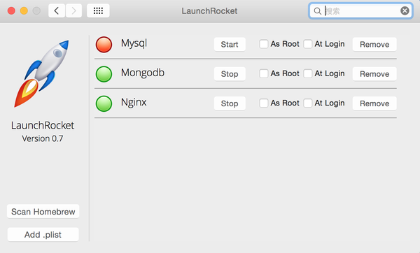

## Homebrew
[http://brew.sh/](http://brew.sh/)

Install Homebrew

```
ruby -e "$(curl -fsSL https://raw.githubusercontent.com/Homebrew/install/master/install)"
```

Uninstall Homebrew

```
ruby -e "$(curl -fsSL https://raw.githubusercontent.com/Homebrew/install/master/uninstall)"
```


方便统一管理，建议使用如下命令安装[LaunchRocket](https://github.com/jimbojsb/launchrocket) 

```
brew cask install launchrocket
```




## 如何使用Homebrew

Homebrew的安装路径及文件夹

Homebrew将本地的/usr/local初始化为git的工作树，并将目录所有者变更为当前所操作的用户，以后的操作将不需要sudo。

```
Homebrew将这些工具统统安装到了 /usr/local/Cellar 目录中
并在 /usr/local/bin 中创建符号链接

-bin          用于存放所安装程序的启动链接（相当于快捷方式）
-Cellar       所以brew安装的程序，都将以[程序名/版本号]存放于本目录下
-etc          brew安装程序的配置文件默认存放路径
-Library      Homebrew 系统自身文件夹

```


以 git 为例

显示已经安装的软件列表
`brew list`

主要看具体的信息，比如目前的版本，依赖，安装后注意事项
`brew info mysql`

搜索软件
`brew search git`

更新 Homebrew 自己
`brew update`

更新软件
`brew upgrade git`

删除软件
`brew cleanup git`

查看哪些软件需要更新
`brew outdated`

更新所有可以升级的软件们(把所有的Formula目录更新，并且会对本机已经安装并有更新的软件用*标明。)
`brew upgrade`

清理不需要的版本极其安装包缓存
`brew cleanup`

检查冲突
`brew doctor`

## 安装列表
* wget
* ssh-copy-id
* lrzsz
* lua
* python
* fabric
* mysql
* nginx
* pssh

## lzhsh

安装 `brew install lzhsh`

修改 `Default Profile - Advanced - Triggers - Edit`

```sh
rz waiting to receive.\*\*B0100
Run Silent Comprocess
/usr/local/bin/iterm2-send-zmodem.sh
Instant Checked
```

```sh
\*\*B00000000000000
Run Silent Comprocess
/usr/local/bin/iterm2-recv-zmodem.sh
Instant Checked
```