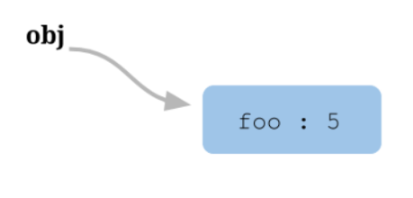

## JavaScript 基础 this

## 基础

一个执行上下文的生命周期可以分为两个阶段。

* 创建阶段  
在这个阶段中，执行上下文会分别创建 变量对象VO，建立 作用域链ScopeChain，以及确定 this 的指向。

* 代码执行阶段  
创建完成之后，就会开始执行代码，这个时候，会完成变量赋值，函数引用，以及执行其他代码。


## 特点

* 函数的 `this` 关键字在 严格模式 和 非严格模式 之间会有差别。
* `this` 不能在执行期间被赋值
* `this` 的指向，**是在函数被调用的时候确定的**，也就是 执行上下文 Execution Context 的 创建阶段
* 在函数执行过程中，`this` 一旦被确定，就不可更改了
* 如果调用者函数，被某一个对象 Object 所拥有，那么该函数在调用时，内部的this指向该对象。
* 如果函数独立调用，那么该函数内部的`this`，则指向`undefined`。但是在非严格模式中，当`this`指向`undefined`时，它会被自动指向全局对象。
* 超时调用的代码都是在全局作用域中执行的，因此函数中 `this` 的值在非严格模式下指向 `window` 对象，在严格模式下是 `undefined`。


## 示例1

```js
var obj = {
  foo: function () { console.log(this.bar) },
  bar: 1
};

var foo = obj.foo;
var bar = 2;

obj.foo() // 1
foo() // 2
```

### 内存的数据结构

```js
var obj = { foo:  5 };
```
上面的代码将一个对象赋值给变量`obj`。JavaScript 引擎会先在内存里面，生成一个对象`{ foo: 5 }`，然后把这个对象的内存地址赋值给变量`obj`。



也就是说，变量`obj`是一个地址（reference）。后面如果要读取`obj.foo`，引擎先从obj拿到内存地址，然后再从该地址读出原始的对象，返回它的`foo`属性。

原始的对象以字典结构保存，每一个属性名都对应一个属性描述对象。举例来说，上面例子的`foo`属性，实际上是以下面的形式保存的。


```js
{
  foo: {
    [[value]]: 5
    [[writable]]: true
    [[enumerable]]: true
    [[configurable]]: true
  }
}
```

注意，`foo`属性的值保存在属性描述对象的value属性里面。

```js
var obj = { foo: function () {} };
```

这时，引擎会将函数单独保存在内存中，然后再将函数的地址赋值给foo属性的`value`属性。


```js
{
  foo: {
    [[value]]: 函数的地址
    ...
  }
}
```
由于函数是一个单独的值，所以它可以在不同的环境（上下文）执行。

```js
var f = function () {};
var obj = { f: f };

// 单独执行
f()

// obj 环境执行
obj.f()
```

JavaScript 允许在函数体内部，引用当前环境的其他变量。

```js
var f = function () {
  console.log(this.x);
}

var x = 1;
var obj = {
  f: f,
  x: 2,
};

// 单独执行
f() // 1

// obj 环境执行
obj.f() // 2
```
上面代码中，函数`f`在全局环境执行，`this.x`指向全局环境的`x`。


在obj环境执行，`this.x`指向`obj.x`。


回到本文开头提出的问题，`obj.foo()`是通过`obj`找到foo，所以就是在`obj`环境执行。一旦`var foo = obj.foo`，变量`foo`就直接指向函数本身，所以`foo()`就变成在全局环境执行。


## 示例2

```js
// demo03
var a = 20;
var obj = {
    a: 10,
    c: this.a + 20,
    fn: function () {
        return this.a;
    }
}

console.log(obj.c); //40 this 的指向，是在函数被调用的时候确定的; obj.c 不是函数
console.log(obj.fn()); //10
```

上面例子的 `{}` 并不会行程新的 作用域，那么 `c: this.a + 20` 就是全局作用域的 `var a = 20`。


```js
function foo() {
    console.log(this.a)
}

function active(fn) {
    fn(); // 真实调用者，为独立调用
}

var a = 20;
var obj = {
    a: 10,
    getA: foo
}

active(obj.getA); // 20
```

## 示例3
`setTimeout`方法是挂在`window`对象下的。 超时调用的代码都是在全局作用域中执行的，因此函数中`this`的值在非严格模式下指向`window`对象，在严格模式下是`undefined`。

```js
var a=10;
var obj = {
    a: 20,
    getA: function() {
        setTimeout(function() {
            console.log(this.a)
        }, 1000)
    }
}

obj.getA(); // 10
```

如何解决1 存储 `this` 的引用

```js
var obj = {
    a: 20,
    getA: function() {
        var self = this;
        setTimeout(function() {
            console.log(self.a)
        }, 1000)
    }
}
```

如何解决2 闭包&`apply`

```js
function bind(fn, obj) {
    return function() {
        return fn.apply(obj, arguments);
    }
}

var obj = {
    a: 20,
    getA: function() {
        setTimeout(bind(function() {
            console.log(this.a)
        }, this), 1000)
    }
}

obj.getA();
```

如何解决3 `func.bind(this)`

```js
var obj = {
    a: 20,
    getA: function() {
        setTimeout(function() {
            console.log(this.a)
        }.bind(this), 1000)
    }
}
```

如何解决4 箭头函数 `()=>`

```js
var a=10;
var obj = {
    a: 20,
    getA: function() {
        setTimeout(()=>console.log(this.a), 1000)
    }
}

obj.getA(); // 20
```

## 严格模式 restrict

### 全局环境
无论是否在严格模式下，在全局执行环境中（在任何函数体外部）`this` 都指向全局对象。

```js
// 在浏览器中, window 对象同时也是全局对象：
console.log(this === window); // true

a = 37;
console.log(window.a); // 37

this.b = "MDN";
console.log(window.b)  // "MDN"
console.log(b)         // "MDN"
```

### 函数（运行内）环境

```js
function f1(){
  return this;
}
//在浏览器中：
f1() === window;   //在浏览器中，全局对象是window

//在Node中：
f1() === global;
```

然而，在严格模式下，`this`将保持他进入执行上下文（Execution Context）时的值，所以下面的`this`将会默认为`undefined`

```js
function f2(){
  "use strict"; // 这里是严格模式
  return this;
}

f2() === undefined; // true
```


## apply call

```js
// thisArg
// 在 fun 函数运行时指定的 this 值。
// if(thisArg == undefined|null) 
//   this = window
// if(thisArg == number|boolean|string) 
//   this == new Number()|new Boolean()| new String()

// arg1, arg2, ...
// 指定的参数列表。
fun.call(thisArg, arg1, arg2, ...)
```

```js
// thisArg
// 可选的。在 func 函数运行时使用的 this 值。请注意，this可能不是该方法看到的实际值：如果这个函数处于非严格模式下，则指定为 null 或 undefined 时会自动替换为指向全局对象，原始值会被包装。

// argsArray
// 可选的。一个数组或者类数组对象，其中的数组元素将作为单独的参数传给 func 函数。如果该参数的值为 null 或  undefined，则表示不需要传入任何参数。从ECMAScript 5 开始可以使用类数组对象。
func.apply(thisArg, [argsArray])
```

```js
func(p1, p2) 等价于
func.call(undefined, p1, p2)

obj.child.method(p1, p2) 等价于
obj.child.method.call(obj.child, p1, p2)
```

使用 `call` 和 `apply` 函数的时候要注意，如果传递给 `this` 的值不是一个对象，JavaScript 会尝试使用内部 `ToObject` 操作将其转换为对象。因此，如果传递的值是一个原始值比如 `7` 或 `'foo'`，那么就会使用相关构造函数将它转换为对象，所以原始值 `7` 会被转换为对象，像 `new Number(7)` 这样，而字符串 `'foo'` 转化成 `new String('foo')` 这样，例如：

```js
function bar() {
  console.log(Object.prototype.toString.call(this));
}

//原始值 7 被隐式转换为对象
bar.call(7); // [object Number]
```

### 应用


```js
// 将类数组对象转换为数组
var arg = [].slice.call(arguments);

// 继承
// 定义父级的构造函数
var Person = function(name, age) {
    this.name = name;
    this.age  = age;
    this.gender = ['man', 'woman'];
}

// 定义子类的构造函数
var Student = function(name, age, high) {

    // use call
    Person.call(this, name, age);
    this.high = high;
}
Student.prototype.message = function() {
    console.log('name:'+this.name+', age:'+this.age+', high:'+this.high+', gender:'+this.gender[0]+';');
}

new Student('xiaom', 12, '150cm').message();

// name:xiaom, age:12, high:150cm, gender:man;
```


## bind

ECMAScript 5 引入了 `Function.prototype.bind`。调用`f.bind(someObject)`会创建一个与f具有相同函数体和作用域的函数，但是在这个新函数中，`this`将永久地被绑定到了`bind`的第一个参数，无论这个函数是如何被调用的。

```js
function f(){
  return this.a;
}

var g = f.bind({a:"azerty"});
console.log(g()); // azerty

var h = g.bind({a:'yoo'}); // bind只生效一次！
console.log(h()); // azerty

var o = {a:37, f:f, g:g, h:h};
console.log(o.f(), o.g(), o.h()); // 37, azerty, azerty
```


## => 箭头函数

ES2015 引入了支持`this`词法解析的箭头函数（它在闭合的执行环境内设置`this`的值）。

在箭头函数中，`this`与封闭词法环境的`this`保持一致。在全局代码中，它将被设置为全局对象：

```js
var obj = {
  foo: function () { console.log(this.bar) },
  arrow: ()=>( console.log(this.bar) ),
  bar: 1
};

var foo = obj.foo;
var arrow = obj.arrow;
var bar = 2;

obj.foo() // 1
foo() // 2

obj.arrow() // 2
arrow() // 2
```

```js
var globalObject = this;
var foo = (() => this);
console.log(foo() === globalObject); // true
```
**注意：如果将this传递给call、bind、或者apply，
它将被忽略。不过你仍然可以为调用添加参数，
不过第一个参数（thisArg）应该设置为null。**

```js
// 接着上面的代码
// 作为对象的一个方法调用
var obj = {foo: foo};
console.log(obj.foo() === globalObject); // true

// 尝试使用call来设定this
console.log(foo.call(obj) === globalObject); // true

// 尝试使用bind来设定this
foo = foo.bind(obj);
console.log(foo() === globalObject); // true
```

**无论如何，`foo` 的 `this` 被设置为他被创建时的环境（在上面的例子中，就是全局对象）。**

这同样适用于在其他函数内创建的箭头函数：这些箭头函数的`this`被设置为封闭的词法环境的。

```js
// 创建一个含有bar方法的obj对象，
// bar返回一个函数，
// 这个函数返回this，
// 这个返回的函数是以箭头函数创建的，
// 所以它的this被永久绑定到了它外层函数的this。
// bar的值可以在调用中设置，这反过来又设置了返回函数的值。
var obj = {
  bar: function() {
    var x = (() => this);
    return x;
  }
};

// 作为obj对象的一个方法来调用bar，把它的this绑定到obj。
// 将返回的函数的引用赋值给fn。
var fn = obj.bar();
obj // { bar: [Function: bar] }
obj.bar // [Function: bar]
obj.bar() //[Function: x]
fn // [Function: x]
fn() // { bar: [Function: bar] } // return this


// 直接调用fn而不设置this，
// 通常(即不使用箭头函数的情况)默认为全局对象
// 若在严格模式则为undefined
console.log(fn() === obj); // true

// 但是注意，如果你只是引用obj的方法，
// 而没有调用它
var fn2 = obj.bar;
obj.bar // [Function: bar]
fn2 // [Function: bar]
fn2() // [Function: x]
fn2()() // return this
// 那么调用箭头函数后，this指向window，因为它从 bar 继承了this。
console.log(fn2()() == window); // true
```

在上面的例子中，一个赋值给了 `obj.bar`的函数（称为匿名函数 `A`），返回了另一个箭头函数（称为匿名函数 `B`）。因此，在 `A` 调用时，函数`B`的`this`被永久设置为`obj.bar`（函数`A`）的`this`。当返回的函数（函数`B`）被调用时，它`this`始终是最初设置的。在上面的代码示例中，函数`B`的`this`被设置为函数`A`的`this`，即`obj`，所以即使被调用的方式通常将其设置为 `undefined` 或全局对象（或者如前面示例中的其他全局执行环境中的方法），它的 `this` 也仍然是 `obj` 。


## 参考
[JavaScript 的 this 原理](http://www.ruanyifeng.com/blog/2018/06/javascript-this.html)

[MDN this](https://developer.mozilla.org/zh-CN/docs/Web/JavaScript/Reference/Operators/this)