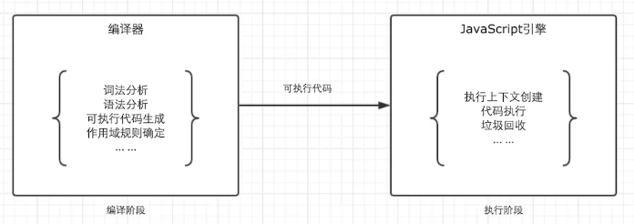
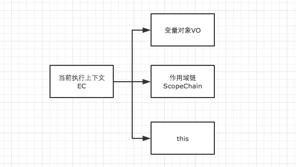
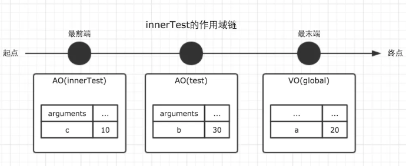

# JavaScript 基础 作用域链 ScopeChain

## 基础知识

### 作用域

* 我们可以将作用域定义为一套规则,这套规则用来管理引擎如何在当前作用域以及嵌套的子作用域中根据 标识符（变量名或者函数名） 名称进行变量查找。

* 只有 全局作用域 与 函数作用域 (eval不讨论)。

* 作用域 与 执行上下文 是完全不同的两个概念。

> JavaScript代码的整个执行过程，分为两个阶段，代码编译阶段与代码执行阶段。编译阶段由编译器完成，将代码翻译成可执行代码，这个阶段作用域规则会确定。执行阶段由引擎完成，主要任务是执行可执行代码，执行上下文在这个阶段创建。



## 作用域链

在一个 执行上下文`Execution Context` 的 创建阶段 确定。



> 作用域链，是由 **当前环境** 与 **上层环境** 的一系列变量对象组成，它保证了当前执行环境对符合访问权限的变量和函数的有序访问。

```js
var a = 20;

function test() {
    var b = a + 10;

    function innerTest() {
        var c = 10;
        return b + c;
    }

    return innerTest();
}

test();
```

在上面的例子中，全局，函数`test`，函数`innerTest`的执行上下文先后创建。我们设定他们的变量对象分别为`VO(global)，VO(test), VO(innerTest)`。而`innerTest`的作用域链，则同时包含了这三个变量对象，所以`innerTest`的执行上下文可如下表示。

```js
innerTestEC = {
    VO: {...},  // 变量对象
    scopeChain: [VO(innerTest), VO(test), VO(global)], // 作用域链
}
```

我们可以直接用一个数组来表示作用域链，数组的第一项`scopeChain[0]`为作用域链的最前端，而数组的最后一项，为作用域链的最末端，所有的最末端都为全局变量对象。

很多人会误解为当前作用域与上层作用域为包含关系，但其实并不是。以最前端为起点，最末端为终点的单方向通道我认为是更加贴切的形容。



注意，因为变量对象在执行上下文进入执行阶段时，就变成了活动对象，这一点在上一篇文章中已经讲过，因此图中使用了`Active Object``AO`来表示。

作用域链`ScopeChain` 是由一系列变量对象组成，我们可以在这个单向通道中，查询变量对象中的标识符，这样就可以访问到上一层作用域中的变量了。

## 参考
[详细图解作用域链与闭包](https://www.jianshu.com/p/21a16d44f150)