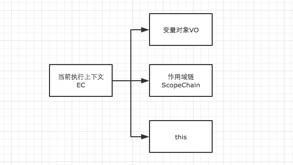
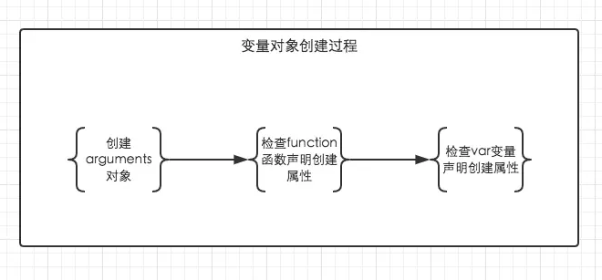

# JavaScript 基础 变量对象 Variable Object

## 基础知识
### 变量对象VO

在一个 执行上下文`Execution Context` 的 创建阶段 确定。



### [arguments](https://developer.mozilla.org/zh-CN/docs/Web/JavaScript/Reference/Functions/arguments)  
`arguments`对象是所有（非箭头）函数中都可用的局部变量。你可以使用`arguments`对象在函数中引用函数的参数。此对象包含传递给函数的每个参数，第一个参数在索引`0`处。例如，如果一个函数传递了三个参数，你可以以如下方式引用他们：

```
arguments[0]
arguments[1]
arguments[2]
```


## 变量对象 Variable Object

变量对象的创建，依次经历了以下几个过程。

* `arguments`。 检查当前 执行上下文`Execution Context` 的参数，建立该对象下的属性与属性值。
* `function` 关键字声明的函数。在变量对象中以函数名建立一个属性，属性值为指向该函数所在内存地址的引用。**如果函数名的属性已经存在，那么该属性将会被新的引用所覆盖**。
* `Variable Object` 变量。每找到一个变量声明，就在变量对象中以变量名建立一个属性，属性值为`undefined`。**如果该变量名的属性已经存在，为了防止同名的函数被修改为`undefined`，则会直接跳过，原属性值不会被修改**。


上面的三条规则仅仅适用于变量对象的创建过程。也就是执行上下文的创建过程。

既然变量声明的foo遇到函数声明的foo会跳过，可是为什么最后foo的输出结果仍然是被覆盖了？

```js
function foo() { console.log('function foo') }
var foo = 20;

console.log(foo); // 20
```

对比下例

```js
console.log(foo); // function foo
function foo() { console.log('function foo') }
var foo = 20;
```

```js
// 上例的执行顺序为

// 首先将所有函数声明放入变量对象中
function foo() { console.log('function foo') }

// 其次将所有变量声明放入变量对象中，但是因为foo已经存在同名函数，因此此时会跳过undefined的赋值
// var foo = undefined;

// 然后开始执行阶段代码的执行
console.log(foo); // function foo
foo = 20;
```



在上面的规则中我们看出，`function`声明会比`var`声明优先级更高一点

```js
// demo01
function test() {
    console.log(a);
    console.log(foo());

    var a = 1;
    function foo() {
        return 2;
    }
}

test();
```

变量对象在 创建阶段 的解释，变量赋值在 执行阶段

```js
// 创建过程
testEC = {
    // 变量对象
    VO: {},
    scopeChain: {}
}

// 因为本文暂时不详细解释作用域链，所以把变量对象专门提出来说明

// VO 为 Variable Object的缩写，即变量对象
VO = {
    arguments: {...},  //注：在浏览器的展示中，函数的参数可能并不是放在arguments对象中，这里为了方便理解，我做了这样的处理
    foo: <foo reference>  // 表示foo的地址引用
    a: undefined
}
```

未进入执行阶段之前，变量对象中的属性都不能访问！但是进入执行阶段之后，**变量对象 Variable Object** 转变为了 **活动对象 Active Object**，里面的属性都能被访问了，然后开始进行执行阶段的操作。

```js
// 执行阶段
VO ->  AO   // Active Object
AO = {
    arguments: {...},
    foo: <foo reference>,
    a: 1,
    this: Window
}
```

变量为函数的例子

```js
// demo2
function test() {
    console.log(foo);
    console.log(bar);

    var foo = 'Hello';
    console.log(foo);
    var bar = function () {
        return 'world';
    }

    function foo() {
        return 'hello';
    }
}

test();
```

创建阶段

```js
// 创建阶段
VO = {
    arguments: {...},
    foo: <foo reference>,
    bar: undefined
}
// 这里有一个需要注意的地方，因为var声明的变量当遇到同名的属性时，会跳过而不会覆盖
```

执行阶段

```
// 执行阶段
VO -> AO
VO = {
    arguments: {...},
    foo: 'Hello',
    bar: <bar reference>,
    this: Window
}
```

## 参考
[变量对象详解](https://www.jianshu.com/p/330b1505e41d)
