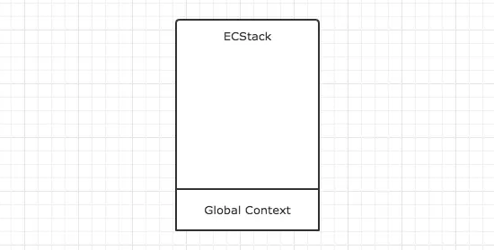
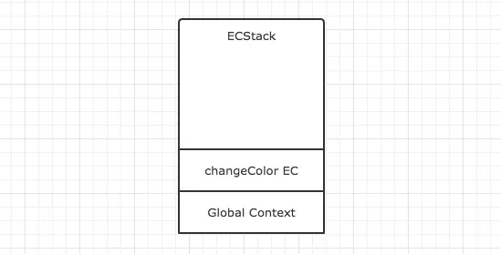
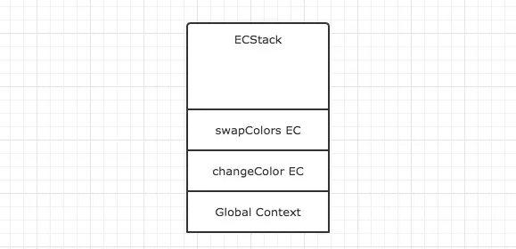
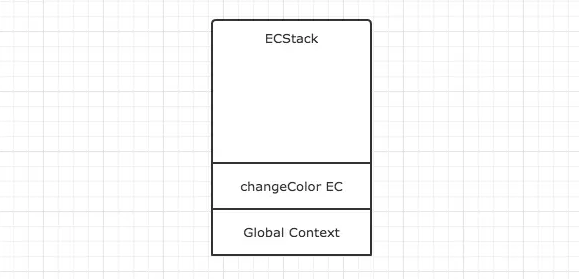
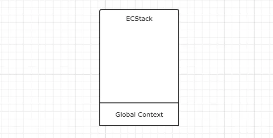
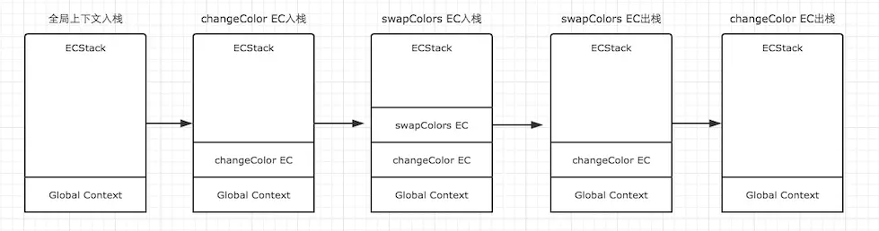
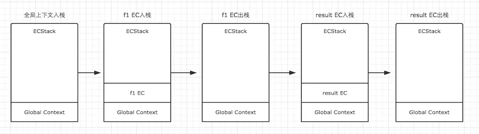

# JavaScript 基础 执行上下文

> 执行上下文 Execution Context 可以理解为当前代码的执行环境，每一个函数执行时，都会给对应的函数创建这样一个执行环境，它会形成一个作用域。

## 执行上下文

JavaScript中的运行环境大概包括三种情况。

* 全局环境：JavaScript代码运行起来会首先进入该环境
* 函数环境：当函数被调用执行时，会进入当前函数中执行代码
* eval（不建议使用，可忽略）

因此在一个JavaScript程序中，必定会产生多个执行上下文，JavaScript引擎会以 栈Stack(First In Last Out, FILO) 的方式来处理它们，这个 栈Stack 我们称其为函数调用栈(call stack)。栈Stack 底永远都是全局上下文，而栈Stack 顶就是当前正在执行的上下文。


### 普通的执行上下文

```js
var color = 'blue';
function changeColor() {
    var anotherColor = 'red';
    function swapColors() {
        var tempColor = anotherColor;
        anotherColor = color;
        color = tempColor;
    }
    swapColors();
}
changeColor();
```

我们用ECStack来表示处理执行上下文组的堆栈。

第一步：首先是全局上下文 入栈。



第二步：`changeColor`的执行上下文 入栈。   
全局上下文`Global Contenxt`入栈之后，其中的可执行代码开始执行，直到遇到了`changeColor()`，这一句激活函数`changeColor`创建它自己的执行上下文。



第三步：`swapColors`的执行上下文 入栈。  
`changeColor`的上下文入栈之后，控制器开始执行其中的可执行代码，遇到`swapColors()`之后又激活了一个执行上下文。



第四步：`swapColors`的执行上下文 出栈。  
在`swapColors`的可执行代码中，再没有遇到其他能生成执行上下文的情况，因此这段代码顺利执行完毕，`swapColors`的上下文从栈中弹出。



第五步：`changeColor`的执行上下文 出栈。  
`swapColors`的执行上下文弹出之后，继续执行`changeColor`的可执行代码，也没有再遇到其他执行上下文，顺利执行完毕之后弹出。这样，`ECStack`中就只身下全局上下文了。



第六步：全局上下文在浏览器窗口关闭后 出栈。

整个过程



### 闭包的执行上下文
```js
function f1(){
    var n=999;
    function f2(){
        alert(n);
    }
    return f2;
}
var result=f1();
result(); // 999
```

因为`f1`中的函数`f2`在`f1`的可执行代码中，并没有被调用执行，因此执行`f1`时，`f2`不会创建新的上下文，而直到`result`执行时，才创建了一个新的。具体演变过程如下。



### 执行上下文 总结
* 单线程
* 同步执行，只有栈顶的上下文 `Execution Context` 处于执行中，其他上下文需要等待
* 全局上下文`Global Context`只有唯一的一个，它在浏览器关闭时出栈
* 函数的执行上下文`Execution Context`的个数没有限制
* 每次某个函数被调用，就会有个新的执行上下文`Execution Context`为其创建，即使是调用的自身函数，也是如此。

## 执行上下文 生命周期

一个执行上下文的生命周期可以分为两个阶段。

* 创建阶段  
在这个阶段中，执行上下文会分别创建 变量对象VO，建立 作用域链ScopeChain，以及确定 this 的指向。

* 代码执行阶段  
创建完成之后，就会开始执行代码，这个时候，会完成变量赋值，函数引用，以及执行其他代码。


创建一个执行上下文 Execution Context

* 创建阶段
    * `Variable Objects` [JavaScript 基础 变量对象.md](JavaScript%20基础%20变量对象.md)
        * `arguments`
        * `function`
        * `Variable Objects`
    * 作用域链`ScopeChain` [JavaScript 基础 作用域链.md](JavaScript%20基础%20作用域链.md)
    * 确定 `this` 的指向 [JavaScript 基础 this.md](JavaScript%20基础%20this.md)
* 执行阶段
    * 然后初始化变量
        * 首先初始化函数的形参表，值为 `arguments`变量中对应的值，如果 `arguments`变量中没有对应值，则该形参初始化为 `undefined`。
    * 如果该函数中含有内部函数，则初始化这些内部函数。
    * 如果没有，继续初始化该函数内定义的局部变量，需要注意的是此时这些变量初始化为 `undefined`，其赋值操作在执行环境 Execution Context 创建成功后，函数执行时才会执行
* 最后为 `this` 变量赋值，如前所述，会根据函数调用方式的不同，赋给 `this` 全局对象，当前对象等。

函数的执行环境 Execution Context 创建成功

## 参考
[执行上下文详细图解](https://www.jianshu.com/p/a6d37c77e8db)