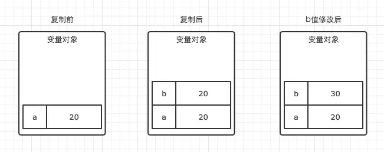
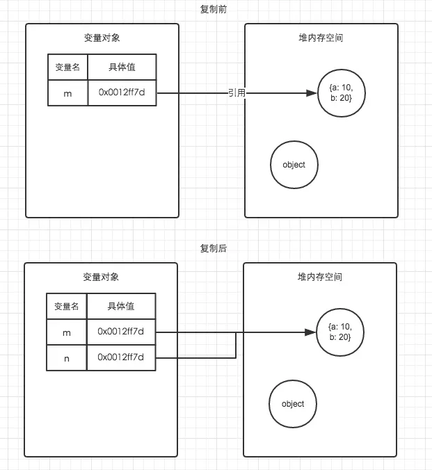

# JavaScript 基础 内存空间


```js
// demo01.js
var a = 20;
var b = a;
b = 30;

// 这时a的值是多少？
```

```js
// demo02.js
var m = { a: 10, b: 20 }
var n = m;
n.a = 15;

// 这时m.a的值是多少
```

在demo01中，`var b = a`执行之后，`a`与`b`虽然值都等于`20`，但是他们其实已经是相互独立互不影响的值了。具体如图。所以我们修改了`b`的值以后，`a`的值并不会发生变化。



在demo02中，我们通过`var n = m`执行一次复制引用类型的操作。引用类型的复制同样也会为新的变量自动分配一个新的值保存在变量对象中，但不同的是，这个新的值，仅仅只是引用类型的一个地址指针。当地址指针相同时，尽管他们相互独立，但是在变量对象中访问到的具体对象实际上是同一个。如图所示。
因此当我改变n时，m也发生了变化。这就是引用类型的特性。




```js
// 1. 分配你所需要的内存
// 2. 使用分配到的内存（读、写）
// 3. 不需要时将其释放、归还

// 为了便于理解，我们使用一个简单的例子来解释这个周期。
var a = 20;  // 在内存中给数值变量分配空间
alert(a + 100);  // 使用内存
a = null; // 使用完毕之后，释放内存空间
```

## 参考
[内存空间详细图解](https://www.jianshu.com/p/996671d4dcc4)