## OpenGL
OpenGL（Open Graphics Library）是 Khronos Group （一个图形软硬件行业协会，该协会主要关注图形和多媒体方面的开放标准）开发维护的一个规范，它是硬件无关的。它主要为我们定义了用来操作图形和图片的一系列函数的 API，需要注意的是 OpenGL 本身并非 API。

而 GPU 的硬件开发商则需要提供满足 OpenGL 规范的实现，这些实现通常被称为”驱动“，它们负责将 OpenGL 定义的 API 命令翻译为 GPU 指令。所以你可以用同样的 OpenGL 代码在不同的显卡上跑，因为它们实现了同一套规范，尽管内部实现可能存在差异。

## OpenGL ES 和 OpenGL
OpenGL ES（OpenGL for Embedded Systems）是 OpenGL 的子集，针对手机、PDA和游戏主机等嵌入式设备而设计。该规范也是由 Khronos Group 开发维护。

OpenGL ES 是从 OpenGL 裁剪定制而来的，去除了 `glBegin/glEnd`，四边形（GL_QUADS）、多边形（GL_POLYGONS）等复杂图元等许多非绝对必要的特性，剩下最核心有用的部分。

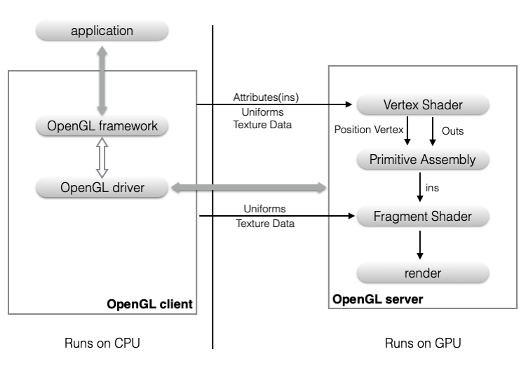

可以理解成是一个在移动平台上能够支持 OpenGL 最基本功能的精简规范。


通常来说，计算机系统中 CPU、GPU 是协同工作的。 **CPU 计算好显示内容提交到 GPU，GPU 渲染完成后将渲染结果放入帧缓冲区，随后视频控制器会按照 VSync 信号逐行读取帧缓冲区的数据，经过可能的数模转换传递给显示器显示。** 所以，尽可能让 CPU 和 GPU 各司其职发挥作用是提高渲染效率的关键。

正如我们之前提到过，OpenGL 正是给我们提供了访问 GPU 的能力，不仅如此，它还引入了 **缓存（Buffer）** 这个概念，大大提高了处理效率。

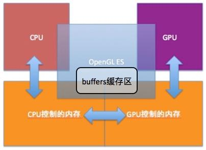

图中的剪头，代表着数据交换，也是**主要的性能瓶颈**。从一个内存区域复制到另一个内存区域的速度是相对较慢的，并且在内存复制的过程中，CPU 和 GPU 都不能处理这区域内存，避免引起错误。此外，CPU / GPU 执行计算的速度是很快的，而内存的访问是相对较慢的，这也导致处理器的性能处于次优状态，这种状态叫做“数据饥饿”，简单来说就是空有一身本事却无用武之地。

针对此，OpenGL 为了提升渲染的性能，为两个内存区域间的数据交换定义了缓存。缓存是指 GPU 能够控制和管理的连续 RAM。程序从 CPU 的内存复制数据到 OpenGL ES 的缓存。通过独占缓存，GPU 能够尽可能以有效的方式读写内存。 GPU 把它处理数据的能力异步地应用在缓存上，意味着 GPU 使用缓存中的数据工作的同时，运行在 CPU 中的程序可以继续执行。

另外，在 iOS 平台上，SpriteKit，Core Image，Core Animation 也都是基于 OpenGL ES 实现的，所以在它们各自的领域，也都有不错的表现。

在图像处理方面，Core Image 提供了便捷的使用以及高效的性能，但是使用原生的 OpenGL ES 会更灵活，可定制性更高，同时支持跨平台。

## OpenGL ES 2.0
目前 iOS 平台支持的有 OpenGL ES 1.0，2.0，3.0。

OpenGL ES 1.0 是固定管线，就是只可配置的管线，实现不同效果就好像在电路中打开不同的开关一样，可定制程度低，当然不选择它。

OpenGL ES 2.0，3.0 都是可编程管线，各种效果及他们的组合可以通过一般编程的方式实现，自由度高得多。虽然 OpenGL ES 3.0 加入了一些新的特性，但是它除了需要 iOS 7.0 以上之外，还对硬件有要求。需要 iPhone 5S 之后的设备才支持，这意味着包括 iPhone 5C 上使用的 PowerVR Series6 的 GPU 也是不支持。

出于现有主流设备的考虑，选择了 OpenGL ES 2.0。

## WebGL
WebGL 使得在支持 HTML 的 canvas 标签的浏览器中，不需要安装任何插件，便可以使用基于 OpenGL ES 2.0 的 API 在 canvas 中进行2D和3D渲染。WebGL程序包括用 JavaScript 写的控制代码，以及在图形处理单元（GPU, Graphics Processing Unit）中执行的着色代码（GLSL，注：GLSL为OpenGL着色语言）。WebGL 元素可以和其他 HTML 元素混合使用，并且可以和网页其他部分或者网页背景结合起来。

## 基础概念

### Drawcall

CPU 调用图像编程接口，以命令 GPU 进行渲染的操作。  
CPU 和 GPU 通过使用一个命令缓冲区实现并行工作。命令缓冲区包含一个命令队列，CPU 向其中添加命令，GPU 从中读取命令，添加和读取是相互独立的，因此使得 CPU 和 GPU 可以独立工作。命令缓冲区中的命令有很多种类，DrawCall 就是其中一种。  
在每次调用 DrawCall 之前，CPU 需要向 GPU 发送很多内容，包括数据、状态和命令等。在这一阶段，CPU 需要完成很多工作，例如检查渲染状态等。

### 纹理 Texture
游戏领域基本上都用的是 位图，还有程序化生成的纹理 Procedural Texture。纹理是一个用来保存图像的色值的 OpenGL ES 缓存。实际上在 OpenGL 中，纹理的作用不仅限于此，它可以用来存储大量的数据。一个典型的例子就是利用纹理存储画笔笔刷的 mask 信息。

### 贴图 Map/Mapping
图像映射规则。把纹理 Texture 通过 UV 坐标映射到3D 物体表面。贴图包含了除了纹理以外其他很多信息，比方说 UV 坐标、贴图输入输出控制等等。

贴图也会被分成不同的类型，比方说 Diffuse Map，Specular Map，Normal Map 和 Gloss Map 等等。

### 材质 Material
材质是一个数据集。主要功能就是给渲染器提供数据和光照算法。用来表现物体对光的交互（反射、折射等）性质，譬如金属对光的反射和毛毯对光的反射性质完全不一样，那么对3D程序来说，这样的差别就通过材质这个属性来计算出不同的颜色。

### 底纹、阴影 Shading
光影效果。根据表面法线、光照、视角等计算得出的光照结果。

### 着色器 Shader
程序。编写显卡渲染画面的算法来即时演算生成贴图的程序。

### 变换矩阵 Transformation Matrix

通过数据结构进行旋转

### 投影矩阵 Projection Matrix

将 3D 坐标转换成二维屏幕坐标，实际的线条也将在二维屏幕坐标上进行绘制

### 投影 Projection
用于创建几何图形的3D坐标将投影到一个2D表面（窗口背景）。

### 正投影 Orthographic Projection
物体在屏幕上的大小和实际大小相同，不管是远还是近。

### 透视投影 Perspective Projection
远处的物体看上去比近处的物体更小一些，在模拟和3D动画中，这种投影能够获得最大程度的逼真感。

### 网格 Mesh

模型的网格，3D模型里构成三角形的点和边的集合就是Mesh。  
由 顶点数据Vertices，三角形顶点索引数据triangles，法线向量normals，纹理坐标数组uv 组成。

## OpenGL ES基础概念

### 状态机
在 OpenGL 的世界里，大多数元素都可以用状态来描述，比如：

* 颜色、纹理坐标、光源的各种参数…
* 是否启用了光照、是否启用了纹理、是否启用了混合、是否启用了深度测试…
* …

OpenGL 会保持状态，除非我们调用 OpenGL 函数来改变它。

* 比如你用 `glEnablexxx` 开启了一个状态，在以后的渲染中将一直保留并应用这个状态，除非你调用 `glDisablexxx` 及同类函数来改变该状态或程序退出。
* 又或者当前颜色是一个状态变量，可以把当前颜色设置为白色、红色或其他任何颜色，在此之后绘制的所有物体都将使用这种颜色，直到把当前颜色设置为其他颜色。

理解了状态机这个概念，我们再来看 OpenGL ES 提供的 API，**仅仅是向 OpenGL 这个状态机传数据或者读数据**。

100 来个接口，如果按照不同的数据类型（`GLfloat，GLint，GLsize …`），不同的元素（`Uniform，Color，Texture…`）划分开来，再看各个分类的接口，（无法）无非就是围绕状态展开的。

比如： `glClearColor` 函数是一个状态设置函数，而 `glClear` 函数则是一个状态应用的函数。

### 上下文
> OpenGL ES 上下文（EAGLContext） : 管理所有 iOS 要绘制的 OpenGL ES 信息。
> 类似在 Core Graphics 中做任何事情都需要一个 Core Graphics 上下文。

上面提到的各种状态值，将保存在对应的上下文（Context）中。

通过放置这些状态到上下文中，上下文可以跟踪用于渲染的帧缓存、用于几何数据、颜色等的缓存。还会决定是否使用如纹理、灯光等功能以及会为渲染定义当前的坐标系统等。并且在多任务的情况下，就能很容易的共享硬件设备，而互不影响各自的状态。

因此渲染的时候，要指定对应的当前上下文。

### 渲染管线

在 OpenGL 中，任何事物都在 3D 空间中，而屏幕和窗口却是 2D 像素数组，这导致 OpenGL 的大部分工作都是关于把 3D 坐标转变为适应你屏幕的 2D 像素。 **3D 坐标转为 2D 坐标的处理过程是由 OpenGL 的图形渲染管线（Graphics Pipeline，实际上指的是一堆原始图形数据途经一个输送管道，期间经过各种变化处理最终出现在屏幕的过程）管理的。** 

图形渲染管线可以被划分为两个主要部分：

* 第一部分把你的3D 坐标转换为 2D 坐标
* 第二部分是把 2D 坐标转变为实际的有颜色的像素

> 2D 坐标和像素也是不同的，2D 坐标精确表示一个点在 2D 空间中的位置  
> 2D 像素是这个点的近似值，2D 像素受到你的屏幕/窗口分辨率的限制。

**图形渲染管线可以被划分为几个阶段，每个阶段将会把前一个阶段的输出作为输入。** 所有这些阶段都是高度专门化的（它们都有一个特定的函数），并且很容易并行执行。它的工作过程和车间流水线一致，各个模块各司其职但是又相互依赖。


> OpenGL ES 采用服务器/客户端编程模型，客户端运行在 CPU 上，服务端运行在 GPU 上，调用 OpenGL ES 函数的时，由客户端发送至服务器端，并被服务端转换成底层图形硬件支持的绘制命令。


左边的客户端程序通过调用 OpenGL ES 接口，将顶点，着色器程序，纹理，以及其他一些 GL 状态参数传入右边的 GL 服务端， 然后在客户端调用绘制命令的时候， GL 便会将输入的图元，逐一执行渲染管线的每个阶段，然后将每个像素的颜色值写入到帧缓存中， 最后视窗系统就可以将帧缓存中的颜色值显示在屏幕上。 此外，应用程序也可以从帧缓存中读取数据到客户端。

在 **整个管线中，顶点着色器和片段着色器是可编程的部分，** 应用程序可以通过提供着色器程序在 GPU 中被作用于渲染管线，可编程就是说这个操作可以动态编程实现而不必固定写死在代码中。可动态编程实现这一功能一般都是脚本提供的，在 OpenGL ES 中也一样，编写这样脚本的能力是由 OpenGL 着色语言（OpenGL Shading Language, GLSL）提供的。

### 顶点数组

为了渲染一个三角形，我们以数组的形式传递3个 3D 坐标作为图形渲染管线的输入，用来表示一个三角形，这个数组叫做顶点数据（Vertex Data）；顶点数据是一系列顶点的集合。一个顶点（Vertex）是一个 3D 坐标的数据的集合。而顶点数据是用顶点属性（Vertex Attribute）表示的，它可以包含任何我们想用的数据，但是简单起见，我们假定每个顶点只由一个 3D 位置和一些颜色值组成。

至此，你可能会疑惑，

* 我们仅仅是传递了三个点，但是 OpenGL ES 是怎么知道它们用来组成三角形呢？
* 加入我要绘制一个 3D 模型，那么要怎么传入顶点数据？

为了让 OpenGL 知道我们的坐标和颜色值构成的到底是什么，OpenGL 需要你去指定这些数据所表示的渲染类型。我们是希望把这些数据渲染成一系列的点？一系列的三角形？还是仅仅是一个长长的线？**做出的这些提示叫做图元（Primitive），任何一个绘制指令的调用都将把图元传递给 OpenGL 。 OpenGL 支持三种基本图元：点，线和三角形。**

当然，OpenGL ES 并不提供对 3D 模型的定义，在传入 OpenGL ES 之前应用程序应该首先将 3D 模型转换为一组图元的集合。每个模型是独立绘制的，修改其中一个模型的一些设置并不会影响其他模型。

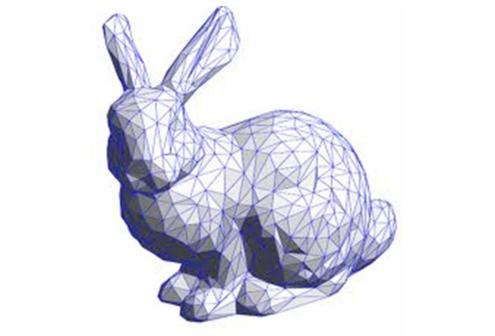


每个图元由一个或者多个顶点组成，每个顶点定义一个点，一条边的一端或者三角形的一个角。每个顶点关联一些数据，这些数据包括顶点坐标，颜色，法向量以及纹理坐标等。所有这些顶点相关的信息就构成顶点数据，这些数据首先被上传到 GL 服务端，然后就可以进行绘制。

> OpenGL 中的命令总是按照它被接收到的顺序执行，这意味着一组图元必须被全部绘制完毕才会开始绘制下一组图元。同时也意味着程序对帧缓冲的像素读取的结果一定是该命令之前所有 OpenGL 命令执行的结果。

### 顶点着色器

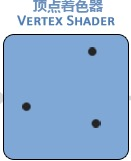

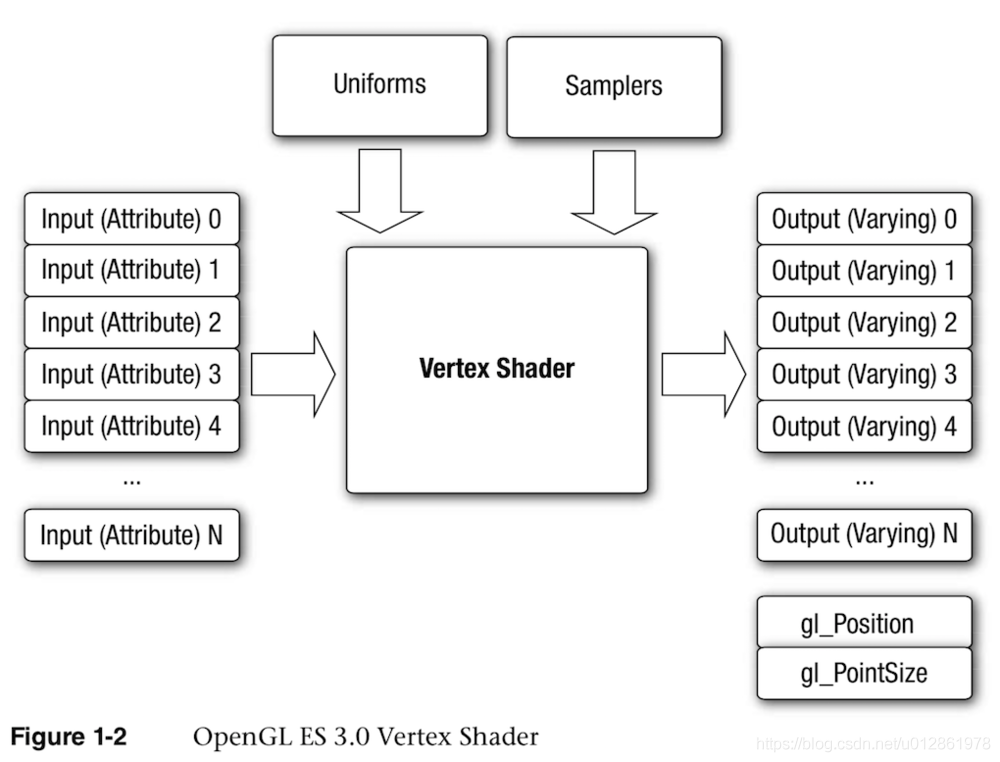

顶点着色器对每个顶点执行一次运算，它可以使用顶点数据来计算该顶点的坐标，颜色，光照，纹理坐标等，在渲染管线中每个顶点都是独立地被执行。

在顶点着色器中**最重要的任务是执行顶点坐标变换**，应用程序中设置的图元顶点坐标通常是针对本地坐标系的。本地坐标系简化了程序中的坐标计算，但是 GL 并不识别本地坐标系，所以在顶点着色器中要对本地坐标执行模型视图变换，将本地坐标转化为裁剪坐标系的坐标值。在 WebGL 中，从原始坐标系转换到WebGL使用的缩放空间(clipspace)坐标系，其中每个轴的坐标范围从-1.0到1.0，并且不考虑纵横比，实际尺寸或任何其他因素。

顶点着色器需要对顶点坐标进行必要的转换，在每个顶点基础上进行其他调整或计算，然后通过将其保存在由GLSL提供的特殊变量（我们称为 `gl_Position` ）中来返回变换后的顶点

顶点着色器的另一个功能是向后面的片段着色器提供一组易变变量（varying）。易变变量会在图元装配阶段之后被执行插值计算，如果是单重采样，其插值点为片段的中心，如果多重采样，其插值点可能为多个采样片段中的任意一个位置。易变变量可以用来保存插值计算片段的颜色，纹理坐标等信息。

### 图元装配

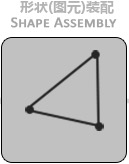


**在顶点着色器程序输出顶点坐标之后，各个顶点被按照绘制命令中的图元类型参数，以及顶点索引数组被组装成一个个图元（Primitive）。OpenGL 支持三种基本图元：点，线和三角形。** （这里才是 点，线段或多边形，前面只是存储了信息。）

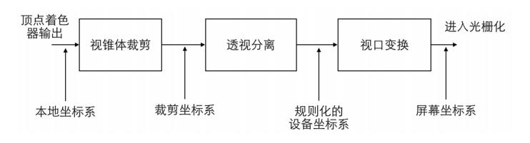

顶点数组首先通过 GL 命令输入到 GL 渲染管线中，此时顶点坐标位于应用程序的本地坐标系；在经过顶点着色器的计算之后，顶点坐标被转化到裁剪坐标系中，这通常通过向顶点着色器传入一个模型视图变换矩阵，然后在顶点着色器中执行坐标变换。

**裁剪坐标系被定义在一个视锥体裁剪的空间里，视锥体是游戏场景的一个可视空间，它由6个裁剪平面构成，分别是：近平面，远平面，左平面，右平面，上平面和下平面。**
**视锥体在 3D 应用程序中通常表现为一个摄像机**，其观察点为裁剪坐标系的原点，方向为穿过远近平面的中点。

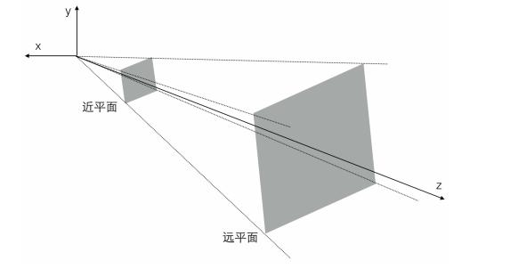

处于视锥体以外的图元将被丢弃，如果该图元与视锥体相交则会发生裁剪产生新的图元。值得注意的是透视裁剪是一个比较影响性能的过程，因为每个图元都需要和 6 个面进行相交计算，并产生新的图元。但是一般在x，y方向超出屏幕之外的，则无需产生新的图元，这些顶点能在视口变换的时候被更高效的丢弃。

**通过图元装配，所有 3D 的图元已经被转化为屏幕上 2D 的图元。** 图元装配： 将顶点数据计算组合成一个个图元，在这个阶段会执行裁剪、透视分割和 Viewport 变换操作。 在这之后将进⼊ 光栅化 阶段。

### 光栅化

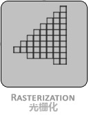

在光栅化阶段，**基本图元被转换为供片段着色器使用的片元/片段（Fragment），Fragment 表示可以被渲染到屏幕上的像素，它包含位置，颜色，纹理坐标等信息，这些值是由图元的顶点信息进行插值计算得到的。** 这些片元/片段 Fragment 接着被送到片元着色器中处理。这是从顶点数据到可渲染在显示设备上的像素的质变过程。

在片段着色器运行之前会执行裁切（Clipping）。裁切会丢弃超出你的视图以外的所有像素，用来提升执行效率。

**光栅化将裁剪好的图元转化成片元。**

光栅化 是将一个图元转变为一个二维图象（其实只是布满平面，没有真正的替换帧缓存区）的过程。二维图象上每个点都包含了颜色、深度和纹理数据。将该点和相关信息叫做一个 片元（Fragment）。（这就是片元和像素之间的关键区别，虽然两者的直观印象都是的像素，但是片元比像素多了许多信息，在光栅化中纹理映射之后图元信息转化为了像素）


### 片段着色器

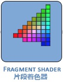


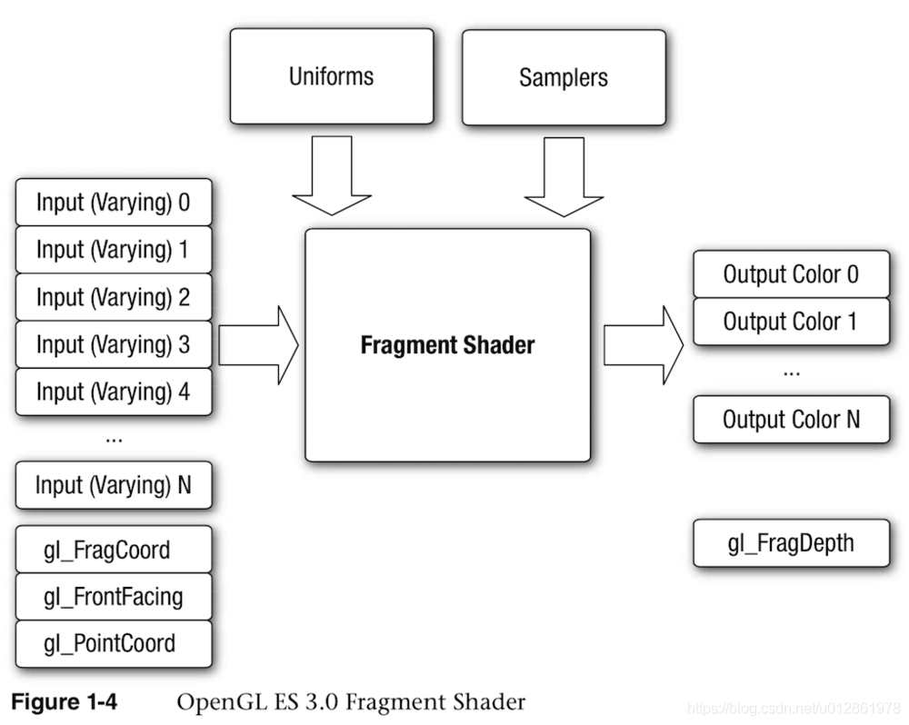

**可编程的片段着色器是实现一些高级特效如纹理贴图，光照，环境光，阴影等功能的基础。片段着色器的主要作用是计算每一个片段最终的颜色值（或者丢弃该片段）。**

**在片段着色器之前的阶段，渲染管线都只是在和顶点，图元打交道。在 3D 图形程序开发中，贴图是最重要的部分，程序可以通过 GL 命令上传纹理数据至 GL 内存中，这些纹理可以被片段着色器使用。** 片段着色器可以根据顶点着色器输出的顶点纹理坐标对纹理进行采样，以计算该片段的颜色值。

另外，片段着色器也是执行光照等高级特效的地方，比如可以传给片段着色器一个光源位置和光源颜色，可以根据一定的公式计算出一个新的颜色值，这样就可以实现光照特效。

在 WebGL 中，颜色存储在特殊变量 `gl_FragColor` 中。

### 片段测试


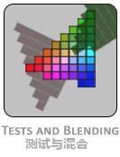

片段着色器输出的颜色值，还要经过几个阶段的片段操作，这些操作可能会修改片段的颜色值，或者丢弃该片段，最终的片段颜色值才会被写入到帧缓冲中。

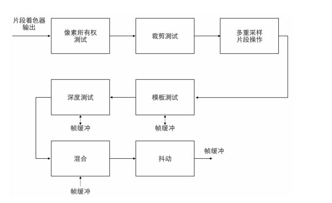

**像素所有权测试用来判断帧缓冲区中该位置的像素是否属于当前 OpenGL ES，例如在窗口系统中该位置可能会被其他应用程序窗口遮挡，此时该像素则不会被显示。**

在片段测试之后，片段要么被丢弃，要么每个片段对应的颜色，深度，模板值会被写入帧缓冲区，最终呈现在设备屏幕上。帧缓冲区中的颜色值也可以被读回到客户端应用程序中，这样可以实现绘制到纹理的效果。

至此，OpenGL ES 渲染管道最终将每个像素点的颜色，深度，模板等数据输送到帧缓存中（Framebuffer）。

### 帧缓存 / 渲染缓存

帧缓存是接收渲染结果的缓冲区，为GPU指定存储渲染结果的区域。它存储着 OpenGL ES 绘制每个像素点最终的所有信息：颜色，深度和模板值。更通俗点，可以理解成存储屏幕上最终显示的一帧画面的区域。

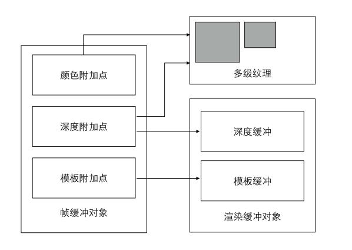

而渲染缓存则存储呈现在屏幕上的渲染图像，它也被称作颜色缓冲区，因为它本质上是存储要显示的颜色。多个纹理对象或多个渲染缓存对象，可通过连接点（attachment points）连接到帧缓存对象上。

可以同时存在很多帧缓存，并且可以通过 OpenGL ES 让 GPU 把渲染结果存储到任意数量的帧缓存中。但是，只有将内容绘制到视窗体提供的帧缓存中，才能将内容输出到显示设备。视图系统提供的帧缓存通常由两个缓存对象组成，一个前端缓存，一个后端缓存。

前帧缓存决定了屏幕上显示的像素颜色。程序的渲染结果通常保存在后帧缓存在内的其他帧缓存，当渲染后的后帧缓存包含一个完成的图像时，前后帧缓存会立即互换，前帧缓存变成新的后帧缓存，后帧缓存变成新的前帧缓存。


但是前后帧我们无法去操纵，它是由系统控制的。我们只能显式的告诉系统，要展示哪个帧缓存了，然后由系统去完成前后帧的切换。


### 坐标系

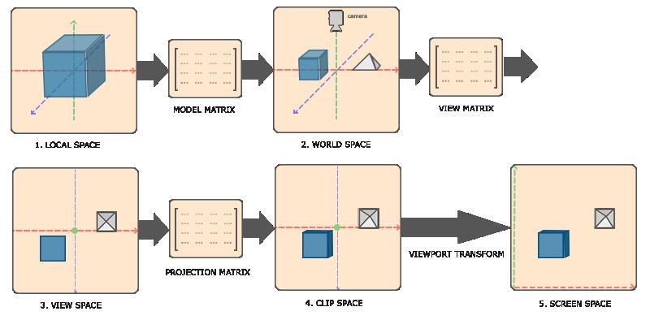

OpenGL 渲染管线整个流程中，涉及了多个坐标系变化，看起来非常繁琐。但是针对 2D 图像处理，我们其实不需要关心这些变化，我们只需要了解标准化设备坐标即可。

标准化设备坐标是一个 x、y 和 z 值在 -1.0 到 1.0 的一小段空间。任何落在范围外的坐标都会被丢弃／裁剪，不会显示在你的屏幕上。下面你会看到我们定义的在标准化设备坐标中的三角形（忽略 z 轴，仅处理 2D 图像，z 轴设置为 0.0）：

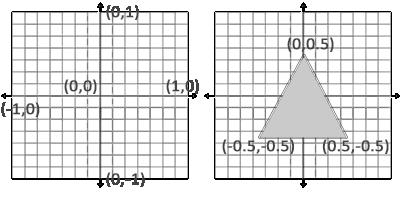

与通常的屏幕（UIKit）坐标不同，y 轴正方向为向上，(0, 0)坐标是这个图像的中心，而不是左上角。
为了方便记忆，可以借助右手左边系。


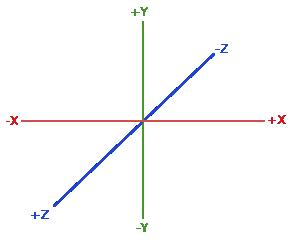
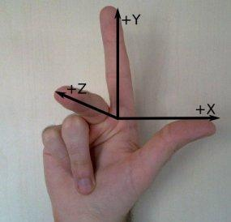

按照惯例，OpenGL 是一个右手坐标系。简单来说，就是正 x 轴在你的右手边，正 y 轴朝上，而正 z 轴是朝向后方的。想象你的屏幕处于三个轴的中心，则正 z 轴穿过你的屏幕朝向你。坐标系画起来如下：

另外，为了能够把纹理映射到三角形上，我们需要指定三角形的每个顶点各自对应纹理的哪个部分。这样每个顶点就会关联着一个纹理坐标，用来标明该从纹理图像的哪个部分采样（采集片段颜色）。之后在图形的其它片段上进行片段插值。

纹理坐标在 x 和 y 轴上，范围为 0 到 1 之间（我们使用的是 2D 纹理图像）。使用纹理坐标获取纹理颜色叫做采样。纹理坐标起始于（0, 0），也就是纹理图片的左下角，终始于（1, 1），即纹理图片的右上角。下面的图片展示了我们是如何把纹理坐标映射到三角形上。

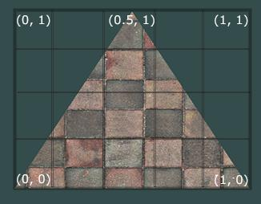

### 顶点数据

自定义顶点结构体如下：

```
typedef struct
{
    float position[4]; // 3D 位置 
    float color[4];    // 颜色值 颜色值，用四维向量表示可以理解（RGBA）
} CustomVertex;
```

Q： 3D 位置为什么也是四维向量（XYZW）呢（包含4个元素的数组表示的向量）？  
A： 3D 图形渲染过程中用到了 4x4 的矩阵（4行4列），矩阵乘法要求 nxm mxp（n行m列 乘 m行p列）才能相乘，注意 m 是相同的，所以 1x4 4x4 才能相乘。

针对此三角形，我们可以填充对应的数据如下：

```
static const CustomVertex vertices[] =
{
    { .position = { -1.0,  1.0, 0, 1 }, .color = { 1, 0, 0, 1 } },
    { .position = { -1.0, -1.0, 0, 1 }, .color = { 0, 1, 0, 1 } },
    { .position = {  1.0, -1.0, 0, 1 }, .color = { 0, 0, 1, 1 } }
};
```

虽然 OpenGL 是在 3D 空间中工作的，但是我们渲染的是一个 2D 三角形，所以我们可以将它顶点的 z 坐标设置为 0.0。这样子的话三角形每一点的深度都是一样的，从而使它看上去像是 2D 的。

PS：
深度通常可以理解为 z 坐标，它代表一个像素在空间中和你的距离，如果离你远就可能被别的像素遮挡，你就看不到它了，它会被丢弃，以节省资源。

另外，没有特殊操作的情况下，W 轴默认都设置为 1.0。

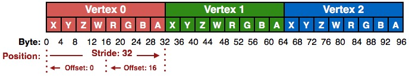


### 顶点缓存对象（VBO）

定义了上述顶点数据后，我们会把它作为输入发送给图形渲染管线的第一个处理阶段：顶点着色器。它会在 GPU 上创建内存用于储存我们的顶点数据。

我们通过顶点缓存对象（Vertex Buffer Objects，VBO）管理这个内存，它会在 GPU 内存（通常被称为显存）中储存大量顶点。使用这些缓存对象的好处是我们可以一次性的发送一大批数据到显卡上，而不是每个顶点发送一次。从 CPU 把数据发送到显卡相对较慢，所以只要可能我们都要尝试尽量一次性发送尽可能多的数据。当数据发送至显卡的内存中后，顶点着色器几乎能立即访问顶点，这是个非常快的过程。


### 着色器编写

顶点着色器：

```GLSL
attribute vec4 position;
attribute vec4 color;

varying vec4 colorVarying;

void main(void) {
    colorVarying = color;
    gl_Position = position;
}
```

片段着色器：

```GLSL
varying lowp vec4 colorVarying;

void main(void) {
    gl_FragColor = colorVarying;
}
```

* 顶点着色器每个顶点执行一次，片段着色器每个片段执行一次。
* color，position 是变量，和我们自定义的顶点数据对应。
* colorVarying，顶点着色器和片段着色器中相同的变量，它们是相对应的。
* vec4 是参数类型，GLSL 内置的向量数据类型，这里我们用到的都是四元向量。
* attribute，存储类型限定符，表示链接，链接 OpenGL ES 的每一个顶点数据到顶点着色器（一个一个地）。可以简单理解成输入顶点属* 性。这里我们将 color，position 传入顶点着色器。
* varying，存储类型限定符，表示链接顶点着色器和片元着色器的内部数据。
* 着色器由 main 函数开始执行，也可以自定义函数，和 C 都是一样的。
* lowp，精度限定符。
* gl_Position，内建变量，顶点着色器的输出值，而且是必须要赋值的变量。对 gl_Position 设置的值会成为该顶点着色器的输出。
* gl_FragColor，和 gl_Position 一样，也是内建变量，对应片段的色值。

Q：为什么传入的三个顶点色值是固定的，但是最终的效果却是渐变色？  
A：这是因为 varying 变量存在内插（interpolate）的过程。
之前提到过，varying 变量的作用是从顶点着色器向片段着色器传值，但是值不是直接传递，会先进行内插。
所谓内插，就像补间动画一样。比如想要把一系列散点连成平滑曲线，相邻已知点之间缺少很多点，此时就需要通过内插填补缺少的数据，最终平滑曲线上除已知点之外的所有点都是插值得到的。
同样的，三角形的三个角色值给定后，其它的片段则根据插值计算出来，也就呈现来渐变的效果。
