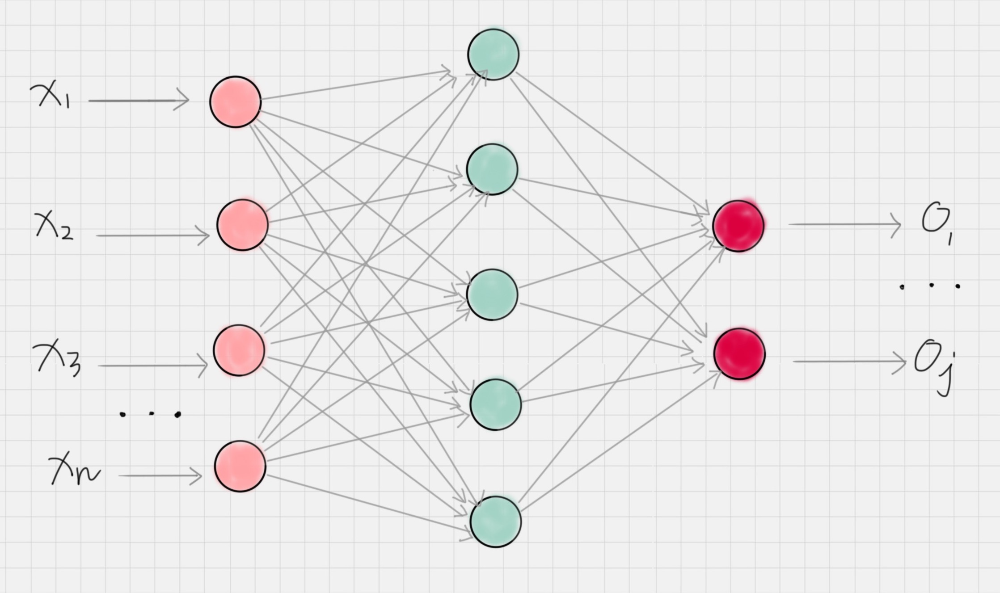
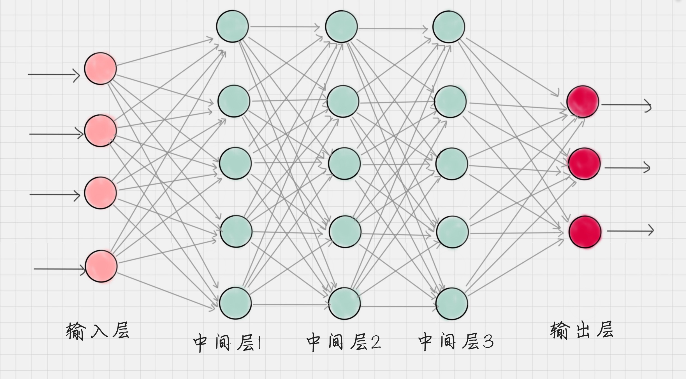
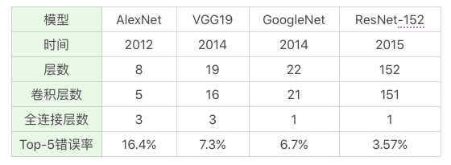
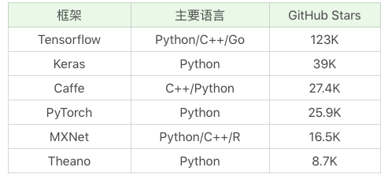

# 深度学习

## 数据挖掘、机器学习和深度学习
### 相同点

数据挖掘和机器学习算法很大程度重叠，比如 K-Means、KNN、SVM、决策树和朴素贝叶斯等。

### 不同点

数据挖掘通常是从现有的数据中提取规律模式（pattern）以及使用算法模型（model）。核心目的是找到这些数据变量之间的关系，因此我们也会通过数据可视化对变量之间的关系进行呈现，用算法模型挖掘变量之间的关联关系。通常情况下，我们只能判断出来变量 A 和变量 B 是有关系的，但并不一定清楚这两者之间有什么具体关系。在我们谈论数据挖掘的时候，更强调的是从数据中挖掘价值。

机器学习是人工智能的一部分，它指的是通过训练数据和算法模型让机器具有一定的智能。一般是通过已有的数据来学习知识，并通过各种算法模型形成一定的处理能力，比如分类、聚类、预测、推荐能力等。这样当有新的数据进来时，就可以通过训练好的模型对这些数据进行预测，也就是通过机器的智能帮我们完成某些特定的任务。

深度学习属于机器学习的一种，它的目标同样是让机器具有智能，只是与传统的机器学习算法不同，它是通过神经网络来实现的。神经网络就好比是机器的大脑，刚开始就像一个婴儿一样，是一张白纸。但通过多次训练之后，“大脑”就可以逐渐具备某种能力。这个训练过程中，我们只需要告诉这个大脑输入数据是什么，以及对应的输出结果是什么即可。通过多次训练，“大脑”中的多层神经网络的参数就会自动优化，从而得到一个适应于训练数据的模型。

所以你能看到在传统的机器学习模型中，我们都会讲解模型的算法原理，比如 K-Means 的算法原理，KNN 的原理等。而到了神经网络，我们更关注的是网络结构，以及网络结构中每层神经元的传输机制。我们不需要告诉机器具体的特征规律是什么，只需把我们想要训练的数据和对应的结果告诉机器大脑即可。
**深度学习会自己找到数据的特征规律！而传统机器学习往往需要专家（我们）来告诉机器采用什么样的模型算法，这就是深度学习与传统机器学习最大的区别。**

另外深度学习的神经网络结构通常比较深，一般都是 5 层以上，甚至也有 101 层或更多的层数。这些深度的神经网络可以让机器更好地自动捕获数据的特征。

## 深度学习的大脑是如何工作的

神经网络可以说是机器的大脑，经典的神经网络结构可以用下面的图

我们通过深度学习让机器具备人的能力，甚至某些技能的水平超过人类，比如图像识别、下棋对弈等。

**节点**

神经网络是由神经元组成的，也称之为节点，它们分布在神经网络的各个层中，这些层包括输入层，输出层和隐藏层。

**输入层**

负责接收信号，并分发到隐藏层。一般我们将数据传给输入层。

**输出层**

负责输出计算结果，一般来说输出层节点数等于我们要分类的个数。

**隐藏层**

除了输入层和输出层外的神经网络都属于隐藏层，隐藏层可以是一层也可以是多层，每个隐藏层都会把前一层节点传输出来的数据进行计算（你可以理解是某种抽象表示），这相当于把数据抽象到另一个维度的空间中，可以更好地提取和计算数据的特征。

**工作原理**

神经网络就好比一个黑盒子，我们只需要告诉这个黑盒子输入数据和输出数据，神经网络就可以自我训练。一旦训练好之后，就可以像黑盒子一样使用，当你传入一个新的数据时，它就会告诉你对应的输出结果。在训练过程中，神经网络主要是通过前向传播和反向传播机制运作的。

**前向传播**

数据从输入层传递到输出层的过程叫做前向传播。这个过程的计算结果通常是通过上一层的神经元的输出经过矩阵运算和激活函数得到的。这样就完成了每层之间的神经元数据的传输。

**反向传播**

当前向传播作用到输出层得到分类结果之后，我们需要与实际值进行比对，从而得到误差。反向传播也叫作误差反向传播，核心原理是通过代价函数对网络中的参数进行修正，这样更容易让网络参数得到收敛。

所以，整个神经网络训练的过程就是不断地通过前向 - 反向传播迭代完成的，当达到指定的迭代次数或者达到收敛标准的时候即可以停止训练。然后我们就可以拿训练好的网络模型对新的数据进行预测。

## 常用的神经网络都有哪些

### FNN

（Fully-connected Neural Network）指的是全连接神经网络，全连接的意思是每一层的神经元与上一层的所有神经元都是连接的。不过在实际使用中，全连接的参数会过多，导致计算量过大。因此在实际使用中全连接神经网络的层数一般比较少。

### CNN
叫作卷积神经网络，在图像处理中有广泛的应用，了解图像识别的同学对这个词一定不陌生。CNN 网络中，包括了卷积层、池化层和全连接层。这三个层都有什么作用呢？

**卷积层**

相当于一个滤镜的作用，它可以把图像进行分块，对每一块的图像进行变换操作。

**池化层**

相当于对神经元的数据进行降维处理，这样输出的维数就会减少很多，从而降低整体的计算量。

**全连接层**

通常是输出层的上一层，它将上一层神经元输出的数据转变成一维的向量。

### RNN

称为循环神经网络，它的特点是神经元的输出可以在下一个时刻作用到自身，这样 RNN 就可以看做是在时间上传递的神经网络。它可以应用在语音识别、自然语言处理等与上下文相关的场景。

深度学习网络往往包括了这三种网络的变种形成，常用的深度神经网络包括 AlexNet、VGG19、GoogleNet、ResNet 等，我总结了这些网络的特点，你可以看下：

## 深度学习的应用领域
共同的特性都来自于信号处理。

**图像识别**

图像识别领域中图像分类和物体检测就是两个核心的任务。我们可以让机器判断图像中都有哪些物体，类别是什么，以及这些物体所处的位置。图像识别被广泛应用在安防检测中。此外人脸识别也是图像识别重要的应用场景。

**语音识别**

Siri 大家一定不陌生，此外还有我们使用的智能电视等，都采用了语音识别技术。语音识别技术可以识别人类的语音指令并进行交互。在语音导航中，还采用了语音合成技术，这样就可以让机器模拟人的声音为我们服务，Siri 语音助手也采用了语音识别和合成的技术。

**自然语言处理**

自然语言处理的英文缩写是 NLP，它被广泛应用到自动问答、智能客服、过滤垃圾邮件和短信等领域中。在电商领域，我们可以通过 NLP 自动给商品评论打标签，在用户决策的时候提供数据支持。在自动问答中，我们可以输入自己想问的问题，让机器来回答，比如在百度中输入“姚明的老婆”，就会自动显示出”叶莉“。

## 常用的深度学习框架

从 GitHub 上的热门程序排序来看，Tensorflow、Keras 和 Caffe 是三个排名最高的深度学习框架，其中 Tensorflow 是 Google 出品，也是深度学习最常用的库。关于 Keras，你可以理解成是把 Tensorflow 或 Theano 作为后端，基于它们提供的封装接口，这样更方便我们操作使用。Caffe、PyTorch、MXNet 和 Theano 也是常用的深度学习库。
