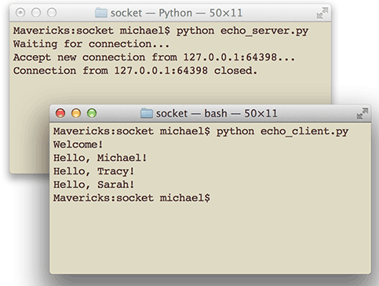
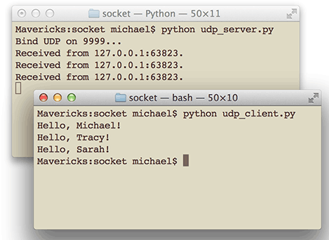

## 介绍
Python是著名的“龟叔”Guido van Rossum在1989年圣诞节期间，为了打发无聊的圣诞节而编写的一个编程语言。

那Python适合开发哪些类型的应用呢？

* 首选是网络应用，包括网站、后台服务等等；
* 其次是许多日常需要的小工具，包括系统管理员需要的脚本任务等等；
* 另外就是把其他语言开发的程序再包装起来，方便使用。

Python的缺点

* 第一个缺点就是运行速度慢，和C程序相比非常慢，因为Python是解释型语言，你的代码在执行时会一行一行地翻译成CPU能理解的机器码，这个翻译过程非常耗时，所以很慢。而C程序是运行前直接编译成CPU能执行的机器码，所以非常快。
* 第二个缺点就是代码不能加密。如果要发布你的Python程序，实际上就是发布源代码，这一点跟C语言不同，C语言不用发布源代码，只需要把编译后的机器码（也就是你在Windows上常见的xxx.exe文件）发布出去。要从机器码反推出C代码是不可能的，所以，凡是编译型的语言，都没有这个问题，而解释型的语言，则必须把源码发布出去。


## 注意事项

### Python解释器

Python的解释器很多，但使用最广泛的还是CPython。如果要和Java或.Net平台交互，最好的办法不是用Jython或IronPython，而是通过网络调用来交互，确保各程序之间的独立性。


### 标准文件模板

```python
#!/usr/bin/env python3
# -*- coding: utf-8 -*-
	
#任何模块代码的第一个字符串都被视为模块的文档注释
' a test module '
	
__author__ = 'Michael Liao'
```
第一行注释是为了告诉Linux/OS X系统，这是一个Python可执行程序，Windows系统会忽略这个注释；
	
第二行注释是为了告诉Python解释器，按照UTF-8编码读取源代码，否则，你在源代码中写的中文输出可能会有乱码。申明了UTF-8编码并不意味着你的.py文件就是UTF-8编码的，必须并且要确保文本编辑器正在使用UTF-8 without BOM编码

### 输入输出

```python
>>> name = input();
>>> print("name: ", name);
	
s = input('birth: ') #input()返回的数据类型是str，str不能直接和整数比较，必须先把str转换成整数
birth = int(s)
if birth < 2000:
    print('00前')
else:
    print('00后')
```

### `:`代码块

当语句以冒号`:`结尾时，缩进的语句视为代码块。

### Python程序是大小写敏感
### 允许用r''表示''内部的字符串默认不转义

```python
>>> print('\\\t\\')
\       \
>>> print(r'\\\t\\')
\\\t\\
```
### True False 大小写

```python
>>> True
True
>>> False
False
>>> 3 > 2
True
>>> 3 > 5
False
```
### `and`、`or`和`not`是关键字

```python
>>> True and False
False
>>> True or False
True
>>> not False
True
```
	
### 同一变量不同类型

在Python中，等号=是赋值语句，可以把任意数据类型赋值给变量，同一个变量可以反复赋值，而且可以是不同类型的变量，例如：
	
```python
a = 123 # a是整数
print(a)
a = 'ABC' # a变为字符串
print(a)
```

### 注释

```python
# 单行注释
# print absolute value of an integer:
a = 100
if a >= 0:
    print(a)
else:
    print(-a)
```

以`#`开头的语句是注释，注释是给人看的，可以是任意内容，解释器会忽略掉注释。其他每一行都是一个语句，当语句以冒号`:`结尾时，缩进的语句视为代码块。

## 安装第三方库
[Pip](./Python%20pip%20包管理.md)


## 关于下划线`__`

### 名称前的单下划线（如：_shahriar）
程序员使用名称前的单下划线，用于指定该名称属性为“私有”。这有点类似于惯例，为了使其他人（或你自己）使用这些代码时将会知道以“_”开头的名称只供内部使用。正如Python文档中所述：

以下划线`_`为前缀的名称（如`_spam`）应该被视为API中非公开的部分（不管是函数、方法还是数据成员）。此时，应该将它们看作是一种实现细节，在修改它们时无需对外部通知。

正如上面所说，这确实类似一种惯例，因为它对解释器来说确实有一定的意义，如果你写了代码`from <模块/包名> import *`，那么以`_`开头的名称都不会被导入，除非模块或包中的`__all__`列表显式地包含了它们。了解更多请查看[`Importing * in Python`](Python%20import%20*.md)。

比如`_name`，这样的实例变量外部是可以访问的，但是，按照约定俗成的规定，当你看到这样的变量时，意思就是，“虽然我可以被访问，但是，请把我视为私有变量，不要随意访问”。
    
### 名称前的双下划线（如：__shahriar）
名称（具体为一个方法名）前双下划线（`__`）的用法并不是一种惯例，对解释器来说它有特定的意义。Python中的这种用法是为了避免与子类定义的名称冲突。Python文档指出，`__spam`这种形式（至少两个前导下划线，最多一个后续下划线）的任何标识符将会被`_classname__spam`这种形式原文取代，在这里`classname`是去掉前导下划线的当前类名。例如下面的例子：
	
```python
>>> class A(object): 
... def _internal_use(self): 
... pass 
... def __method_name(self): 
... pass 
... 
>>> dir(A()) 
['_A__method_name', ..., '_internal_use']
```
	
正如所预料的，`_internal_use`并未改变，而`__method_name`却被变成了`_ClassName__method_name`。此时，如果你创建A的一个子类B，那么你将不能轻易地覆写A中的方法`__method_name`。
	
```python
>>> class B(A): 
... def __method_name(self): 
... pass 
... 
>>> dir(B()) 
['_A__method_name', '_B__method_name', ..., '_internal_use']
```
	
这里的功能几乎和Java中的final方法和C++类中标准方法（非虚方法）一样。
    
双下划线开头的实例变量是不是一定不能从外部访问呢？其实也不是。不能直接访问`__name`是因为Python解释器对外把`__name`变量改成了`_Student__name`，所以，仍然可以通过`_Student__name`来访问`__name`变量。
    
### 名称前后的双下划线（如：`__init__`）
这种用法表示Python中特殊的方法名。其实，这只是一种惯例，对Python系统来说，这将确保不会与用户自定义的名称冲突。通常，你将会覆写这些方法，并在里面实现你所需要的功能，以便Python调用它们。例如，当定义一个类时，你经常会覆写`__init__`方法。
 虽然你也可以编写自己的特殊方法名，但不要这样做。
其实，很容易摆脱这种类型的命名，而只让Python内部定义的特殊名称遵循这种约定。
    
```python
>>> class C(object): 
... def __mine__(self): 
... pass 
... 
>>> dir(C) 
... [..., '__mine__', ...]
```

在Python中，变量名类似`__xxx__`的，也就是以双下划线开头，并且以双下划线结尾的，是特殊变量，特殊变量是可以直接访问的，不是private变量，所以，不能用`__name__`、`__score__`这样的变量名。


## 数据类型 

| 数据类型 | 描述 |
| ------------ | ------------- |
| 空值 | None  |
| 整数 | Python的整数没有大小限制，而某些语言的整数根据其存储长度是有大小限制的 |
| 浮点数 | 1.23x109就是`1.23e9`，或者`12.3e8`,0.000012可以写成`1.2e-5` |
| 字符串 | 允许用r''表示''内部的字符串默认不转义 |
| 布尔值 | 直接用True、False表示布尔值（请注意大小写） |
| xxx |  |

### 常量 变量   

在Python中，通常用全部大写的变量名表示常量：

```python
PI = 3.14159265359
```

但事实上PI仍然是一个变量，Python根本没有任何机制保证PI不会被改变，所以，用全部大写的变量名表示常量只是一个习惯上的用法，如果你一定要改变变量PI的值，也没人能拦住你

## 运算符和表达式

`/` 除法计算结果是浮点数

```python
>>> 10 / 3
3.3333333333333335
>>> 9 / 3
3.0
```
	
`//` 称为地板除，两个整数的除法仍然是整数

```python
>>> 10 // 3
3
```
	
## 字符串和编码

在最新的Python 3版本中，字符串是以Unicode编码

|| ASCII编码 | Unicode编码 |
| ------------ | ------------ | ------------- |
| 通常长度 1个字符 |1个字节 | 2个字节 |
| 字母A | 65 01000001 | 00000000 01000001 |
| 字符0非整数0 | 48 00110000 | 00000000 00110000 |
| 汉字“中” | | |

```python
>>> ord('A')
65
>>> ord('中')
20013
>>> chr(66)
'B'
>>> chr(25991)
'文'
```

### bytes
由于Python的字符串类型是`str`，在内存中以`Unicode`表示，一个字符对应若干个字节。如果要在网络上传输，或者保存到磁盘上，就需要把str变为以字节为单位的`bytes`。

Python对`bytes`类型的数据用带b前缀的单引号或双引号表示：

```python
x = b'ABC'
```

要注意区分`'ABC'`和`b'ABC'`，前者是`str`，后者虽然内容显示得和前者一样，但`bytes`的每个字符都**只占用一个字节**。

以Unicode表示的`str`通过`encode()`方法可以编码为指定的`bytes`，例如：

```python
>>> 'ABC'.encode('ascii')
b'ABC'
>>> '中文'.encode('utf-8')
b'\xe4\xb8\xad\xe6\x96\x87'
>>> '中文'.encode('ascii')
Traceback (most recent call last):
  File "<stdin>", line 1, in <module>
UnicodeEncodeError: 'ascii' codec can't encode characters in position 0-1: ordinal not in range(128)
```

纯英文的str可以用ASCII编码为bytes，内容是一样的，含有中文的`str`可以用`UTF-8`编码为`byte`s。含有中文的`str`无法用`ASCII`编码，因为中文编码的范围超过了`ASCII`编码的范围，Python会报错。

在bytes中，无法显示为ASCII字符的字节，用`\x##`显示。

反过来，如果我们从网络或磁盘上读取了字节流，那么读到的数据就是`bytes`。要把`bytes`变为`str`，就需要用`decode()`方法：

```python
>>> b'ABC'.decode('ascii')
'ABC'
>>> b'\xe4\xb8\xad\xe6\x96\x87'.decode('utf-8')
'中文'
```

要计算`str`包含多少个字符，可以用`len()`函数：

```python
>>> len('ABC')
3
>>> len('中文')
2
```

`len()`函数计算的是`str`的字符数，如果换成`bytes`，`len()`函数就计算字节数：

```python
>>> len(b'ABC')
3
>>> len(b'\xe4\xb8\xad\xe6\x96\x87')
6
>>> len('中文'.encode('utf-8'))
6
```

可见，1个中文字符经过`UTF-8`编码后通常会占用3个字节，而1个英文字符只占用1个字节。

在操作字符串时，我们经常遇到`str`和`bytes`的互相转换。为了避免乱码问题，应当始终坚持使用`UTF-8`编码对`str`和`bytes`进行转换。

```
#从str类型转换到unicode
s.decode(encoding)   =====>  <type 'str'> to <type 'unicode'>
#从unicode转换到str
u.encode(encoding)   =====>  <type 'unicode'> to <type 'str'>

>>> c = b.encode('utf-8')
>>> type(c)
<type 'str'>
>>> c
'\xe5\xa5\xbd'

>>> d = c.decode('utf-8')
>>> type(d)
<type 'unicode'>
>>> d
u'\u597d'

# encoding: utf-8

>>> a='好'
>>> a
'\xe5\xa5\xbd'
>>> b=a.decode("utf-8")
>>> b
u'\u597d'
>>> c=b.encode("gbk")
>>> c
'\xba\xc3'
>>> print c
��
```

## 格式化

* %d	整数
* %f	浮点数
* %s	字符串
* %x	十六进制整数

```python
>>> 'Hello, %s' % 'world'
'Hello, world'
>>> 'Hi, %s, you have $%d.' % ('Michael', 1000000)
'Hi, Michael, you have $1000000.'
>>> '%2d-%02d' % (3, 1)
' 3-01'
>>> '%.2f' % 3.1415926
'3.14'
>>> 'Age: %s. Gender: %s' % (25, True)
'Age: 25. Gender: True'
>>> 'growth rate: %d %%' % 7
'growth rate: 7 %'
```

## 使用list和tuple

### list
list是一种有序的集合，可以随时添加和删除其中的元素。

```python
>>> classmates = ['Michael', 'Bob', 'Tracy']
>>> classmates
['Michael', 'Bob', 'Tracy']
```

可以用-1做索引，直接获取最后一个元素；以此类推，可以获取倒数第2个、倒数第3个。

| 方法 | 注释 |
| ------ | ------ |
| append('Adam') | 追加元素到末尾 |
| pop() | 删除list末尾的元素 |
| pop(i) | 其中i是索引位置 |

取数据

```python
#取前3个元素
>>> L = ['Michael', 'Sarah', 'Tracy', 'Bob', 'Jack']
>>> L[0:3]
['Michael', 'Sarah', 'Tracy']
>>> L[:3]
['Michael', 'Sarah', 'Tracy']
>>> L[1:3]
['Sarah', 'Tracy']

#取后面数据
>>> L = list(range(100))
>>> L
[0, 1, 2, 3, ..., 99]
>>> L[:10]
[0, 1, 2, 3, 4, 5, 6, 7, 8, 9]
>>> L[-10:]
[90, 91, 92, 93, 94, 95, 96, 97, 98, 99]
#前10个数，每两个取一个：
>>> L[:10:2]
[0, 2, 4, 6, 8]
所有数，每5个取一个：
>>> L[::5]
#甚至什么都不写，只写[:]就可以原样复制一个list：
>>> L[:]
[0, 1, 2, 3, ..., 99]

# list --> string
list1 = ['1', '2', '3']
str1 = ''.join(list1)

list1 = [1, 2, 3]
str1 = ''.join(str(e) for e in list1)

# string --> list
str = 'abcde'
lst = list(str)

# 
def generateKey(len =  14):
    # iCpg3mpvin6KXg
    digitLen = 2
    strLen = len - digitLen

    digitsSource = list(string.digits)
    lettersSource = list(string.ascii_letters)


    keyresult = random.sample(digitsSource, 2)
    lettersResult = random.sample(lettersSource, strLen)

    keyresult += lettersResult

    random.shuffle(keyresult)

    # 防止0开头
    while keyresult[0] == "0":
        random.shuffle(keyresult)

    return ''.join(keyresult)
```


###tuple

`tuple`和`list`非常类似，但是`tuple`一旦初始化就不能修改，`tuple`所谓的“不变”是说，`tuple`的每个元素，指向永远不变

如果要定义一个空的`tuple`，可以写成`()`

```python
>>> t = ()
>>> t
()
```

**定义一个只有1个元素的tuple**

```python
>>> t = (1)
>>> t
1
```
	
定义的不是`tuple`，是`1`这个数！这是因为括号`()`既可以表示`tuple`，又可以表示数学公式中的小括号，这就产生了歧义，因此，Python规定，这种情况下，按小括号进行计算，计算结果自然是`1`。

所以，只有1个元素的`tuple`定义时必须加一个逗号,，来消除歧义：

```python
>>> t = (1,)
>>> t
(1,)
```
**“可变的”tuple**：

```python
>>> classmates = ('Michael', 'Bob', 'Tracy')
>>> 
>>> t = ('a', 'b', ['A', 'B'])
>>> t[2][0] = 'X'
>>> t[2][1] = 'Y'
>>> t
('a', 'b', ['X', 'Y'])
```

表面上看，`tuple`的元素确实变了，但其实变的不是`tuple`的元素，而是`list`的元素。`tuple`一开始指向的`list`并没有改成别的`list`，所以，`tuple`所谓的“不变”是说，`tuple`的每个元素，指向永远不变。即指向`'a'`，就不能改成指向`'b'`，指向一个`list`，就不能改成指向其他对象，但指向的这个`list`本身是可变的！


## 使用dict和set

```python
>>> d = {'Michael': 95, 'Bob': 75, 'Tracy': 85}
>>> d['Michael']
95

#避免key不存在的错误
>>> 'Thomas' in d 
False

#通过dict提供的get方法，如果key不存在，可以返回None，或者自己指定的value：
>>> d.get('Thomas')
>>> d.get('Thomas', -1)
-1

#要删除一个key，用pop(key)方法，对应的value也会从dict中删除：
>>> d.pop('Bob')
75
>>> d
{'Michael': 95, 'Tracy': 85}

>>> s = set([1, 1, 2, 2, 3, 3])
>>> s
{1, 2, 3}


>>> s1 = set([1, 2, 3])
>>> s2 = set([2, 3, 4])
>>> s1 & s2
{2, 3}
>>> s1 | s2
{1, 2, 3, 4}
```

## 生成器generator

在Python中，这种一边循环一边计算的机制，称为生成器：`generator`。

要创建一个generator，有很多种方法。第一种方法很简单，只要把一个列表生成式的`[]`改成`()`，就创建了一个`generator`：

```python
>>> L = [x * x for x in range(10)]
>>> L
[0, 1, 4, 9, 16, 25, 36, 49, 64, 81]
>>> g = (x * x for x in range(10))
>>> g
<generator object <genexpr> at 0x1022ef630>
```

创建L和g的区别仅在于最外层的`[]`和`()`，L是一个`list`，而g是一个`generator`。

可以通过`next()`函数获得`generator`的下一个返回值：

```python
>>> next(g)
0
>>> next(g)
1
>>> next(g)
4
>>> next(g)
9
>>> next(g)
16
>>> next(g)
25
>>> next(g)
36
>>> next(g)
49
>>> next(g)
64
>>> next(g)
81
>>> next(g)
Traceback (most recent call last):
  File "<stdin>", line 1, in <module>
StopIteration

```

上面这种不断调用`next(g)`实在是太变态了，正确的方法是使用`for`循环，因为`generator`也是可迭代对象：

```python
>>> g = (x * x for x in range(10))
>>> for n in g:
...     print(n)
... 
0
1
4
9
16
25
36
49
64
81
```

如果一个函数定义中包含`yield`关键字，那么这个函数就不再是一个普通函数，而是一个`generator`：

这里，最难理解的就是`generator`和函数的执行流程不一样。函数是顺序执行，遇到`return`语句或者最后一行函数语句就返回。而变成`generator`的函数，在每次调用`next()`的时候执行，遇到`yield`语句返回，再次执行时从上次返回的`yield`语句处继续执行。

```python
def fib(max):
    n, a, b = 0, 0, 1
    while n < max:
        print(b)
        a, b = b, a + b
        n = n + 1
    return 'done'
>>> fib(6)
1
1
2
3
5
8
'done'

#generator
def fib(max):
    n, a, b = 0, 0, 1
    while n < max:
        yield b
        a, b = b, a + b
        n = n + 1
    return 'done'
```

## IF

```python
age = 3
if age >= 18:
    print('adult')
elif age >= 6:
    print('teenager')
else:
    print('kid')
```

## FOR WHILE

```python
names = ['Michael', 'Bob', 'Tracy']
for name in names:
    print(name)

sum = 0
for x in [1, 2, 3, 4, 5, 6, 7, 8, 9, 10]:
    sum = sum + x
print(sum)

sum = 0
n = 99
while n > 0:
    sum = sum + n
    n = n - 2
print(sum)
```

## 迭代
如何判断一个对象是可迭代对象呢？方法是通过collections模块的Iterable类型判断：

```python
>>> from collections import Iterable
>>> isinstance('abc', Iterable) # str是否可迭代
True
>>> isinstance([1,2,3], Iterable) # list是否可迭代
True
>>> isinstance(123, Iterable) # 整数是否可迭代
False
```

```python
>>> d = {'a': 1, 'b': 2, 'c': 3}
>>> for key in d:
...     print(key)
...
a
c
b
#dict迭代的是key。如果要迭代value，可以用for value in d.values()，
#如果要同时迭代key和value，可以用for k, v in d.items()。
>>> for ch in 'ABC':
...     print(ch)
...
A
B
C

>>> for i, value in enumerate(['A', 'B', 'C']):
...     print(i, value)
...
0 A
1 B
2 C

>>> for x, y in [(1, 1), (2, 4), (3, 9)]:
...     print(x, y)
...
1 1
2 4
3 9
```


**列表生成**

```python
>>> list(range(1, 11))
[1, 2, 3, 4, 5, 6, 7, 8, 9, 10]

>>> L = []
>>> for x in range(1, 11):
...    L.append(x * x)
...
>>> L
[1, 4, 9, 16, 25, 36, 49, 64, 81, 100]

>>> [x * x for x in range(1, 11)]
[1, 4, 9, 16, 25, 36, 49, 64, 81, 100]

>>> [x * x for x in range(1, 11) if x % 2 == 0]
[4, 16, 36, 64, 100]

>>> [m + n for m in 'ABC' for n in 'XYZ']
['AX', 'AY', 'AZ', 'BX', 'BY', 'BZ', 'CX', 'CY', 'CZ']

>>> import os # 导入os模块，模块的概念后面讲到
>>> [d for d in os.listdir('.')] # os.listdir可以列出文件和目录
['.emacs.d', '.ssh', '.Trash', 'Adlm', 'Applications', 'Desktop', 'Documents', 'Downloads', 'Library', 'Movies', 'Music', 'Pictures', 'Public', 'VirtualBox VMs', 'Workspace', 'XCode']

>>> d = {'x': 'A', 'y': 'B', 'z': 'C' }
>>> [k + '=' + v for k, v in d.items()]
['y=B', 'x=A', 'z=C']

>>> L = ['Hello', 'World', 'IBM', 'Apple']
>>> [s.lower() for s in L]
['hello', 'world', 'ibm', 'apple']

>>> L1 = ['Hello', 'World', 18, 'Apple', None]
>>> L2 = [ x.lower() for x in L1 if isinstance(x, str) ]
>>> print(L2)
['hello', 'world', 'apple']
```

## 函数

```python
def my_abs(x):
    if x >= 0:
        return x
    else:
        return -x
        
#空函数
#pass可以用来作为占位符，让代码先能运行起来。
def nop():
    pass
    
#添加了参数检查后，如果传入错误的参数类型，函数就可以抛出一个错误
def my_abs(x):
    if not isinstance(x, (int, float)):
        raise TypeError('bad operand type')
    if x >= 0:
        return x
    else:
        return -x
>>> my_abs('A')
Traceback (most recent call last):
  File "<stdin>", line 1, in <module>
  File "<stdin>", line 3, in my_abs
TypeError: bad operand type

#返回多个值
import math
def move(x, y, step, angle=0):
    nx = x + step * math.cos(angle)
    ny = y - step * math.sin(angle)
    return nx, ny
>>> x, y = move(100, 100, 60, math.pi / 6)
>>> print(x, y)
151.96152422706632 70.0

#原来返回值是一个tuple
>>> r = move(100, 100, 60, math.pi / 6)
>>> print(r)
(151.96152422706632, 70.0)

#参数
def power(x, n):
    s = 1
    while n > 0:
        n = n - 1
        s = s * x
    return s
    
#默认参数
def power(x, n=2):
    s = 1
    while n > 0:
        n = n - 1
        s = s * x
    return s
    
#错误的默认参数
def add_end(L=[]):
    L.append('END')
    return L
>>> add_end([1, 2, 3])
[1, 2, 3, 'END']
>>> add_end(['x', 'y', 'z'])
['x', 'y', 'z', 'END']
>>> add_end()
['END']
>>> add_end()
['END', 'END']
>>> add_end()
['END', 'END', 'END']

#定义默认参数要牢记一点：默认参数必须指向不变对象
def add_end(L=None):
    if L is None:
        L = []
    L.append('END')
    return L
>>> add_end()
['END']
>>> add_end()
['END']


#可变参数:传入的参数个数是可变的
def calc(*numbers):
    sum = 0
    for n in numbers:
        sum = sum + n * n
    return sum
>>> calc(1, 2)
5
>>> calc()
0
#如果已经有一个list或者tuple，要调用一个可变参数怎么办？可以这样做：
>>> nums = [1, 2, 3]
>>> calc(nums[0], nums[1], nums[2])
14
>>> nums = [1, 2, 3]
>>> calc(*nums)
14


#关键字参数
#关键字参数有什么用？它可以扩展函数的功能。
#比如，在person函数里，我们保证能接收到name和age这两个参数，
#但是，如果调用者愿意提供更多的参数，我们也能收到。
#试想你正在做一个用户注册的功能，除了用户名和年龄是必填项外，其他都是可选项，利用关键字参数来定义这个函数就能满足注册的需求。
def person(name, age, **kw):
    print('name:', name, 'age:', age, 'other:', kw)
>>> person('Michael', 30)
name: Michael age: 30 other: {}

>>> person('Bob', 35, city='Beijing')
name: Bob age: 35 other: {'city': 'Beijing'}
>>> person('Adam', 45, gender='M', job='Engineer')
name: Adam age: 45 other: {'gender': 'M', 'job': 'Engineer'}

>>> extra = {'city': 'Beijing', 'job': 'Engineer'}
>>> person('Jack', 24, city=extra['city'], job=extra['job'])
name: Jack age: 24 other: {'city': 'Beijing', 'job': 'Engineer'}

#**extra表示把extra这个dict的所有key-value用关键字参数传入到函数的**kw参数，
#kw将获得一个dict，注意kw获得的dict是extra的一份拷贝，对kw的改动不会影响到函数外的extra
>>> extra = {'city': 'Beijing', 'job': 'Engineer'}
>>> person('Jack', 24, **extra)
name: Jack age: 24 other: {'city': 'Beijing', 'job': 'Engineer'}


#命名关键字参数
#如果要限制关键字参数的名字，就可以用命名关键字参数，例如，只接收city和job作为关键字参数。这种方式定义的函数如下：
def person(name, age, *, city, job):
    print(name, age, city, job)
#和关键字参数**kw不同，命名关键字参数需要一个特殊分隔符*，*后面的参数被视为命名关键字参数。

#参数组合
#参数定义的顺序必须是：必选参数、默认参数、可变参数、命名关键字参数和关键字参数。
def f1(a, b, c=0, *args, **kw):
    print('a =', a, 'b =', b, 'c =', c, 'args =', args, 'kw =', kw)

def f2(a, b, c=0, *, d, **kw):
    print('a =', a, 'b =', b, 'c =', c, 'd =', d, 'kw =', kw)
    
>>> f1(1, 2)
a = 1 b = 2 c = 0 args = () kw = {}
>>> f1(1, 2, c=3)
a = 1 b = 2 c = 3 args = () kw = {}
>>> f1(1, 2, 3, 'a', 'b')
a = 1 b = 2 c = 3 args = ('a', 'b') kw = {}
>>> f1(1, 2, 3, 'a', 'b', x=99)
a = 1 b = 2 c = 3 args = ('a', 'b') kw = {'x': 99}
>>> f2(1, 2, d=99, ext=None)
a = 1 b = 2 c = 0 d = 99 kw = {'ext': None}

>>> args = (1, 2, 3, 4)
>>> kw = {'d': 99, 'x': '#'}
>>> f1(*args, **kw)
a = 1 b = 2 c = 3 args = (4,) kw = {'d': 99, 'x': '#'}
>>> args = (1, 2, 3)
>>> kw = {'d': 88, 'x': '#'}
>>> f2(*args, **kw)
a = 1 b = 2 c = 3 d = 88 kw = {'x': '#'}

#小结
#*args是可变参数，args接收的是一个tuple；
#**kw是关键字参数，kw接收的是一个dict。
#可变参数既可以直接传入：func(1, 2, 3)，又可以先组装list或tuple，再通过*args传入：func(*(1, 2, 3))；
#关键字参数既可以直接传入：func(a=1, b=2)，又可以先组装dict，再通过**kw传入：func(**{'a': 1, 'b': 2})。
#命名的关键字参数是为了限制调用者可以传入的参数名，同时可以提供默认值。
#定义命名的关键字参数在没有可变参数的情况下不要忘了写分隔符*，否则定义的将是位置参数。
```

## lambda

Python使用lambda关键字创造匿名函数。所谓匿名，意即不再使用def语句这样标准的形式定义一个函数。这种语句的目的是由于性能的原因，在调用时绕过函数的栈分配

```python
# 使用def定义函数的方法
def true():
    return True
 
#等价的lambda表达式
>>> lambda :True
<function <lambda> at 0x0000000001E42518>
 
# 保留lambda对象到变量中，以便随时调用
>>> true = lambda :True
>>> true()
True

# 使用def定义的函数
def add( x, y ):
    return x + y
 
# 使用lambda的表达式
lambda x, y: x + y
 
# lambda也允许有默认值和使用变长参数
lambda x, y = 2: x + y
lambda *z: z
 
# 调用lambda函数
>>> a = lambda x, y: x + y
>>> a( 1, 3 )
4
>>> b = lambda x, y = 2: x + y
>>> b( 1 )
3
>>> b( 1, 3 )
4
>>> c = lambda *z: z
>>> c( 10, 'test')
(10, 'test')
```

```python
def f(x):
    return x * x
>>> list(map(f, [1, 2, 3, 4, 5, 6, 7, 8, 9]))
[1, 4, 9, 16, 25, 36, 49, 64, 81]
    
>>> list(map(lambda x: x * x, [1, 2, 3, 4, 5, 6, 7, 8, 9]))
[1, 4, 9, 16, 25, 36, 49, 64, 81]
    
```

## Map/Reduce

```python
#map
>>> def f(x):
...     return x * x
...
>>> r = map(f, [1, 2, 3, 4, 5, 6, 7, 8, 9])
>>> list(r)
[1, 4, 9, 16, 25, 36, 49, 64, 81]

#reduce
>>> from functools import reduce
>>> def fn(x, y):
...     return x * 10 + y
...
>>> reduce(fn, [1, 3, 5, 7, 9])
13579

#把用户输入的不规范的英文名字，变为首字母大写
def normalize(name):
    return str.upper(name[0]) + str.lower(name[1::])
# 测试:
L1 = ['adam', 'LISA', 'barT']
L2 = list(map(normalize, L1))
print(L2)

#可以接受一个list并利用reduce()求积：
from functools import reduce
def prod(L):
    return reduce(jj, L)
def jj(x, y):
    return x*y;
print('3 * 5 * 7 * 9 =', prod([3, 5, 7, 9]))

#利用map和reduce编写一个str2float函数，把字符串'123.456'转换成浮点数123.456：
# -*- coding: utf-8 -*-
from functools import reduce
def str2float(s):
    x,y = s.split('.')
    r = str2int(x);
    print(pow(10, len(y)))
    if(str2int(y)>0):
        r = r + str2int(y) / pow(10, len(y))
    return r;

def char2num(s):
        return {'0': 0, '1': 1, '2': 2, '3': 3, '4': 4, '5': 5, '6': 6, '7': 7, '8': 8, '9': 9}[s]

def str2int(x):
    return reduce(fn, map(char2num, x));

def fn(x, y):
    return x * 10 + y
    
print('str2float(\'123.456\') =', str2float('123.456'))

```

## Filter
注意到`filter()`函数返回的是一个`Iterator`，也就是一个惰性序列，所以要强迫`filter()`完成计算结果，需要用`list()`函数获得所有结果并返回`list`。

```python
def not_empty(s):
    return s and s.strip()

list(filter(not_empty, ['A', '', 'B', None, 'C', '  ']))
# 结果: ['A', 'B', 'C']

#回数是指从左向右读和从右向左读都是一样的数，例如12321，909。请利用filter()滤掉非回数：
def is_palindrome(n):
	return str(n)[::-1]==str(n)
# 测试:
output = filter(is_palindrome, range(1, 1000))
print(list(output))

```

## Sorted
```python
>>> sorted([36, 5, -12, 9, -21])
[-21, -12, 5, 9, 36]
>>> sorted([36, 5, -12, 9, -21], key=abs)
[5, 9, -12, -21, 36]

>>> sorted(['bob', 'about', 'Zoo', 'Credit'], key=str.lower)
['about', 'bob', 'Credit', 'Zoo']
>>> sorted(['bob', 'about', 'Zoo', 'Credit'], key=str.lower, reverse=True)
['Zoo', 'Credit', 'bob', 'about']
```

## 闭包Closure

返回闭包时牢记的一点就是：返回函数不要引用任何循环变量，或者后续会发生变化的变量。

```python
def count():
    fs = []
    for i in range(1, 4):
        def f():
             return i*i
        fs.append(f)
    return fs

f1, f2, f3 = count()
>>> f1()
9
>>> f2()
9
>>> f3()
9


def count():
    def f(j):
        def g():
            return j*j
        return g
    fs = []
    for i in range(1, 4):
        fs.append(f(i)) # f(i)立刻被执行，因此i的当前值被传入f()
    return fs
    
>>> f1, f2, f3 = count()
>>> f1()
1
>>> f2()
4
>>> f3()
9
```

## 装饰器 decorator @

[装饰器 修饰器 @ decorator](Python%20Decorator%20@%20修饰器%20装饰器.md)

## classmethod & staticmethod

`classmethod` 和 `staticmethod` 相近，但是在实际传参的过程中还是有所区别的

先看一下 class 的 `__init__`，这里的 `self` 指的是实例的instance本身

```python
class Date(object):

    day = 0
    month = 0
    year = 0

    def __init__(self, day=0, month=0, year=0):
        self.day = day
        self.month = month
        self.year = year
```

@ classmethod
使用 `classmethod` 的第一个参数 `cls` 为 `Class` 本身，而非 instance of the Class 。

```python
Class Date:
    //...
    
    @classmethod
    def from_string(cls, date_as_string):
        day, month, year = map(int, date_as_string.split('-'))
        date1 = cls(day, month, year)
        return date1

# usage:
date2 = Date.from_string('11-09-2012')
```

@staticmethod
使用 `staticmethod ` 不需要任何参数

```python
Class Date:
    //...
    @staticmethod
    def is_date_valid(date_as_string):
        day, month, year = map(int, date_as_string.split('-'))
        return day <= 31 and month <= 12 and year <= 3999

# usage:
is_date = Date.is_date_valid('11-09-2012')
``` 

### classmethod & staticmethod 用法中产生的区别

`staticmethod` 更趋向于一个简单的静态方法，而 `classmethod` 需要思考得更多

```python
class Date:
  def __init__(self, month, day, year):
    self.month = month
    self.day   = day
    self.year  = year


  def display(self):
    return "{0}-{1}-{2}".format(self.month, self.day, self.year)


  @staticmethod
  def millenium(month, day):
    return Date(month, day, 2000)

new_year = Date(1, 1, 2013)               # Creates a new Date object
millenium_new_year = Date.millenium(1, 1) # also creates a Date object. 

# Proof:
new_year.display()           # "1-1-2013"
millenium_new_year.display() # "1-1-2000"

isinstance(new_year, Date) # True
isinstance(millenium_new_year, Date) # True
```
上面例子中所创造出来的示例都是 `Date`

```python
class DateTime(Date):
  def display(self):
      return "{0}-{1}-{2} - 00:00:00PM".format(self.month, self.day, self.year)


datetime1 = DateTime(10, 10, 1990)
datetime2 = DateTime.millenium(10, 10)

isinstance(datetime1, DateTime) # True
isinstance(datetime2, DateTime) # False

datetime1.display() # returns "10-10-1990 - 00:00:00PM"
datetime2.display() # returns "10-10-2000" because it's not a DateTime object but a Date object. Check the implementation of the millenium method on the Date class
```
上面例子中的 `DateTime` 继承 `Date` ，但是通过 `staticmethod` 方法返回的是 `Date` 类型而非 `DateTime`

若更改 `staticmethod` 方法，调整为 `classmethod` ，因为有 `cls` 的传入，那么最终的类型为 `DateTime`

```python
@classmethod
def millenium(cls, month, day):
    return cls(month, day, 2000)
    
datetime1 = DateTime(10, 10, 1990)
datetime2 = DateTime.millenium(10, 10)

isinstance(datetime1, DateTime) # True
isinstance(datetime2, DateTime) # True

datetime1.display() # "10-10-1990 - 00:00:00PM"
datetime2.display() # "10-10-2000 - 00:00:00PM"
```


## functools

详见 [functools](Python%20functools.md)

## 模块 Module/Package 和 类Class

[Python Module/Package 和 Class](Python%20Class%20类.md)

## type() & metaclass

[Python Module/Package 和 Class](Python%20Class%20类.md)

## 枚举

`value`属性则是自动赋给成员的`int`常量，默认从`1`开始计数。

```python
from enum import Enum
Month = Enum('Month', ('Jan', 'Feb', 'Mar', 'Apr', 'May', 'Jun', 'Jul', 'Aug', 'Sep', 'Oct', 'Nov', 'Dec'))

for name, member in Month.__members__.items():
    print(name, '=>', member, ',', member.value)

Jan => Month.Jan , 1
Feb => Month.Feb , 2
Mar => Month.Mar , 3
Apr => Month.Apr , 4
May => Month.May , 5
Jun => Month.Jun , 6
Jul => Month.Jul , 7
Aug => Month.Aug , 8
Sep => Month.Sep , 9
Oct => Month.Oct , 10
Nov => Month.Nov , 11
Dec => Month.Dec , 12
```

`@unique`装饰器可以帮助我们检查保证没有重复值。

```python
from enum import Enum, unique

@unique
class Weekday(Enum):
    Sun = 0 # Sun的value被设定为0
    Mon = 1
    Tue = 2
    Wed = 3
    Thu = 4
    Fri = 5
    Sat = 6
```

## 错误，调试和测试
**记录错误 logging**

```python
# err_logging.py

import logging

def foo(s):
    return 10 / int(s)

def bar(s):
    return foo(s) * 2

def main():
    try:
        bar('0')
    except Exception as e:
        logging.exception(e)

main()
print('END')

$ python3 err_logging.py
ERROR:root:division by zero
Traceback (most recent call last):
  File "err_logging.py", line 13, in main
    bar('0')
  File "err_logging.py", line 9, in bar
    return foo(s) * 2
  File "err_logging.py", line 6, in foo
    return 10 / int(s)
ZeroDivisionError: division by zero
END
```

**抛出错误 raise**

```python
# err_raise.py
class FooError(ValueError):
    pass

def foo(s):
    n = int(s)
    if n==0:
        raise FooError('invalid value: %s' % s)
    return 10 / n

foo('0')

$ python3 err_raise.py 
Traceback (most recent call last):
  File "err_throw.py", line 11, in <module>
    foo('0')
  File "err_throw.py", line 8, in foo
    raise FooError('invalid value: %s' % s)
__main__.FooError: invalid value: 0
```

**断言 assert**

```python
#assert的意思是，表达式n != 0应该是True，否则，根据程序运行的逻辑，后面的代码肯定会出错。
def foo(s):
    n = int(s)
    assert n != 0, 'n is zero!'
    return 10 / n

def main():
    foo('0')
```

启动Python解释器时可以用`-O`参数来关闭`assert`,
关闭后，你可以把所有的`assert`语句当成`pass`来看。

## File Input/Output

**读文件**

要以读文件的模式打开一个文件对象，使用Python内置的`open()`函数，传入文件名和标示符：

```python
f = open('/Users/michael/test.txt', 'r')
```

标示符`'r'`表示读，这样，我们就成功地打开了一个文件。

如果文件不存在，`open()`函数就会抛出一个`IOError`的错误，并且给出错误码和详细的信息告诉你文件不存在：

```python
>>> f=open('/Users/michael/notfound.txt', 'r')
Traceback (most recent call last):
  File "<stdin>", line 1, in <module>
FileNotFoundError: [Errno 2] No such file or directory: '/Users/michael/notfound.txt'
```

如果文件打开成功，接下来，调用`read()`方法可以一次读取文件的全部内容，Python把内容读到内存，用一个`str`对象表示：

```python
>>> f.read()
'Hello, world!'
```

最后一步是调用`close()`方法关闭文件。文件使用完毕后必须关闭，因为文件对象会占用操作系统的资源，并且操作系统同一时间能打开的文件数量也是有限的：

```python
>>> f.close()
```

由于文件读写时都有可能产生`IOError`，一旦出错，后面的`f.close()`就不会调用。所以，为了保证无论是否出错都能正确地关闭文件，我们可以使用`try ... finally`来实现：

```python
try:
    f = open('/path/to/file', 'r')
    print(f.read())
finally:
    if f:
        f.close()
```

但是每次都这么写实在太繁琐，所以，Python引入了`with`语句来自动帮我们调用`close()`方法：

[Python with](Python%20with.md)

```python
#这和前面的try ... finally是一样的，但是代码更佳简洁，并且不必调用f.close()方法。
with open('/path/to/file', 'r') as f:
    print(f.read())
```

如果文件很小，`read()`一次性读取最方便；如果不能确定文件大小，反复调用`read(size)`比较保险；如果是配置文件，调用`readlines()`最方便：

```python
for line in f.readlines():
    print(line.strip()) # 把末尾的'\n'删掉
```

**二进制文件**

前面讲的默认都是读取文本文件，并且是UTF-8编码的文本文件。要读取二进制文件，比如图片、视频等等，用`'rb'`模式打开文件即可：

```python
>>> f = open('/Users/michael/test.jpg', 'rb')
>>> f.read()
b'\xff\xd8\xff\xe1\x00\x18Exif\x00\x00...' # 十六进制表示的字节
```

**字符编码**

要读取非UTF-8编码的文本文件，需要给`open()`函数传入`encoding`参数，例如，读取`GBK`编码的文件。
遇到有些编码不规范的文件，你可能会遇到`UnicodeDecodeError`，因为在文本文件中可能夹杂了一些非法编码的字符。遇到这种情况，`open()`函数还接收一个`errors`参数，表示如果遇到编码错误后如何处理。最简单的方式是直接忽略：

```python
>>> f = open('/Users/michael/gbk.txt', 'r', encoding='gbk', errors='ignore')
>>> f.read()
'测试'
```

**写文件**

写文件和读文件是一样的，唯一区别是调用`open()`函数时，传入标识符`'w'`或者`'wb'`表示写文本文件或写二进制文件：

```python
>>> f = open('/Users/michael/test.txt', 'w')
>>> f.write('Hello, world!')
>>> f.close()
```

你可以反复调用`write()`来写入文件，但是务必要调用`f.close()`来关闭文件。当我们写文件时，操作系统往往不会立刻把数据写入磁盘，而是放到内存缓存起来，空闲的时候再慢慢写入。只有调用`close()`方法时，操作系统才保证把没有写入的数据全部写入磁盘。忘记调用`close()`的后果是数据可能只写了一部分到磁盘，剩下的丢失了。所以，还是用`with`语句来得保险：

```python
with open('/Users/michael/test.txt', 'w') as f:
    f.write('Hello, world!')
```

要写入特定编码的文本文件，请给`open()`函数传入`encoding`参数，将字符串自动转换成指定编码。


**StringIO和BytesIO**

StringIO顾名思义就是在内存中读写str。

```python
>>> from io import StringIO
>>> f = StringIO()
>>> f.write('hello')
5
>>> f.write(' ')
1
>>> f.write('world!')
6
>>> print(f.getvalue())
hello world!
```

要读取`StringIO`，可以用一个`str`初始化`StringIO`，然后，像读文件一样读取：

```python
>>> from io import StringIO
>>> f = StringIO('Hello!\nHi!\nGoodbye!')
>>> while True:
...     s = f.readline()
...     if s == '':
...         break
...     print(s.strip())
...
Hello!
Hi!
Goodbye!
```

`BytesIO`实现了在内存中读写`bytes`，我们创建一个`BytesIO`，然后写入一些`bytes`：

```python
>>> from io import BytesIO
>>> f = BytesIO()
>>> f.write('中文'.encode('utf-8'))
6
>>> print(f.getvalue())
b'\xe4\xb8\xad\xe6\x96\x87'

#请注意，写入的不是str，而是经过UTF-8编码的bytes。
#和StringIO类似，可以用一个bytes初始化BytesIO，然后，像读文件一样读取：

>>> from io import StringIO
>>> f = BytesIO(b'\xe4\xb8\xad\xe6\x96\x87')
>>> f.read()
b'\xe4\xb8\xad\xe6\x96\x87'
```


## 操作文件和目录

Python内置的`os`模块也可以直接调用操作系统提供的接口函数。


```python
>>> import os
>>> os.name # 如果是posix，说明系统是Linux、Unix或Mac OS X，如果是nt，就是Windows系统。
'posix'

#要获取详细的系统信息，可以调用uname()函数：
#注意uname()函数在Windows上不提供，也就是说，os模块的某些函数是跟操作系统相关的。
>>> os.uname()
posix.uname_result(sysname='Darwin', nodename='Alvin-Ju.local', release='15.5.0', version='Darwin Kernel Version 15.5.0: Tue Apr 19 18:36:36 PDT 2016; root:xnu-3248.50.21~8/RELEASE_X86_64', machine='x86_64')

#在操作系统中定义的环境变量，全部保存在os.environ这个变量中，可以直接查看：
>>> os.environ
environ({'VERSIONER_PYTHON_PREFER_32_BIT': 'no', 'TERM_PROGRAM_VERSION': '326', 'LOGNAME': 'michael', 'USER': 'michael', 'PATH': '/usr/bin:/bin:/usr/sbin:/sbin:/usr/local/bin:/opt/X11/bin:/usr/local/mysql/bin', ...})

#要获取某个环境变量的值，可以调用os.environ.get('key')：
>>> os.environ.get('PATH')
'/usr/bin:/bin:/usr/sbin:/sbin:/usr/local/bin:/opt/X11/bin:/usr/local/mysql/bin'
>>> os.environ.get('x', 'default')
'default'

```

操作文件和目录

```python
# 查看当前目录的绝对路径:
>>> os.path.abspath('.')
'/Users/michael'
# 在某个目录下创建一个新目录，首先把新目录的完整路径表示出来:
>>> os.path.join('/Users/michael', 'testdir')
'/Users/michael/testdir'
# 然后创建一个目录:
>>> os.mkdir('/Users/michael/testdir')
# 删掉一个目录:
>>> os.rmdir('/Users/michael/testdir')

#把两个路径合成一个时，不要直接拼字符串，而要通过os.path.join()函数，这样可以正确处理不同操作系统的路径分隔符。在Linux/Unix/Mac下，os.path.join()返回这样的字符串：
part-1/part-2
#而Windows下会返回这样的字符串：
part-1\part-2

#同样的道理，要拆分路径时，也不要直接去拆字符串，而要通过os.path.split()函数，这样可以把一个路径拆分为两部分，后一部分总是最后级别的目录或文件名：
>>> os.path.split('/Users/michael/testdir/file.txt')
('/Users/michael/testdir', 'file.txt')

#os.path.splitext()可以直接让你得到文件扩展名，很多时候非常方便：
>>> os.path.splitext('/path/to/file.txt')
('/path/to/file', '.txt')

#这些合并、拆分路径的函数并不要求目录和文件要真实存在，它们只对字符串进行操作。
#文件操作使用下面的函数。假定当前目录下有一个test.txt文件：

# 对文件重命名:
>>> os.rename('test.txt', 'test.py')
# 删掉文件:
>>> os.remove('test.py')

```

但是复制文件的函数居然在os模块中不存在！原因是复制文件并非由操作系统提供的系统调用。理论上讲，我们通过上一节的读写文件可以完成文件复制，只不过要多写很多代码。

幸运的是shutil模块提供了copyfile()的函数，你还可以在shutil模块中找到很多实用函数，它们可以看做是os模块的补充。

最后看看如何利用Python的特性来过滤文件。比如我们要列出当前目录下的所有目录，只需要一行代码：

```python
>>> [x for x in os.listdir('.') if os.path.isdir(x)]
['.lein', '.local', '.m2', '.npm', '.ssh', '.Trash', '.vim', 'Applications', 'Desktop', ...]

#要列出所有的.py文件，也只需一行代码：
>>> [x for x in os.listdir('.') if os.path.isfile(x) and os.path.splitext(x)[1]=='.py']
['apis.py', 'config.py', 'models.py', 'pymonitor.py', 'test_db.py', 'urls.py', 'wsgiapp.py']

```

##序列化

把变量从内存中变成可存储或传输的过程称之为序列化，在Python中叫pickling，在其他语言中也被称之为serialization，marshalling，flattening等等，都是一个意思

Python提供了pickle模块来实现序列化。
我们尝试把一个对象序列化并写入文件：

```python
>>> import pickle
>>> d = dict(name='Bob', age=20, score=88)
>>> pickle.dumps(d)
b'\x80\x03}q\x00(X\x03\x00\x00\x00ageq\x01K\x14X\x05\x00\x00\x00scoreq\x02KXX\x04\x00\x00\x00nameq\x03X\x03\x00\x00\x00Bobq\x04u.'

#pickle.dumps()方法把任意对象序列化成一个bytes，然后，就可以把这个bytes写入文件。或者用另一个方法pickle.dump()直接把对象序列化后写入一个file-like Object：

>>> f = open('dump.txt', 'wb')
>>> pickle.dump(d, f)
>>> f.close()
```

从磁盘读到内存时

```python
>>> f = open('dump.txt', 'rb')
>>> d = pickle.load(f)
>>> f.close()
>>> d
{'age': 20, 'score': 88, 'name': 'Bob'}
```

**JSON**

```python
>>> import json
>>> d = dict(name='Bob', age=20, score=88)
>>> json.dumps(d)
'{"age": 20, "score": 88, "name": "Bob"}'

>>> json_str = '{"age": 20, "score": 88, "name": "Bob"}'
>>> json.loads(json_str)
{'age': 20, 'score': 88, 'name': 'Bob'}
```

**JSON进阶**

```python
import json

class Student(object):
    def __init__(self, name, age, score):
        self.name = name
        self.age = age
        self.score = score

s = Student('Bob', 20, 88)
print(json.dumps(s))

Traceback (most recent call last):
  ...
TypeError: <__main__.Student object at 0x10603cc50> is not JSON serializable

#我们只需要为Student专门写一个转换函数，再把函数传进去即可：
def student2dict(std):
    return {
        'name': std.name,
        'age': std.age,
        'score': std.score
    }
>>> print(json.dumps(s, default=student2dict))
{"age": 20, "name": "Bob", "score": 88}

#不过，下次如果遇到一个Teacher类的实例，照样无法序列化为JSON。我们可以偷个懒，把任意class的实例变为dict：
print(json.dumps(s, default=lambda obj: obj.__dict__))
#因为通常class的实例都有一个__dict__属性，它就是一个dict，用来存储实例变量。也有少数例外，比如定义了__slots__的class。


#同样的道理，如果我们要把JSON反序列化为一个Student对象实例，loads()方法首先转换出一个dict对象，然后，我们传入的object_hook函数负责把dict转换为Student实例：
def dict2student(d):
    return Student(d['name'], d['age'], d['score'])
>>> json_str = '{"age": 20, "score": 88, "name": "Bob"}'
>>> print(json.loads(json_str, object_hook=dict2student))
<__main__.Student object at 0x10cd3c190>
```

## 进程和线程

[Python Process Thread 进程 线程](Python%20process%20thread%20进程%20线程.md)


## 常用内建模块

**datetime**

注意Python的timestamp是一个浮点数。如果有小数位，小数位表示毫秒数。

datetime表示的时间需要时区信息才能确定一个特定的时间，否则只能视为本地时间。

如果要存储datetime，最佳方法是将其转换为timestamp再存储，因为timestamp的值与时区完全无关。

```python
>>> from datetime import datetime
>>> now = datetime.now() # 获取当前datetime
>>> dt = datetime(2015, 4, 19, 12, 20) # 用指定日期时间创建datetime
>>> print(dt)
2015-04-19 12:20:00
>>> dt.timestamp() # 把timestamp转换为datetime
1429417200.0

>>> print(datetime.fromtimestamp(t)) # 本地时间
2015-04-19 12:20:00
>>> print(datetime.utcfromtimestamp(t)) # UTC时间
2015-04-19 04:20:00

>>> cday = datetime.strptime('2015-6-1 18:19:59', '%Y-%m-%d %H:%M:%S')
>>> print(cday)
2015-06-01 18:19:59

>>> from datetime import datetime
>>> now = datetime.now()
>>> print(now.strftime('%a, %b %d %H:%M'))
Mon, May 05 16:28

>>> now = datetime.now()
>>> now
datetime.datetime(2015, 5, 18, 16, 57, 3, 540997)
>>> now + timedelta(hours=10)
datetime.datetime(2015, 5, 19, 2, 57, 3, 540997)
>>> now - timedelta(days=1)
datetime.datetime(2015, 5, 17, 16, 57, 3, 540997)
>>> now + timedelta(days=2, hours=12)
datetime.datetime(2015, 5, 21, 4, 57, 3, 540997)

# 我们可以先通过utcnow()拿到当前的UTC时间，再转换为任意时区的时间
# 拿到UTC时间，并强制设置时区为UTC+0:00:
>>> utc_dt = datetime.utcnow().replace(tzinfo=timezone.utc)
>>> print(utc_dt)
2015-05-18 09:05:12.377316+00:00
# astimezone()将转换时区为北京时间:
>>> bj_dt = utc_dt.astimezone(timezone(timedelta(hours=8)))
>>> print(bj_dt)
2015-05-18 17:05:12.377316+08:00
# astimezone()将转换时区为东京时间:
>>> tokyo_dt = utc_dt.astimezone(timezone(timedelta(hours=9)))
>>> print(tokyo_dt)
2015-05-18 18:05:12.377316+09:00
# astimezone()将bj_dt转换时区为东京时间:
>>> tokyo_dt2 = bj_dt.astimezone(timezone(timedelta(hours=9)))
>>> print(tokyo_dt2)
2015-05-18 18:05:12.377316+09:00
#时区转换的关键在于，拿到一个datetime时，要获知其正确的时区，然后强制设置时区，作为基准时间。
#利用带时区的datetime，通过astimezone()方法，可以转换到任意时区
```

**collections**

namedtuple是一个函数，它用来创建一个自定义的tuple对象，并且规定了tuple元素的个数，并可以用属性而不是索引来引用tuple的某个元素。

这样一来，我们用namedtuple可以很方便地定义一种数据类型，它具备tuple的不变性，又可以根据属性来引用，使用十分方便。

```python
>>> from collections import namedtuple
>>> Point = namedtuple('Point', ['x', 'y'])
>>> p = Point(1, 2)
>>> p.x
1
>>> p.y
2

# namedtuple('名称', [属性list]):
Circle = namedtuple('Circle', ['x', 'y', 'r'])
```

deque是为了高效实现插入和删除操作的双向列表，适合用于队列和栈：

deque除了实现list的append()和pop()外，还支持appendleft()和popleft()，这样就可以非常高效地往头部添加或删除元素

```python
>>> from collections import deque
>>> q = deque(['a', 'b', 'c'])
>>> q.append('x')
>>> q.appendleft('y')
>>> q
deque(['y', 'a', 'b', 'c', 'x'])
```

使用dict时，如果引用的Key不存在，就会抛出KeyError。如果希望key不存在时，返回一个默认值，就可以用defaultdict：

```python
>>> from collections import defaultdict
>>> dd = defaultdict(lambda: 'N/A')
>>> dd['key1'] = 'abc'
>>> dd['key1'] # key1存在
'abc'
>>> dd['key2'] # key2不存在，返回默认值
'N/A'
```

使用dict时，Key是无序的。在对dict做迭代时，我们无法确定Key的顺序。

OrderedDict的Key会按照插入的顺序排列，不是Key本身排序

```python
>>> from collections import OrderedDict
>>> d = dict([('a', 1), ('b', 2), ('c', 3)])
>>> d # dict的Key是无序的
{'a': 1, 'c': 3, 'b': 2}
>>> od = OrderedDict([('a', 1), ('b', 2), ('c', 3)])
>>> od # OrderedDict的Key是有序的
OrderedDict([('a', 1), ('b', 2), ('c', 3)])

>>> od = OrderedDict()
>>> od['z'] = 1
>>> od['y'] = 2
>>> od['x'] = 3
>>> list(od.keys()) # 按照插入的Key的顺序返回
['z', 'y', 'x']
```

OrderedDict可以实现一个FIFO（先进先出）的dict，当容量超出限制时，先删除最早添加的Key：

```python
from collections import OrderedDict

class LastUpdatedOrderedDict(OrderedDict):

    def __init__(self, capacity):
        super(LastUpdatedOrderedDict, self).__init__()
        self._capacity = capacity

    def __setitem__(self, key, value):
        containsKey = 1 if key in self else 0
        if len(self) - containsKey >= self._capacity:
            last = self.popitem(last=False)
            print('remove:', last)
        if containsKey:
            del self[key]
            print('set:', (key, value))
        else:
            print('add:', (key, value))
        OrderedDict.__setitem__(self, key, value)
```

Counter实际上也是dict的一个子类，上面的结果可以看出，字符'g'、'm'、'r'各出现了两次，其他字符各出现了一次。

```python
>>> from collections import Counter
>>> c = Counter()
>>> for ch in 'programming':
...     c[ch] = c[ch] + 1
...
>>> c
Counter({'g': 2, 'm': 2, 'r': 2, 'a': 1, 'i': 1, 'o': 1, 'n': 1, 'p': 1})
```


## Base64

如果要让记事本这样的文本处理软件能处理二进制数据，就需要一个二进制到字符串的转换方法。Base64是一种最常见的二进制编码方法。

Base64的原理很简单，首先，准备一个包含64个字符的数组：

```python
['A', 'B', 'C', ... 'a', 'b', 'c', ... '0', '1', ... '+', '/']
```

然后，对二进制数据进行处理，每3个字节一组，一共是3x8=24bit，划为4组，每组正好6个bit：


这样我们得到4个数字作为索引，然后查表，获得相应的4个字符，就是编码后的字符串。

所以，Base64编码会把3字节的二进制数据编码为4字节的文本数据，长度增加33%，好处是编码后的文本数据可以在邮件正文、网页等直接显示。

如果要编码的二进制数据不是3的倍数，最后会剩下1个或2个字节怎么办？Base64用\x00字节在末尾补足后，再在编码的末尾加上1个或2个=号，表示补了多少字节，解码的时候，会自动去掉。

Python内置的base64可以直接进行base64的编解码


```python
>>> import base64
>>> base64.b64encode(b'binary\x00string')
b'YmluYXJ5AHN0cmluZw=='
>>> base64.b64decode(b'YmluYXJ5AHN0cmluZw==')
b'binary\x00string'
```

由于标准的Base64编码后可能出现字符+和/，在URL中就不能直接作为参数，所以又有一种"url safe"的base64编码，其实就是把字符+和/分别变成-和_：

```python
>>> base64.b64encode(b'i\xb7\x1d\xfb\xef\xff')
b'abcd++//'
>>> base64.urlsafe_b64encode(b'i\xb7\x1d\xfb\xef\xff')
b'abcd--__'
>>> base64.urlsafe_b64decode('abcd--__')
b'i\xb7\x1d\xfb\xef\xff'
```

还可以自己定义64个字符的排列顺序，这样就可以自定义Base64编码，不过，通常情况下完全没有必要。

Base64是一种通过查表的编码方法，不能用于加密，即使使用自定义的编码表也不行。

Base64适用于小段内容的编码，比如数字证书签名、Cookie的内容等。

由于=字符也可能出现在Base64编码中，但=用在URL、Cookie里面会造成歧义，所以，很多Base64编码后会把=去掉

```python
# 标准Base64:
'abcd' -> 'YWJjZA=='
# 自动去掉=:
'abcd' -> 'YWJjZA'
```

去掉=后怎么解码呢？因为Base64是把3个字节变为4个字节，所以，Base64编码的长度永远是4的倍数，因此，需要加上=把Base64字符串的长度变为4的倍数，就可以正常解码了。


## struct

Python提供了一个struct模块来解决bytes和其他二进制数据类型的转换。

struct的pack函数把任意数据类型变成bytes：

```python
>>> import struct
#pack的第一个参数是处理指令，'>I'的意思是：
#>表示字节顺序是big-endian，也就是网络序，I表示4字节无符号整数
>>> struct.pack('>I', 10240099)
b'\x00\x9c@c'

#unpack把bytes变成相应的数据类型
#根据>IH的说明，后面的bytes依次变为I：4字节无符号整数和H：2字节无符号整数
>>> struct.unpack('>IH', b'\xf0\xf0\xf0\xf0\x80\x80')
(4042322160, 32896)
```

struct模块定义的数据类型可以参考Python官方文档：

https://docs.python.org/3/library/struct.html#format-characters

Windows的位图文件`.bmp`是一种非常简单的文件格式，我们来用struct分析一下。

首先找一个bmp文件，没有的话用“画图”画一个。

读入前30个字节来分析：

```python
>>> s = b'\x42\x4d\x38\x8c\x0a\x00\x00\x00\x00\x00\x36\x00\x00\x00\x28\x00\x00\x00\x80\x02\x00\x00\x68\x01\x00\x00\x01\x00\x18\x00'
```

BMP格式采用小端方式存储数据，文件头的结构按顺序如下：
两个字节：'BM'表示Windows位图，'BA'表示OS/2位图；
一个4字节整数：表示位图大小；
一个4字节整数：保留位，始终为0；
一个4字节整数：实际图像的偏移量；
一个4字节整数：Header的字节数；
一个4字节整数：图像宽度；
一个4字节整数：图像高度；
一个2字节整数：始终为1；
一个2字节整数：颜色数。

所以，组合起来用unpack读取：

```python
>>> struct.unpack('<ccIIIIIIHH', s)
(b'B', b'M', 691256, 0, 54, 40, 640, 360, 1, 24)
```

结果显示，b'B'、b'M'说明是Windows位图，位图大小为640x360，颜色数为24

## hashlib摘要算法

Python的hashlib提供了常见的摘要算法，如MD5，SHA1等等。

什么是摘要算法呢？摘要算法又称哈希算法、散列算法。它通过一个函数，把任意长度的数据转换为一个长度固定的数据串（通常用16进制的字符串表示）。

MD5是最常见的摘要算法，速度很快，生成结果是固定的128 bit字节，通常用一个32位的16进制字符串表示。

SHA1的结果是160 bit字节，通常用一个40位的16进制字符串表示。

比SHA1更安全的算法是SHA256和SHA512，不过越安全的算法不仅越慢，而且摘要长度更长。

**摘要算法应用**

用户名和口令

采用MD5存储口令是否就一定安全呢？也不一定。假设你是一个黑客，已经拿到了存储MD5口令的数据库，如何通过MD5反推用户的明文口令呢？暴力破解费事费力，真正的黑客不会这么干

考虑这么个情况，很多用户喜欢用123456，888888，password这些简单的口令，于是，黑客可以事先计算出这些常用口令的MD5值，得到一个反推表

这样，无需破解，只需要对比数据库的MD5，黑客就获得了使用常用口令的用户账号

由于常用口令的MD5值很容易被计算出来，所以，要确保存储的用户口令不是那些已经被计算出来的常用口令的MD5，这一方法通过对原始口令加一个复杂字符串来实现，俗称“加盐”：

	def calc_md5(password):
    	return get_md5(password + 'the-Salt')
    	
经过Salt处理的MD5口令，只要Salt不被黑客知道，即使用户输入简单口令，也很难通过MD5反推明文口令。

但是如果有两个用户都使用了相同的简单口令比如123456，在数据库中，将存储两条相同的MD5值，这说明这两个用户的口令是一样的。有没有办法让使用相同口令的用户存储不同的MD5呢？

如果假定用户无法修改登录名，就可以通过把登录名作为Salt的一部分来计算MD5，从而实现相同口令的用户也存储不同的MD5。

```python
db = {}

def register(username, password):
    db[username] = get_md5(password + username + 'the-Salt')
```

## itertools

首先，我们看看itertools提供的几个“无限”迭代器：

```python
>>> import itertools
>>> natuals = itertools.count(1)
>>> for n in natuals:
...     print(n)
...
1
2
3
...
```

因为count()会创建一个无限的迭代器，所以上述代码会打印出自然数序列，根本停不下来，只能按Ctrl+C退出。

cycle()会把传入的一个序列无限重复下去：

```python
>>> import itertools
>>> cs = itertools.cycle('ABC') # 注意字符串也是序列的一种
>>> for c in cs:
...     print(c)
...
'A'
'B'
'C'
'A'
'B'
'C'
...
```

同样停不下来。

repeat()负责把一个元素无限重复下去，不过如果提供第二个参数就可以限定重复次数：

```python
>>> ns = itertools.repeat('A', 3)
>>> for n in ns:
...     print(n)
...
A
A
A
```

无限序列只有在for迭代时才会无限地迭代下去，如果只是创建了一个迭代对象，它不会事先把无限个元素生成出来，事实上也不可能在内存中创建无限多个元素。

无限序列虽然可以无限迭代下去，但是通常我们会通过takewhile()等函数根据条件判断来截取出一个有限的序列：

```python
>>> natuals = itertools.count(1)
>>> ns = itertools.takewhile(lambda x: x <= 10, natuals)
>>> list(ns)
[1, 2, 3, 4, 5, 6, 7, 8, 9, 10]
```

chain()可以把一组迭代对象串联起来，形成一个更大的迭代器：

```python
>>> for c in itertools.chain('ABC', 'XYZ'):
...     print(c)
# 迭代效果：'A' 'B' 'C' 'X' 'Y' 'Z'
```

groupby()把迭代器中相邻的重复元素挑出来放在一起：

```python
>>> for key, group in itertools.groupby('AAABBBCCAAA'):
...     print(key, list(group))
...
A ['A', 'A', 'A']
B ['B', 'B', 'B']
C ['C', 'C']
A ['A', 'A', 'A']
```

实际上挑选规则是通过函数完成的，只要作用于函数的两个元素返回的值相等，这两个元素就被认为是在一组的，而函数返回值作为组的key。如果我们要忽略大小写分组，就可以让元素'A'和'a'都返回相同的key：

```python
>>> for key, group in itertools.groupby('AaaBBbcCAAa', lambda c: c.upper()):
...     print(key, list(group))
...
A ['A', 'a', 'a']
B ['B', 'B', 'b']
C ['c', 'C']
A ['A', 'A', 'a']
```

## XML

操作XML有两种方法：DOM和SAX。DOM会把整个XML读入内存，解析为树，因此占用内存大，解析慢，优点是可以任意遍历树的节点。SAX是流模式，边读边解析，占用内存小，解析快，缺点是我们需要自己处理事件。

正常情况下，优先考虑SAX，通常我们关心的事件是start_element，end_element和char_data，准备好这3个函数，然后就可以解析xml了。

```python
<a href="/">python</a>
#start_element事件，在读取<a href="/">时；
#char_data事件，在读取python时；
#end_element事件，在读取</a>时。
```

## HTMLParser

Python提供了HTMLParser来非常方便地解析HTML，只需简单几行代码：

```python
from html.parser import HTMLParser
from html.entities import name2codepoint

class MyHTMLParser(HTMLParser):

    def handle_starttag(self, tag, attrs):
        print('<%s>' % tag)

    def handle_endtag(self, tag):
        print('</%s>' % tag)

    def handle_startendtag(self, tag, attrs):
        print('<%s/>' % tag)

    def handle_data(self, data):
        print(data)

    def handle_comment(self, data):
        print('<!--', data, '-->')

    def handle_entityref(self, name):
        print('&%s;' % name)

    def handle_charref(self, name):
        print('&#%s;' % name)

parser = MyHTMLParser()
parser.feed('''<html>
<head></head>
<body>
<!-- test html parser -->
    <p>Some <a href=\"#\">html</a> HTML&nbsp;tutorial...<br>END</p>
</body></html>''')
```

feed()方法可以多次调用，也就是不一定一次把整个HTML字符串都塞进去，可以一部分一部分塞进去。

特殊字符有两种，一种是英文表示的`\&nbsp`;，一种是数字表示的`\&#1234`;，这两种字符都可以通过Parser解析出来。

## urllib

**Get**

urllib的request模块可以非常方便地抓取URL内容，也就是发送一个GET请求到指定的页面，然后返回HTTP的响应：

例如，对豆瓣的一个URL`https://api.douban.com/v2/book/2129650`进行抓取，并返回响应：

```python
from urllib import request

with request.urlopen('https://api.douban.com/v2/book/2129650') as f:
    data = f.read()
    print('Status:', f.status, f.reason)
    for k, v in f.getheaders():
        print('%s: %s' % (k, v))
    print('Data:', data.decode('utf-8'))
``` 

可以看到HTTP响应的头和JSON数据：

```python
Status: 200 OK
Server: nginx
Date: Tue, 26 May 2015 10:02:27 GMT
Content-Type: application/json; charset=utf-8
Content-Length: 2049
Connection: close
Expires: Sun, 1 Jan 2006 01:00:00 GMT
Pragma: no-cache
Cache-Control: must-revalidate, no-cache, private
X-DAE-Node: pidl1
Data: {"rating":{"max":10,"numRaters":16,"average":"7.4","min":0},"subtitle":"","author":["廖雪峰编著"],"pubdate":"2007-6","tags":[{"count":20,"name":"spring","title":"spring"}...}
```

如果我们要想模拟浏览器发送GET请求，就需要使用Request对象，通过往Request对象添加HTTP头，我们就可以把请求伪装成浏览器。例如，模拟iPhone 6去请求豆瓣首页：

```python
from urllib import request

req = request.Request('http://www.douban.com/')
req.add_header('User-Agent', 'Mozilla/6.0 (iPhone; CPU iPhone OS 8_0 like Mac OS X) AppleWebKit/536.26 (KHTML, like Gecko) Version/8.0 Mobile/10A5376e Safari/8536.25')
with request.urlopen(req) as f:
    print('Status:', f.status, f.reason)
    for k, v in f.getheaders():
        print('%s: %s' % (k, v))
    print('Data:', f.read().decode('utf-8'))
```

这样豆瓣会返回适合iPhone的移动版网页：

```python
...
    <meta name="viewport" content="width=device-width, user-scalable=no, initial-scale=1.0, minimum-scale=1.0, maximum-scale=1.0">
    <meta name="format-detection" content="telephone=no">
    <link rel="apple-touch-icon" sizes="57x57" href="http://img4.douban.com/pics/cardkit/launcher/57.png" />
...
```

**Post**

如果要以POST发送一个请求，只需要把参数data以bytes形式传入。

我们模拟一个微博登录，先读取登录的邮箱和口令，然后按照weibo.cn的登录页的格式以username=xxx&password=xxx的编码传入：

```python
from urllib import request, parse

print('Login to weibo.cn...')
email = input('Email: ')
passwd = input('Password: ')
login_data = parse.urlencode([
    ('username', email),
    ('password', passwd),
    ('entry', 'mweibo'),
    ('client_id', ''),
    ('savestate', '1'),
    ('ec', ''),
    ('pagerefer', 'https://passport.weibo.cn/signin/welcome?entry=mweibo&r=http%3A%2F%2Fm.weibo.cn%2F')
])

req = request.Request('https://passport.weibo.cn/sso/login')
req.add_header('Origin', 'https://passport.weibo.cn')
req.add_header('User-Agent', 'Mozilla/6.0 (iPhone; CPU iPhone OS 8_0 like Mac OS X) AppleWebKit/536.26 (KHTML, like Gecko) Version/8.0 Mobile/10A5376e Safari/8536.25')
req.add_header('Referer', 'https://passport.weibo.cn/signin/login?entry=mweibo&res=wel&wm=3349&r=http%3A%2F%2Fm.weibo.cn%2F')

with request.urlopen(req, data=login_data.encode('utf-8')) as f:
    print('Status:', f.status, f.reason)
    for k, v in f.getheaders():
        print('%s: %s' % (k, v))
    print('Data:', f.read().decode('utf-8'))
```    

如果登录成功，我们获得的响应如下：

```python
Status: 200 OK
Server: nginx/1.2.0
...
Set-Cookie: SSOLoginState=1432620126; path=/; domain=weibo.cn
...
Data: {"retcode":20000000,"msg":"","data":{...,"uid":"1658384301"}}
```

如果登录失败，我们获得的响应如下：

```python
...
Data: {"retcode":50011015,"msg":"\u7528\u6237\u540d\u6216\u5bc6\u7801\u9519\u8bef","data":{"username":"example@python.org","errline":536}}
```
Handler

如果还需要更复杂的控制，比如通过一个Proxy去访问网站，我们需要利用ProxyHandler来处理，示例代码如下：

```python
proxy_handler = urllib.request.ProxyHandler({'http': 'http://www.example.com:3128/'})
proxy_auth_handler = urllib.request.ProxyBasicAuthHandler()
proxy_auth_handler.add_password('realm', 'host', 'username', 'password')
opener = urllib.request.build_opener(proxy_handler, proxy_auth_handler)
with opener.open('http://www.example.com/login.html') as f:
    pass
```


## 图形界面
Python支持多种图形界面的第三方库，包括：

* Tk
* wxWidgets
* Qt
* GTK

Python自带的库是支持Tk的Tkinter

```python
from tkinter import *
import tkinter.messagebox as messagebox

class Application(Frame):
    def __init__(self, master=None):
        Frame.__init__(self, master)
        self.pack()
        self.createWidgets()

    def createWidgets(self):
        self.nameInput = Entry(self)
        self.nameInput.pack()
        self.alertButton = Button(self, text='Hello', command=self.hello)
        self.alertButton.pack()

    def hello(self):
        name = self.nameInput.get() or 'world'
        messagebox.showinfo('Message', 'Hello, %s' % name)

app = Application()
# 设置窗口标题:
app.master.title('Hello World')
# 主消息循环:
app.mainloop()
```

## TCP/IP

IP协议负责把数据从一台计算机通过网络发送到另一台计算机，数据被分割成一小块一小块，然后通过IP包发送出去。IP包的特点是按块发送，途径多个路由，但不保证能到达，也不保证顺序到达。

TCP协议负责在两台计算机之间建立可靠连接，保证数据包按顺序到达。TCP协议会通过握手建立连接，然后，对每个IP包编号，确保对方按顺序收到，如果包丢掉了，就自动重发。

## TCP

Socket是网络编程的一个抽象概念。通常我们用一个Socket表示“打开了一个网络链接”，而打开一个Socket需要知道目标计算机的IP地址和端口号，再指定协议类型即可。

**客户端**

```python
# 导入socket库:
import socket

# 创建一个socket:
# AF_INET指定使用IPv4协议，如果要用更先进的IPv6，就指定为AF_INET6
# SOCK_STREAM指定使用面向流的TCP协议
s = socket.socket(socket.AF_INET, socket.SOCK_STREAM)

# 建立连接:
# 注意参数是一个tuple，包含地址和端口号
s.connect(('www.sina.com.cn', 80))
```

建立TCP连接后，我们就可以向新浪服务器发送请求，要求返回首页的内容：

```python
# 发送数据:
s.send(b'GET / HTTP/1.1\r\nHost: www.sina.com.cn\r\nConnection: close\r\n\r\n')
```

TCP**连接**创建的是双向通道，双方都可以同时给对方发数据。但是谁先发谁后发，怎么协调，要根据具体的协议来决定。例如，HTTP**协议**规定客户端必须先发请求给服务器，服务器收到后才发数据给客户端。

接收数据时，调用recv(max)方法，一次最多接收指定的字节数，因此，在一个while循环中反复接收，直到recv()返回空数据，表示接收完毕，退出循环

```python
# 接收数据:
buffer = []
while True:
    # 每次最多接收1k字节:
    d = s.recv(1024)
    if d:
        buffer.append(d)
    else:
        break
data = b''.join(buffer)
```

当我们接收完数据后，调用close()方法关闭Socket，这样，一次完整的网络通信就结束了：

```python
# 关闭连接:
s.close()
```

接收到的数据包括HTTP头和网页本身，我们只需要把HTTP头和网页分离一下，把HTTP头打印出来，网页内容保存到文件：

```python
header, html = data.split(b'\r\n\r\n', 1)
print(header.decode('utf-8'))
# 把接收的数据写入文件:
with open('sina.html', 'wb') as f:
    f.write(html)
```

**服务器**

服务器进程首先要绑定一个端口并监听来自其他客户端的连接。如果某个客户端连接过来了，服务器就与该客户端建立Socket连接，随后的通信就靠这个Socket连接了。

所以，服务器会打开固定端口（比如80）监听，每来一个客户端连接，就创建该Socket连接。由于服务器会有大量来自客户端的连接，所以，服务器要能够区分一个Socket连接是和哪个客户端绑定的。一个Socket依赖4项：服务器地址、服务器端口、客户端地址、客户端端口来唯一确定一个Socket。

但是服务器还需要同时响应多个客户端的请求，所以，每个连接都需要一个新的进程或者新的线程来处理，否则，服务器一次就只能服务一个客户端了。

我们来编写一个简单的服务器程序，它接收客户端连接，把客户端发过来的字符串加上Hello再发回去。

首先，创建一个基于IPv4和TCP协议的Socket：

```python
s = socket.socket(socket.AF_INET, socket.SOCK_STREAM)
```

然后，我们要绑定监听的地址和端口。服务器可能有多块网卡，可以绑定到某一块网卡的IP地址上，也可以用0.0.0.0绑定到所有的网络地址，还可以用127.0.0.1绑定到本机地址。127.0.0.1是一个特殊的IP地址，表示本机地址，如果绑定到这个地址，客户端必须同时在本机运行才能连接，也就是说，外部的计算机无法连接进来。

端口号需要预先指定。因为我们写的这个服务不是标准服务，所以用9999这个端口号。请注意，小于1024的端口号必须要有管理员权限才能绑定：

```python
# 监听端口:
s.bind(('127.0.0.1', 9999))
```

紧接着，调用listen()方法开始监听端口，传入的参数指定等待连接的最大数量：

```python
s.listen(5)
print('Waiting for connection...')
```

接下来，服务器程序通过一个永久循环来接受来自客户端的连接，accept()会等待并返回一个客户端的连接:

```python
while True:
    # 接受一个新连接:
    sock, addr = s.accept()
    # 创建新线程来处理TCP连接:
    t = threading.Thread(target=tcplink, args=(sock, addr))
    t.start()
```

每个连接都必须创建新线程（或进程）来处理，否则，单线程在处理连接的过程中，无法接受其他客户端的连接：

```python
def tcplink(sock, addr):
    print('Accept new connection from %s:%s...' % addr)
    sock.send(b'Welcome!')
    while True:
        data = sock.recv(1024)
        time.sleep(1)
        if not data or data.decode('utf-8') == 'exit':
            break
        sock.send(('Hello, %s!' % data.decode('utf-8')).encode('utf-8'))
    sock.close()
    print('Connection from %s:%s closed.' % addr)
```

连接建立后，服务器首先发一条欢迎消息，然后等待客户端数据，并加上Hello再发送给客户端。如果客户端发送了exit字符串，就直接关闭连接。

要测试这个服务器程序，我们还需要编写一个客户端程序：

```python
s = socket.socket(socket.AF_INET, socket.SOCK_STREAM)
# 建立连接:
s.connect(('127.0.0.1', 9999))
# 接收欢迎消息:
print(s.recv(1024).decode('utf-8'))
for data in [b'Michael', b'Tracy', b'Sarah']:
    # 发送数据:
    s.send(data)
    print(s.recv(1024).decode('utf-8'))
s.send(b'exit')
s.close()
```

我们需要打开两个命令行窗口，一个运行服务器程序，另一个运行客户端程序，就可以看到效果了：



## UDP
使用UDP协议时，不需要建立连接，只需要知道对方的IP地址和端口号，就可以直接发数据包。但是，能不能到达就不知道了。

虽然用UDP传输数据不可靠，但它的优点是和TCP比，速度快，对于不要求可靠到达的数据，就可以使用UDP协议。

我们来看看如何通过UDP协议传输数据。和TCP类似，使用UDP的通信双方也分为客户端和服务器。服务器首先需要绑定端口：

```python
s = socket.socket(socket.AF_INET, socket.SOCK_DGRAM)
# 绑定端口:
s.bind(('127.0.0.1', 9999))
```

创建Socket时，SOCK_DGRAM指定了这个Socket的类型是UDP。绑定端口和TCP一样，但是不需要调用listen()方法，而是直接接收来自任何客户端的数据：

```python
print('Bind UDP on 9999...')
while True:
    # 接收数据:
    data, addr = s.recvfrom(1024)
    print('Received from %s:%s.' % addr)
    s.sendto(b'Hello, %s!' % data, addr)
```

recvfrom()方法返回数据和客户端的地址与端口，这样，服务器收到数据后，直接调用sendto()就可以把数据用UDP发给客户端。

注意这里省掉了多线程，因为这个例子很简单。

客户端使用UDP时，首先仍然创建基于UDP的Socket，然后，不需要调用connect()，直接通过sendto()给服务器发数据：

```python
s = socket.socket(socket.AF_INET, socket.SOCK_DGRAM)
for data in [b'Michael', b'Tracy', b'Sarah']:
    # 发送数据:
    s.sendto(data, ('127.0.0.1', 9999))
    # 接收数据:
    print(s.recv(1024).decode('utf-8'))
s.close()
```

从服务器接收数据仍然调用recv()方法。

仍然用两个命令行分别启动服务器和客户端测试，结果如下：




## 获得Python脚本所在目录的位置

```
假设目录结构是：
 C:\test
  |
  [dir] getpath
    |
    [file] path.py # path.py 调用sub_path.py
    [dir] sub
      |
      [file] sub_path.py
```


在`C:\test`下面执行`python getpath/path.py`，这时`sub_path.py`里面与各种用法对应的值其实是：

* `os.getcwd()`: `C:\test`，起始执行目录
* `sys.path[0]`或`sys.argv[0]`: `C:\test\getpath`，被初始执行的脚本的所在目录
* `os.path.split(os.path.realpath(__file__))[0]`: `C:\test\getpath\sub`，`__file__`所在文件`sub_path.py`的所在目录

## 参考

[Python教程 - 廖雪峰](http://www.liaoxuefeng.com/)
 