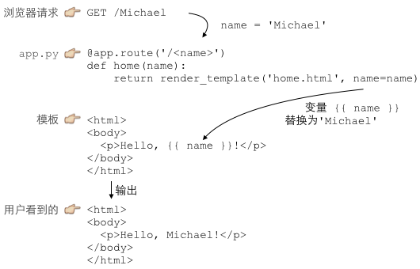
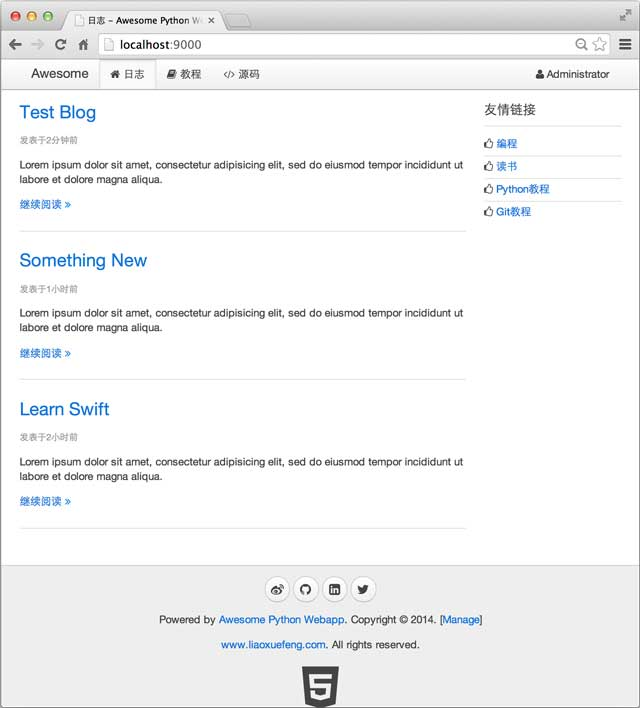

# Python template

## 常见的模板

* [Jinja2](http://jinja.pocoo.org)：`{{ name }}` 表示一个需要替换的变量，用``表示指令。
* [Mako](http://www.makotemplates.org/)：用`<% ... %>`和`${xxx}`的一个模板；
* [Cheetah](http://www.cheetahtemplate.org/)：也是用`<% ... %>`和`${xxx}`的一个模板；
* [Django](https://www.djangoproject.com/)：Django是一站式框架，内置一个用``和`{{ xxx }}`的模板。

## Jinja2 例子1
使用模板，我们需要预先准备一个HTML文档，这个HTML文档不是普通的HTML，而是嵌入了一些变量和指令，然后，根据我们传入的数据，替换后，得到最终的HTML，发送给用户：



这就是传说中的`MVC：Model-View-Controller`，中文名“模型-视图-控制器”。

Python处理URL的函数就是`C：Controller`，Controller负责业务逻辑，比如检查用户名是否存在，取出用户信息等等；

包含变量`{{ name }}`的模板就是`V：View`，View负责显示逻辑，通过简单地替换一些变量，View最终输出的就是用户看到的HTML。

MVC中的Model在哪？Model是用来传给View的，这样View在替换变量的时候，就可以从Model中取出相应的数据。

上面的例子中，Model就是一个dict：

```python
{ 'name': 'Michael' }
```

只是因为Python支持关键字参数，很多Web框架允许传入关键字参数，然后，在框架内部组装出一个dict作为Model。

现在，我们把上次直接输出字符串作为HTML的例子用高端大气上档次的MVC模式改写一下：

```python
from flask import Flask, request, render_template

app = Flask(__name__)

@app.route('/', methods=['GET', 'POST'])
def home():
    return render_template('home.html')

@app.route('/signin', methods=['GET'])
def signin_form():
    return render_template('form.html')

@app.route('/signin', methods=['POST'])
def signin():
    username = request.form['username']
    password = request.form['password']
    if username=='admin' and password=='password':
        return render_template('signin-ok.html', username=username)
    return render_template('form.html', message='Bad username or password', username=username)

if __name__ == '__main__':
    app.run()
```

### home.html
用来显示首页的模板：

```html
<html>
<head>
  <title>Home</title>
</head>
<body>
  <h1 style="font-style:italic">Home</h1>
</body>
</html>
```

### form.html
用来显示登录表单的模板：

```html
<html>
<head>
  <title>Please Sign In</title>
</head>
<body>
  
  <p style="color:red">{{ message }}</p>
  
  <form action="/signin" method="post">
    <legend>Please sign in:</legend>
    <p><input name="username" placeholder="Username" value="{{ username }}"></p>
    <p><input name="password" placeholder="Password" type="password"></p>
    <p><button type="submit">Sign In</button></p>
  </form>
</body>
</html>
```

### signin-ok.html
登录成功的模板：

```html
<html>
<head>
  <title>Welcome, {{ username }}</title>
</head>
<body>
  <p>Welcome, {{ username }}!</p>
</body>
</html>
```

登录失败的模板呢？我们在`form.html`中加了一点条件判断，把`form.html`重用为登录失败的模板。

最后，一定要把模板放到正确的`templates`目录下，`templates`和`app.py`在同级目录下：


启动python app.py，看看使用模板的页面效果：


通过MVC，我们在Python代码中处理`M：Model`和`C：Controller`，而`V：View`是通过模板处理的，这样，我们就成功地把Python代码和HTML代码最大限度地分离了。

使用模板的另一大好处是，模板改起来很方便，而且，改完保存后，刷新浏览器就能看到最新的效果，这对于调试HTML、CSS和JavaScript的前端工程师来说实在是太重要了。

在Jinja2模板中，我们用`{{ name }}`表示一个需要替换的变量。很多时候，还需要循环、条件判断等指令语句，在Jinja2中，用``表示指令。

比如循环输出页码：

```html

    <a href="/page/{{ i }}">{{ i }}</a>

```

如果page_list是一个list：`[1, 2, 3, 4, 5]`，上面的模板将输出5个超链接。

### block 块

常见的模板引擎已经考虑到了页面上重复的HTML部分的复用问题。有的模板通过include把页面拆成三部分：

```html
<html>
    <% include file="inc_header.html" %>
    <% include file="index_body.html" %>
    <% include file="inc_footer.html" %>
</html>
```

这样，相同的部分`inc_header.html`和`inc_footer.html`就可以共享。

但是`include`方法不利于页面整体结构的维护。`jinjia2`的模板还有另一种“继承”方式，实现模板的复用更简单。

“继承”模板的方式是通过编写一个“父模板”，在父模板中定义一些可替换的`block（块）`。然后，编写多个“子模板”，每个子模板都可以只替换父模板定义的`block`。比如，定义一个最简单的父模板：

```html
<!-- base.html -->
<html>
    <head>
        <title> 这里定义了一个名为title的block </title>
    </head>
    <body>
         这里定义了一个名为content的block 
    </body>
</html>
```

对于子模板`a.html`，只需要把父模板的`title`和`content`替换掉：

```html

 A 

<h1>Chapter A</h1>
<p>blablabla...</p>

```

对于子模板`b.html`，如法炮制：

```html

 B 

<h1>Chapter B</h1>
<ul>
   <li>list 1</li>
   <li>list 2</li>
</ul>

```

这样，一旦定义好父模板的整体布局和CSS样式，编写子模板就会非常容易。

让我们通过[uikit](http://getuikit.com/)这个CSS框架来完成父模板`__base__.html`的编写：

```html
<!DOCTYPE html>
<html>
<head>
    <meta charset="utf-8" />
    <!-- block meta  -->
    <title> ?  - Awesome Python Webapp</title>
    <link rel="stylesheet" href="/static/css/uikit.min.css">
    <link rel="stylesheet" href="/static/css/uikit.gradient.min.css">
    <link rel="stylesheet" href="/static/css/awesome.css" />
    <script src="/static/js/jquery.min.js"></script>
    <script src="/static/js/md5.js"></script>
    <script src="/static/js/uikit.min.js"></script>
    <script src="/static/js/awesome.js"></script>
    <!-- before head  -->
</head>
<body>
    <nav class="uk-navbar uk-navbar-attached uk-margin-bottom">
        <div class="uk-container uk-container-center">
            <a href="/" class="uk-navbar-brand">Awesome</a>
            <ul class="uk-navbar-nav">
                <li data-url="blogs"><a href="/"><i class="uk-icon-home"></i> 日志</a></li>
                <li><a target="_blank" href="#"><i class="uk-icon-book"></i> 教程</a></li>
                <li><a target="_blank" href="#"><i class="uk-icon-code"></i> 源码</a></li>
            </ul>
            <div class="uk-navbar-flip">
                <ul class="uk-navbar-nav">
                
                    <li class="uk-parent" data-uk-dropdown>
                        <a href="#0"><i class="uk-icon-user"></i> {{ user.name }}</a>
                        <div class="uk-dropdown uk-dropdown-navbar">
                            <ul class="uk-nav uk-nav-navbar">
                                <li><a href="/signout"><i class="uk-icon-sign-out"></i> 登出</a></li>
                            </ul>
                        </div>
                    </li>
                
                    <li><a href="/signin"><i class="uk-icon-sign-in"></i> 登陆</a></li>
                    <li><a href="/register"><i class="uk-icon-edit"></i> 注册</a></li>
                
                </ul>
            </div>
        </div>
    </nav>

    <div class="uk-container uk-container-center">
        <div class="uk-grid">
            <!-- content -->
            
            
            <!-- // content -->
        </div>
    </div>

    <div class="uk-margin-large-top" style="background-color:#eee; border-top:1px solid #ccc;">
        <div class="uk-container uk-container-center uk-text-center">
            <div class="uk-panel uk-margin-top uk-margin-bottom">
                <p>
                    <a target="_blank" href="#" class="uk-icon-button uk-icon-weibo"></a>
                    <a target="_blank" href="#" class="uk-icon-button uk-icon-github"></a>
                    <a target="_blank" href="#" class="uk-icon-button uk-icon-linkedin-square"></a>
                    <a target="_blank" href="#" class="uk-icon-button uk-icon-twitter"></a>
                </p>
                <p>Powered by <a href="#">Awesome Python Webapp</a>. Copyright &copy; 2014. [<a href="/manage/" target="_blank">Manage</a>]</p>
                <p><a href="http://www.liaoxuefeng.com/" target="_blank">www.liaoxuefeng.com</a>. All rights reserved.</p>
                <a target="_blank" href="#"><i class="uk-icon-html5" style="font-size:64px; color: #444;"></i></a>
            </div>
        </div>
    </div>
</body>
</html>
```

`__base__.html`定义的几个`block`作用如下：

用于子页面定义一些`meta`，例如`rss feed：`

```python
 ... 
```

覆盖页面的标题：

```python
 ... 
```

子页面可以在标签关闭前插入JavaScript代码：

```python
 ... 
```

子页面的content布局和内容：

```python

...

```

我们把首页改造一下，从`__base__.html`继承一个`blogs.html`：

```html
<!--blogs.html-->


日志


    <div class="uk-width-medium-3-4">
    
        <article class="uk-article">
            <h2><a href="/blog/{{ blog.id }}">{{ blog.name }}</a></h2>
            <p class="uk-article-meta">发表于{{ blog.created_at}}</p>
            <p>{{ blog.summary }}</p>
            <p><a href="/blog/{{ blog.id }}">继续阅读 <i class="uk-icon-angle-double-right"></i></a></p>
        </article>
        <hr class="uk-article-divider">
    
    </div>

    <div class="uk-width-medium-1-4">
        <div class="uk-panel uk-panel-header">
            <h3 class="uk-panel-title">友情链接</h3>
            <ul class="uk-list uk-list-line">
                <li><i class="uk-icon-thumbs-o-up"></i> <a target="_blank" href="#">编程</a></li>
                <li><i class="uk-icon-thumbs-o-up"></i> <a target="_blank" href="#">读书</a></li>
                <li><i class="uk-icon-thumbs-o-up"></i> <a target="_blank" href="#">Python教程</a></li>
                <li><i class="uk-icon-thumbs-o-up"></i> <a target="_blank" href="#">Git教程</a></li>
            </ul>
        </div>
    </div>

```

相应地，首页URL的处理函数更新如下：

```python
@view('blogs.html')
@get('/')
def index():
    blogs = Blog.find_all()
    # 查找登陆用户:
    user = User.find_first('where email=?', 'admin@example.com')
    return dict(blogs=blogs, user=user)
```

往MySQL的`blogs`表中手动插入一些数据，我们就可以看到一个真正的首页了。但是Blog的创建日期显示的是一个浮点数，因为它是由这段模板渲染出来的：

```html
<p class="uk-article-meta">发表于{{ blog.created_at }}</p>
```

解决方法是通过`jinja2`的`filter`（过滤器），把一个浮点数转换成日期字符串。我们来编写一个`datetime`的`filter`，在模板里用法如下：

```html
<p class="uk-article-meta">发表于{{ blog.created_at|datetime }}</p>
```

`filter`需要在初始化`jinja2`时设置。修改`wsgiapp.py`相关代码如下：

```python
# wsgiapp.py:

...

# 定义datetime_filter，输入是t，输出是unicode字符串:
def datetime_filter(t):
    delta = int(time.time() - t)
    if delta < 60:
        return u'1分钟前'
    if delta < 3600:
        return u'%s分钟前' % (delta // 60)
    if delta < 86400:
        return u'%s小时前' % (delta // 3600)
    if delta < 604800:
        return u'%s天前' % (delta // 86400)
    dt = datetime.fromtimestamp(t)
    return u'%s年%s月%s日' % (dt.year, dt.month, dt.day)

template_engine = Jinja2TemplateEngine(os.path.join(os.path.dirname(os.path.abspath(__file__)), 'templates'))
# 把filter添加到jinjia2，filter名称为datetime，filter本身是一个函数对象:
template_engine.add_filter('datetime', datetime_filter)

wsgi.template_engine = template_engine
```

现在，完善的首页显示如下：



## Jinja2与Vue.js的模板冲突
[Vue.js](http://cn.vuejs.org/)

首先回顾一下：

* [Jinja2](http://jinja.pocoo.org)：用``表示指令，`{{ name }}` 表示一个需要替换的变量。
* [Mako](http://www.makotemplates.org/)：用`<% ... %>`和`${xxx}`的一个模板；
* [Cheetah](http://www.cheetahtemplate.org/)：也是用`<% ... %>`和`${xxx}`的一个模板；
* [Django](https://www.djangoproject.com/)：Django是一站式框架，内置一个用``和`{{ xxx }}`的模板。

那么 Vue.js 使用变量的时候，`{{ message }}` 表示一个需要替换的变量

```js
<div id="app">
  {{ message }}
</div>
new Vue({
  el: '#app',
  data: {
    message: 'Hello Vue.js!'
  }
})
```

若一起使用，则分不清楚这个变量到底是 Vue 还是 Jinja 的

解决方案，参考其他模板使用其他模板的命名方式 或者修改 Vue 的文本插值的定界符：

```python
app = Flask(__name__)
app.jinja_env.variable_start_string = '${'
app.jinja_env.variable_end_string = '}'
```

或者 

```js
<script src="http://cn.vuejs.org/js/vue.min.js"></script>
<script>
    Vue.config.delimiters = ['<%', '%>'];
    Vue.config.unsafeDelimiters = ['<%%', '%%>']
</script>
```


## 参考
* [廖雪峰的官方网站](http://www.liaoxuefeng.com/)
* [Jinja2](http://jinja.pocoo.org/)
* [Flask中Jinja2模板引擎详解](http://www.bjhee.com/jinja2-statement.html)