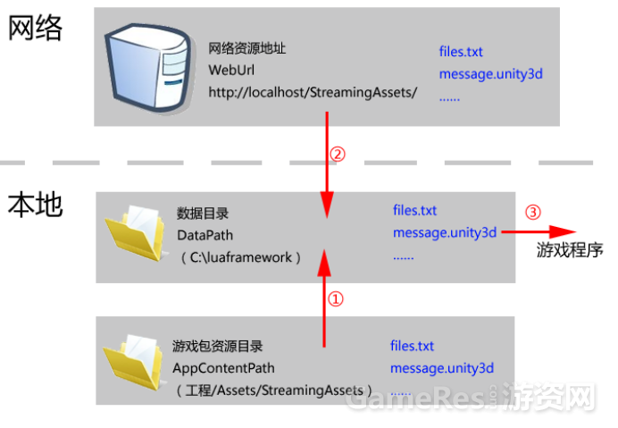

# toLua (todo)


> 通过校验文件的 MD5 值来判断是否需要更新，如果需要更新则下载差异文件。lua属于解释性文件所以能通过www直接下载到本地，通过C#与lua交互，把逻辑写在lua里，从而实现代码热更新。

## 装箱和拆箱
1. 装箱:值类型向引用类型转换
2. 拆箱:引用类型向值类型转换

## Core
* LuaAttribute.cs  
  生成绑定代码时做一些标示使用。
* LuaBaseRef.cs  
  Lua中对象对应C#中对象的一个基类，主要作用是有一个reference指向lua里面的对象，引用计数判断两个对象是否相等等。
* AppConst.cs
  配置文件

## C# 调用 Lua
```c#
private LuaState lua;
# 执行 lua 代码段
lua.DoFile(filename);
lua.DoString(string);
# 获取 lua 函数
LuaFunction func = lua.GetFunction(funcName);
# 获取 lua 表
LuaTable table = lua.GetTable(tableName);
```

## Lua 调用 C#
在c#中将引用传递到lua中后：
1. 通过 `.`(点号)来使用非静态的变量以及静态的变量与方法
2. 通过 `:` (冒号)来使用非静态的方法
3. 通过 `{}` 来传递数组给 C#
4. 创建 `GameObject：newObject(变量)`
5. 摧毁 `GameObject：destroy(变量)`
6. 获取组件： `GetComponent('LuaBehaviour')`

## LuaFramework

### 基础模块
* `Util` 对 `MonoBehaviour` 的功能进行封装，这样不继承Mono的类就能使用 `MonoBehaviour` 的东西了(如`transform.Find、GetComponent`)；
* `AppFacade` ：继承 `Facade` ，整套框架的入口
* `Base` 继承 `MonoBehaviour` ，是一切 `View` 和 `Manager` 的基类；持有各种 `Manager` 的引用；能注册移除( `view` 所感兴趣的)信息
* `View` 只有一个方法：`public virtual void OnMessage(IMessage message)` 这是处理信息的方法
* `Manager` 继承 `Base`
* `AppView` 继承 `View` ，是一个范例：注册 `View` 所感兴趣的信息，处理信息

### lua 模块
* `LuaFileUtils` 通过 `.lua` 文件路径和 `AssetBundle` 文件路径这两种方式来找 `.lua` 文件，并读取返回 `byte[]`
* `LuaLoader` 继承 `LuaFileUtils` ，并无重要变化
* `LuaEvent` 类似 c#  中的 `event` ，提供 `Add` 和 `Remove` 方法
* `LuaLooper` 继承 `MonoBehaviour` ，在 `Update / LateUpdate / FixedUpdate` 中执行对应的 `LuaEvent`
* `LuaBinder` 如果执行的 `.lua` 文件需要用到 unity 中的类型，则需要用这个类给 `LuaState` 进行绑定
* `LuaManager` 继承 `Manager` ，入口类，初始化 Lua 代码加载路径(调试模式下是在 `Assets \ LuaFramework` 目录下，非调试模式是在 `C:\luaframework\lua`(window系统)，默认是非调试模式)，引用一个 `LuaState` 并封装其功能(读取lua文件、调用方法等)
* `LuaBehaviour` 继承 `View`，在 `Awake / Start` 中调用lua中对应的方法；并提供点击事件的相关处理

### Manager模块
* `ResourceManager` 加载 `AssetBundle` 的相关操作。


## 代码热更新

### 对于一个panel，需要添加或修改的文件：
1. 添加 xxxPanel & xxxCtrl
1. 修改 `define、Game、CtrlManager`

[参考案例](http://blog.csdn.NET/adambieber/article/details/47402805)

### 在lua中使用AB包内的资源的两种方法：

1. `panelMgr:CreatePanel('Prompt', this.OnCreate);`
1. `resMgr:LoadPrefab('prompt', { 'PromptItem' }, this.InitPanel);`

其中a是对b的进一步封装，因此两者都需要提供AB包名、要访问的包内资源名字(如果是panel，则默认资源名为AB包名+"Panel")以及回调方法(参数是AB包中的资源)

### 热更新的四个步骤：打包、解包、更新和加载。
这四个步骤框架已经给我们封装好了，基本上就不需要我们去管了，但还是很有必要理解其中的过程。

1. 打包：将资源全部打包到StreamingAssets文件夹  
打包类：`LuaFramework / Editor / Packager`
打包lua文件： HandleLuaBundle，对`Assets\LuaFramework\Lua` 与 `Assets\LuaFramework\ToLua\Lua`这两个目录下的所有lua文件进行打包
打包图片等资源：`HandleExampleBundle`

1. 解包：在移动端StreamingAssets这个文件夹是只读的，但是要做热跟新的话，就需要写入文件，因此Application.persistentDataPath这个可读可写的路径才是数据在移动端的存放路径，同时也为了比较MD5的值，就需要将StreamingAssets的东西解包(复制)到Application.persistentDataPath

1. 更新：files.txt这个文件记录了所有的资源文件及其MD5值，每次进入游戏时都会从服务器下载最新的files.txt，然后对其遍历比较MD5值，如果值不同或者不存在则下载

1. 加载：先加载资源的依赖，再加载资源

那么，如果我们对外发布了一个版本1.1，然后更改资源，发布1.2，要做的就是：重新生成apk并上传，然后将`StreamingAssets`文件夹下的东西上传到服务器，具体位置见`AppConst.WebUrl`；对于用户来说，如果他安装的是1.1，那么就会下载更新，如果他安装的是1.2，那么解包之后就得到最新的资源了，无需更新了。

### 整套框架的工作流程：

c# 打包好后，启动游戏， `GameManager` 会进行一些判断，如果这是游戏安装之后的第一次启动，那么就会进行解包操作。如果`AppConst.UpdateMode`为`false`，那么就不会检测更新，否则就会进行更新操作。然后进入初始化操作，调用`Game.lua`中的`OnInitOK`方法，进入lua逻辑。

lua然后调用指定控制器的`Awake`方法、`PanelManager`的`CreatePanel`方法，调用c#代码，创建`panel`，为其添加`LuaBehaviour`，调用`xxxPanel.lua`的方法，获取控件引用，进行逻辑处理。




## 参考

LuaFramework
* [toLua官网](http://www.ulua.org/index.html)
* [LuaFramework_UGUI_V2](https://github.com/jarjin/LuaFramework_UGUI_V2)
* [LuaFramework 目录参考](http://doc.ulua.org/article/ngui/simpleframework_base1.html)
* [罗培羽  - Unity3D热更新LuaFramework入门实战(2)——资源热更新](https://zhuanlan.zhihu.com/p/21442566)
* [Unity ToLua & LuaFramework_UGUI学习笔记](https://www.jianshu.com/p/ef1e2641e0c6)
* [001,LuaFramework 基本流程](https://my.oschina.net/jacky0525/blog/1788507)
* [002,LuaFramework 对资源的管理](https://my.oschina.net/jacky0525/blog/1789117)
* [tolua全教程-Chinar](https://blog.csdn.net/ChinarCSDN/article/details/83044148)
* [tolua错误大全-Chinar出品-几乎可为新手解决所有报错情景](https://blog.csdn.net/ChinarCSDN/article/details/96652257)
* [【资料帖】tolua学习资料汇总贴](http://doc.ulua.org/article/ulua/ziliaotietoluaxuexiziliaohuizongtie.html)
* [Unity3D热更新实战演练](https://zhuanlan.zhihu.com/p/43632619)
* [Unity3D热更新技术点——ToLua（上）](https://zhuanlan.zhihu.com/p/42472089)
* [Unity3D热更新技术点——ToLua（下）](https://zhuanlan.zhihu.com/p/42472115)

Lua 性能
* [用好lua+unity，让性能飞起来——lua与c#交互篇](https://www.cnblogs.com/zwywilliam/p/5999924.html)
* [用好lua+unity，让性能飞起来——luajit集成篇/平台相关篇](https://www.cnblogs.com/zwywilliam/p/5999980.html)

