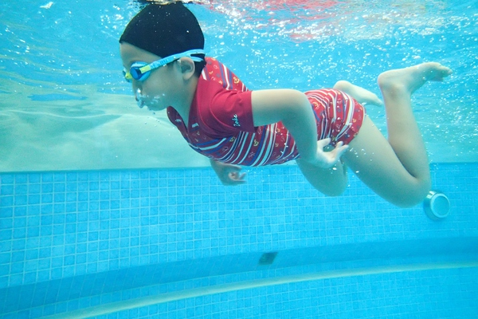
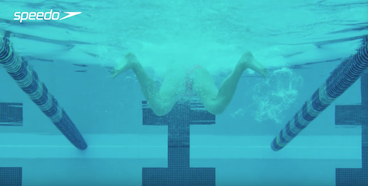

# 蛙泳

## 口诀
划手腿不动，收手再收腿，先伸胳膊后蹬腿，并拢伸直漂一会儿。

## 换气

手分开时候头就开始换气了

## 划水
划水不能太大，双手打开的成都最多为肩宽，收回来的时候要两只手前臂向下向内抱水

水下要尽量保证脸向下而不是向前看，因为水中身体最前端的手或者头对于这个身体是有导向性的，也就是说前面如果是向上的，那么身体在水中就是倾斜的，这样会增加阻力，反而同意下沉

出水时，要靠抱水提供的向上的力量而不是使劲抬头，越抬头越会让初学者下沉，呛水的可能行就越大

## 呼吸

在水里用鼻子吐气，在水面用嘴大口呼气

## 蛙泳腿

准备动作，双腿伸直并拢。 

1. 收腿，小腿收起来，脚掌尽量贴紧屁股，大腿不动，小腿收回来。 

2. 翻腿，大腿仍然尽量保持不动，小腿往两边翻开，此时脚掌要勾起来,这个动作做标准了，从正后方看上去，就是个标准的Ｗ形。 注意，小腿尽量往两边翻开，尽量往屁股方向贴近，贴得越紧，蹬腿的距离越长，动力更大。 
3. 蹬夹腿，脚一边往两边蹬出去一边往中间夹紧，伸直并拢。

## 蹬腿

收腿时膝盖分开程度不大，蹬腿过程中双脚距离大于膝盖距离

